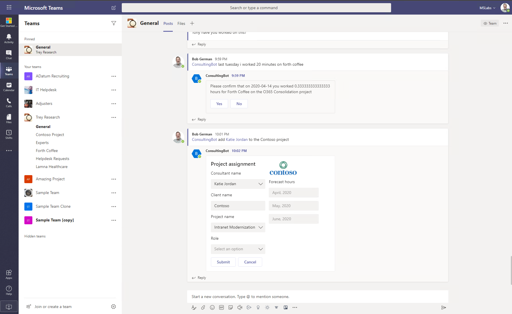

---
page_type: sample
products:
- teams
languages:
- javascript
- typescript
- csharp
extensions:
  contentType: samples
  technologies:
  - Microsoft Teams
  createdDate: 5/1/2019 12:00:00 AM
---
# Microsoft Teams Development Samples

These samples demonstrate different capabilities of Microsoft Teams applications. Some illustrate specific capabilities, while others are complete demonstration apps. They are samples, not complete or production-ready solutions. Each sample has its own dedicated readme file to explain setup instructions and demonstrated capability.

## List of samples

### Applications

Application samples include multiple Teams extensions, such as a bot and a tab or messaging extension. 

Title|Language|Contains|Description|Preview| Frameworks
----|----|-------|------|-----|------
Consulting Bot [dotnetcore/app-consulting-bot](#) | C# | <ul><li>Bot</li><li>Messaging Extension</li></ul>|This sample demonstrates a bot to be used by consultants. It allows users to add a person to a project (using adaptive cards), and to charge time to a project (using natural language conversation). Messaging extensions display a project and add a person to a project. Data is mocked, and is not updated, but the bot does show use of LUIS, QnA Maker, adaptive cards, and dialogs.||

### Bots

Bot samples include a only a bot

Title|Language|Description|Preview| Frameworks
----|----|-------|------|-----
State Bot [node/bot-state-bot](#)|C#|This bot demonstrates the use of conversation and user state in a Bot ||

### Low-Code: Power Apps

These samples include a Power App with optional attached Power Automate flows

### Low-Code Power Automate

These samples are for Power Automate flows that work with Microsoft Teams

### Tabs

These samples are Teams tabs using single page applications or SharePoint Framework web parts

Title|Language|Description|Preview| Frameworks
----|----|-------|------|-----
Field Visit Tab [tabs/spfx-react-field-visit-tab](#)|Typescript|This sample shows how to build a mashup of data about a customer visit using data in the Team calendar, SharePoint, Bing Maps, Northwind database, and Open Weather Maps. Shows deep linking with SPFx.||