# Azure Communication Services – Teams InterOp with Call Routing

## Summary

The sample supporting Azure Communication Services (ACS) and Teams Interoperation allows citizen end users get in touch with an SME / Support Agent belonging to a business entity over a video call in order to discuss and address an issue. It allows business users with a Teams license on one side have a call with a citizen consumer who doesn’t have a Teams license / login.   

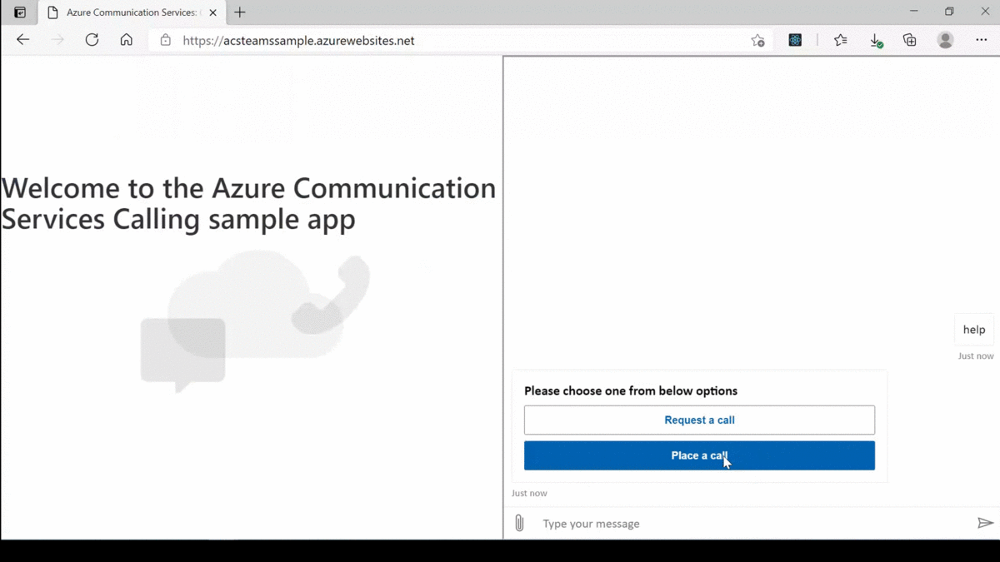
 
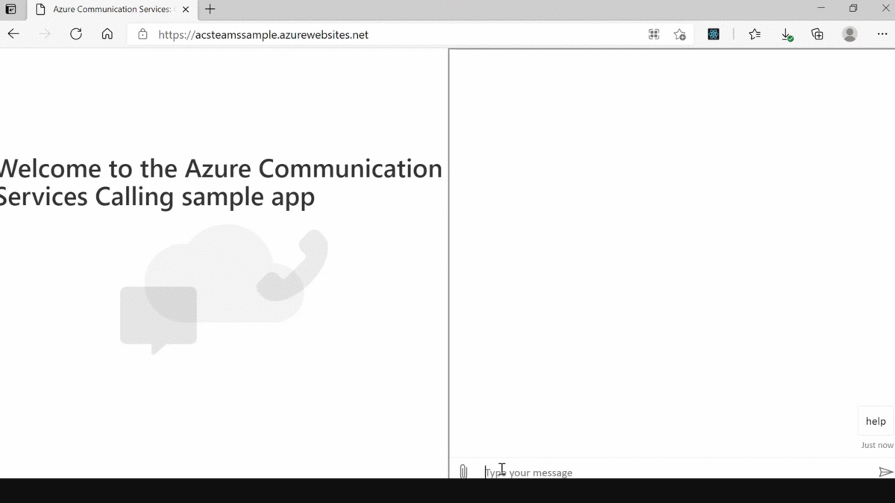

## Frameworks

## Prerequisites

* [Office 365 tenant](https://developer.microsoft.com/en-us/microsoft-365/dev-program).

* An Azure account with an active subscription. For details, see [Create an account for free](https://azure.microsoft.com/free/?WT.mc_id=A261C142F).

* Enable the federation between ACS resources and your Teams tenant using [this form](https://forms.office.com/Pages/ResponsePage.aspx?id=v4j5cvGGr0GRqy180BHbR21ouQM6BHtHiripswZoZsdURDQ5SUNQTElKR0VZU0VUU1hMOTBBMVhESS4u), if already not enabled.

* [Node.js (12.18.4 and above)](https://nodejs.org/en/download/), [Visual Studio (2019 and above)](https://visualstudio.microsoft.com/vs/), [.NET Core 3.1](https://dotnet.microsoft.com/download/dotnet-core/3.1) (Make sure to install version that corresponds with your visual studio instance, 32 vs 64 bit)

* An Azure Communication Services resource. For details, see [Create an Azure Communication Resource](https://docs.microsoft.com/en-us/azure/communication-services/quickstarts/create-communication-resource). You'll need to record your resource connection string for this QuickStart

* To test locally, you'll need [Ngrok](https://ngrok.com/download) and [Azure Cosmos DB Emulator](https://docs.microsoft.com/en-us/azure/cosmos-db/local-emulator?tabs=cli%2Cssl-netstd21) installed on your development machine. Make sure you've downloaded and installed both on your local machine. ngrok will tunnel requests from the Internet to your local computer and terminate the SSL connection from Teams.

    * ex: `https://subdomain.ngrok.io`.
    
	 NOTE: A free Ngrok plan will generate a new URL every time you run it, which requires you to update your Azure AD registration, the Teams app manifest, and the project configuration. A paid account with a permanent Ngrok URL is recommended.

## Version history

Version|Date|Author|Comments
-------|----|----|--------
1.0|June 18, 2021|Sathya Raveendran   Saikrishna Neeli   Arun Kumar Anaparthi  |Initial release

## Disclaimer

**THIS CODE IS PROVIDED *AS IS* WITHOUT WARRANTY OF ANY KIND, EITHER EXPRESS OR IMPLIED, INCLUDING ANY IMPLIED WARRANTIES OF FITNESS FOR A PARTICULAR PURPOSE, MERCHANTABILITY, OR NON-INFRINGEMENT.**

---

## Minimal Path to Awesome

Step 1: Setup bot in Service
====================================
1. Create new bot channel registration resource in Azure.

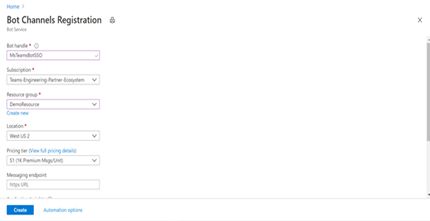

	* Remember the bot handle, you will need it while updating the HomeScreen.tsx file.

2. Create New Microsoft App ID and Password.

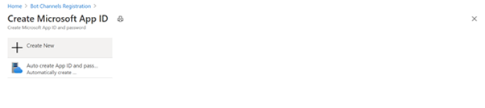

3. Go to App registrations and create a new app registration in a different tab.
4. Register an application.
	* Fill out name and select third option for supported account type and click "Register".

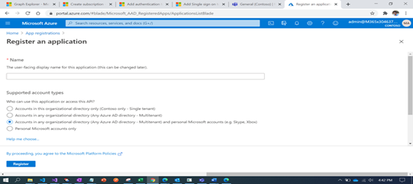

	* Copy and paste the App Id and Tenant ID somewhere safe. You will need it in a future step.

5. Create Client Secret.
   * Navigate to the "Certificates & secrets" blade and add a client secret by clicking "New Client Secret".

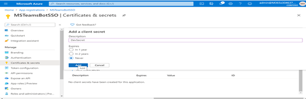

	* Copy and paste the secret somewhere safe. You will need it in a future step.
	
   * Paste the App Id and password in the respective blocks and click on OK.

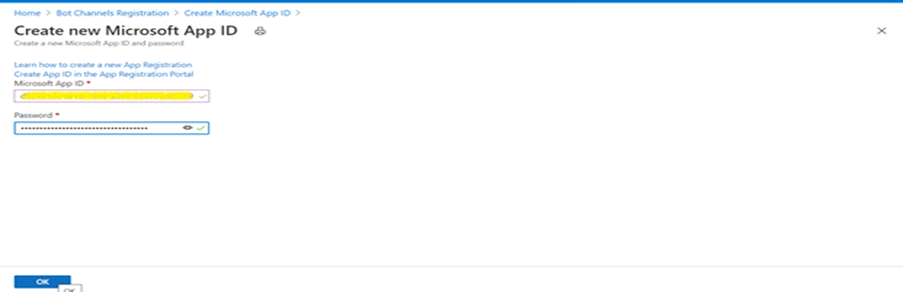

   * Click on Create on the Bot Channel registration.
   
6. Go to the created resource, navigate to channels and add "Microsoft Teams" and “Web chat” channels.

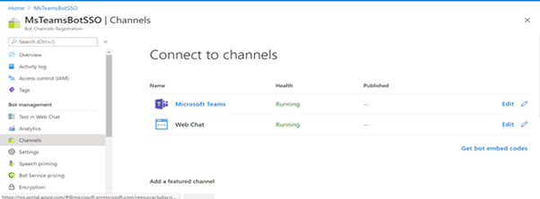

7. Edit Web chat, click on the show under secret keys section in the right panel.

	* copy the secret, you will need it while updating the HomeScreen.tsx file.	
											      
9. Add any necessary API permissions for downstream calls in the App registration.
	* Navigate to "API permissions" blade on the left-hand side.
	* Add following permissions to the application.
		* Application permissions
			* OnlineMeetings.ReadWrite.All
			* Calls.AccessMedia.All
			* Calls.Initiate.All
			* Calls.InitiateGroupCall.All
			* Calls.JoinGroupCall.All
			* Calls.JoinGroupCallAsGuest.All

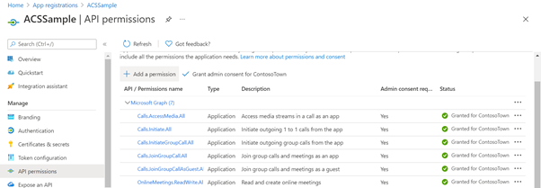

If you are logged in as the Global Administrator, click on the “Grant admin consent for %tenant-name%” button to grant admin consent, else inform your Admin to do the same through the portal.

Step 2: Create a Policy for a user in the tenant for creating online meetings on behalf of that user using below PowerShell script
====================================

Import-Module MicrosoftTeams 
$userCredential = Get-Credential 
Connect-MicrosoftTeams -Credential $userCredential 
 
New-CsApplicationAccessPolicy -Identity %policy-identity/policy-name% -AppIds "%replace-applicaition-id-from-step-1%" -Description "%policy-desciption%" 
Grant-CsApplicationAccessPolicy -PolicyName %policy-identity/policy-name% -Identity "%object-id-of-the-user-to-whom-policy-need-to-be-granted%"

	
Step 3: Run the app locally 
====================================
1. Clone the repository.

  		git clone “https://github.com/pnp/teams-dev-samples.git”

2. If you are using Visual Studio
 	- Launch Visual Studio
 	- File -> Open -> Project/Solution
 	- Navigate to samples/app-acs-calling/Source folder.
 	- Select Calling.csproj file.

3. The Azure Cosmos DB Emulator must be runnning before starting the service. To start the Azure Cosmos DB Emulator on Windows, select the Start button or press the Windows key. Begin typing Azure Cosmos DB Emulator, and select the emulator from the list of applications.When the emulator has started, you'll see an icon in the Windows taskbar notification area. It automatically opens the Azure Cosmos data explorer in your browser at this URL https://localhost:8081/_explorer/index.html URL. Make sure to copy the URI and Primary key values from the data explorer, update the same in the appsettings.json file. Cosmos Database and collection names can be anything of your choice. For more information, see the [Azure Cosmos DB Emulator reference](https://docs.microsoft.com/en-us/azure/cosmos-db/local-emulator?tabs=cli%2Cssl-netstd21) article. Values of the keys [GroupId](https://docs.microsoft.com/en-us/graph/api/user-list-joinedteams?view=graph-rest-1.0&tabs=http), [ChannelId](https://docs.microsoft.com/en-us/graph/api/channel-list?view=graph-rest-1.0&tabs=http) can be retrieved using the Graph explorer.

4. Update the HomeScreen.tsx and appsettings.json files. 
      - TeamsServiceUrl, is the URL sent by Teams in the Bot payload in the turnContext.Activity.serviceUrl property, dubug the project to get the URL.

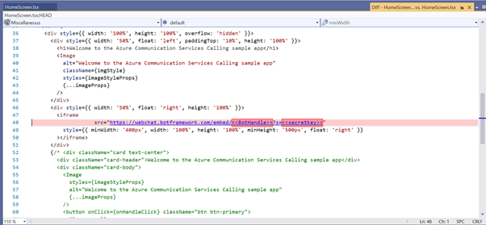
 
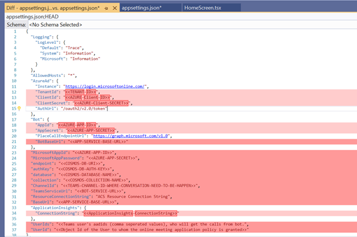

5. Run Ngrok to expose your local web server via a public URL. Make sure to point it to your Ngrok URI. For example, if you're using port 3333 locally, run:

		Win: ./ngrok http 3333 -host-header=localhost:3333 -subdomain="contoso"
		Mac: /ngrok http 3333 -host-header=localhost:3333 -subdomain="contoso".

6. Update messaging endpoint in the Azure Bots Channel Registration. Open the Bot channel registration, click on Configuration/Settings on the left pane, whichever is available and update the messaging endpoint to the endpoint that bot app will be listening on. Update the ngrok URL in the below format for the messaging endpoint.

		ex: https://<subdomain>.ngrok.io/api/messages.

7. Enable calling on the Calling tab of the Microsoft Teams channel. Fill in the Webhook (for calling) where you will receive incoming notifications. 
		
		ex: https://<subdomain>.ngrok.io/callback/calling.

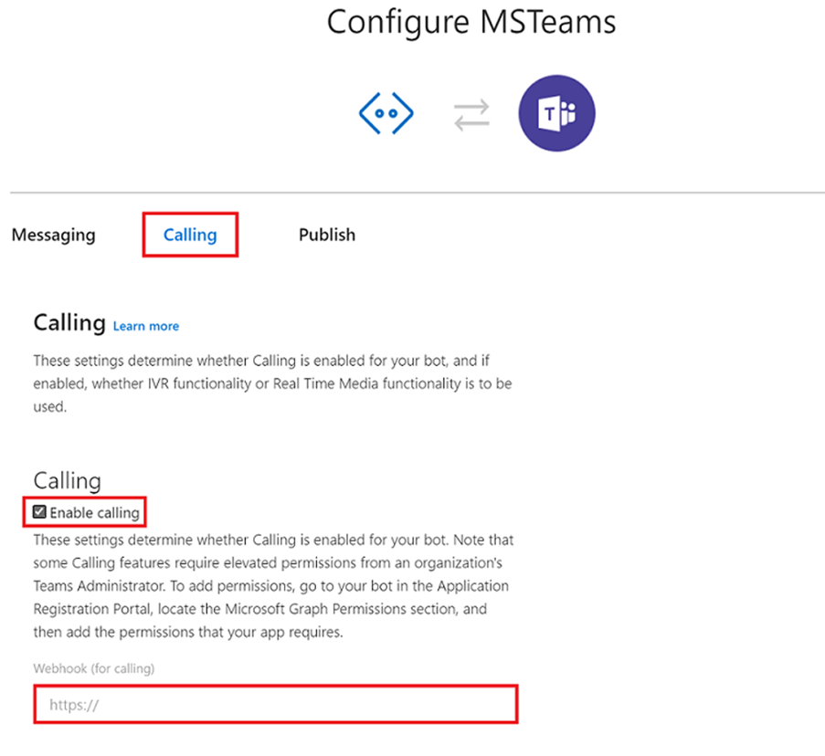

Step 4: Packaging and installing your app to Teams 
==================================================

Make sure the required values such ap App id, bot ids are populated in the manifest, Zip the manifest with the profile images and install/add it in Teams.

Step 5: Try out the app
==================================================

1. Request call

    - Type help in the bot interface on the website
    - In the menu option that appears, select Request a call
    - Enter the citizen user name, query details and select submit to request a call from the agent
    - As the agent, accept the call request by selecting ‘Accept’ in the adaptive card that gets posted
    - Click on Join button to join the call on Teams
    - As a citizen user, once you receive the meeting join link on the bot interface, click to open a meeting interface.
    - Select a name to be displayed while joining the call. Allow camera / microphone permissions in your browser and join the call with the agent. 

2. Place call

    - Type help in the bot interface on the website
    - In the menu option that appears, select Place a call.
    - Once you receive the meeting join link on the bot interface, click to open a meeting interface.
    - Select a name to be displayed while joining the call. Allow camera / microphone permissions in your browser and join the call.
    - The app will call each agent in a particular order. Click on accept.
    - Once the agent joins the call, follow the instructions provided by the bot in the meeting.
    - Admit the user waiting in lobby to kickstart the call with citizen user

## Limitations

* This Web app supports 2 video streams, i.e., One is Local and other one is Remote video stream. It’s a known behaviour of the Calling SDK. For more information refer to Calling SDK streaming support.
* In case of Place a call flow, A call will be made to Teams experts instantly, it will take around 30 – 35 sec to make subsequent calls in calls of earlier calls are not answered/declined.
* Video of Citizen end user who is using ACS on iOS devices, will not be rendered on the Teams meeting stage.

## App Features

The sample app allows two ways in which a citizen user can get in touch with an agent using Teams. Citizen user can use the passive option of ‘requesting a call back’ once an agent is available or ‘place an urgent call’ to get connected with an available agent right away. 

Request Call: (Agent initiates the call)

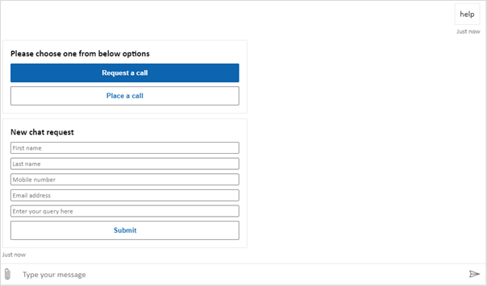

- Citizen end users can request for a call with an SME / support agent on Teams using bot interface on a website. The users are asked to submit basic contact information, query details to aid in triage. 
- Agents may assign the incoming citizen requests to themselves and initiate a call. This will share a Meeting Join link for the citizen user
- The citizen user may join the meeting by clicking on the Join link. It in turn opens a meeting interface in the website with options to turn on video, microphone and providing a name for joining the call. 
- When a citizen user joins the call, the agent would be prompted to allow entry from lobby. As both parties join, they can perform a video call and share screens between each other. 
    
Place a call (Citizen user initiates the call)

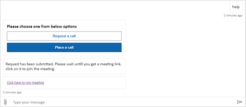

- On clicking ‘Place a call’ a meeting join URL is immediately formed allowing citizen user to join an open meeting using the browser interface via ACS. 
- A Calling and Meeting bot follows a routing logic and calls first agent in the queue. If the agent accepts the call, both parties get to join and participate in a video meeting. 
- If the agent is unavailable and misses accepting the call or if the agent rejects the call, the bot looks for next available agent in the queue and repeats the process. 
- This routing logic can be customized and extended for any number of agents. 

## Take it Further

There are multiple real world scenarios across different industries that can be brought to life by enabling a B2C Calling. Following are few scenarios where a B2C video call would play crux of the solution. 

<table>
<tbody>
<tr>
<td class="col-md-8" style="color:black;" align="center"><b>Industry</b></td>
<td class="col-md-8" style="color:black;" align="center"><b>Scenario Description</b></td>
<td class="col-md-8" style="color:black;" align="center"><b>Citizen end user</b></td>
<td class="col-md-8" style="color:black;" align="center"><b>Business SME</b></td>
</tr>
<tr>
<td>Finance & Banking</td>
<td>A bank’s customer is confused with the ideal policy that will suit his needs and wants to speak to an agent from the bank to go through his options in detail.</td>
<td>High net worth individuals, Banking customers, loan requesters</td>
<td>Relationship managers, Policy Sales Agents
</td>
</tr>
<tr>
<td>Healthcare</td>
<td>A patient would like to speak to a doctor for routine consultation but wants to avoid physical hospital visits and potential exposure to COVID 19 pandemic. </td>
<td>Patient</td>
<td>Doctor</td>
</tr>
<tr>
<td>Retail</td>
<td>An avid shopper likes a cleaning equipment they saw on the store’s website and would like to see video demo from store executive before placing an order</td>
<td>Shopping consumer</td>
<td>Sales Agent, Store FLW </td>
</tr>
<tr>
<td>Insurance</td>
<td>An insurance policy holder has met with an accident and has the damaged vehicle. He gets in touch with insurance firm to show vehicle and ask questions</td>
<td>Insurance policy customers</td>
<td>Insurance agent</td>
</tr>
<tr>
<td>Government</td>
<td>Residents of a city / state can ask questions and get answers from state officials regarding COVID 19 lockdowns, travel and other restrictions</td>
<td>Residents</td>
<td>Government support desk</td>
</tr>
</tbody>
</table>

