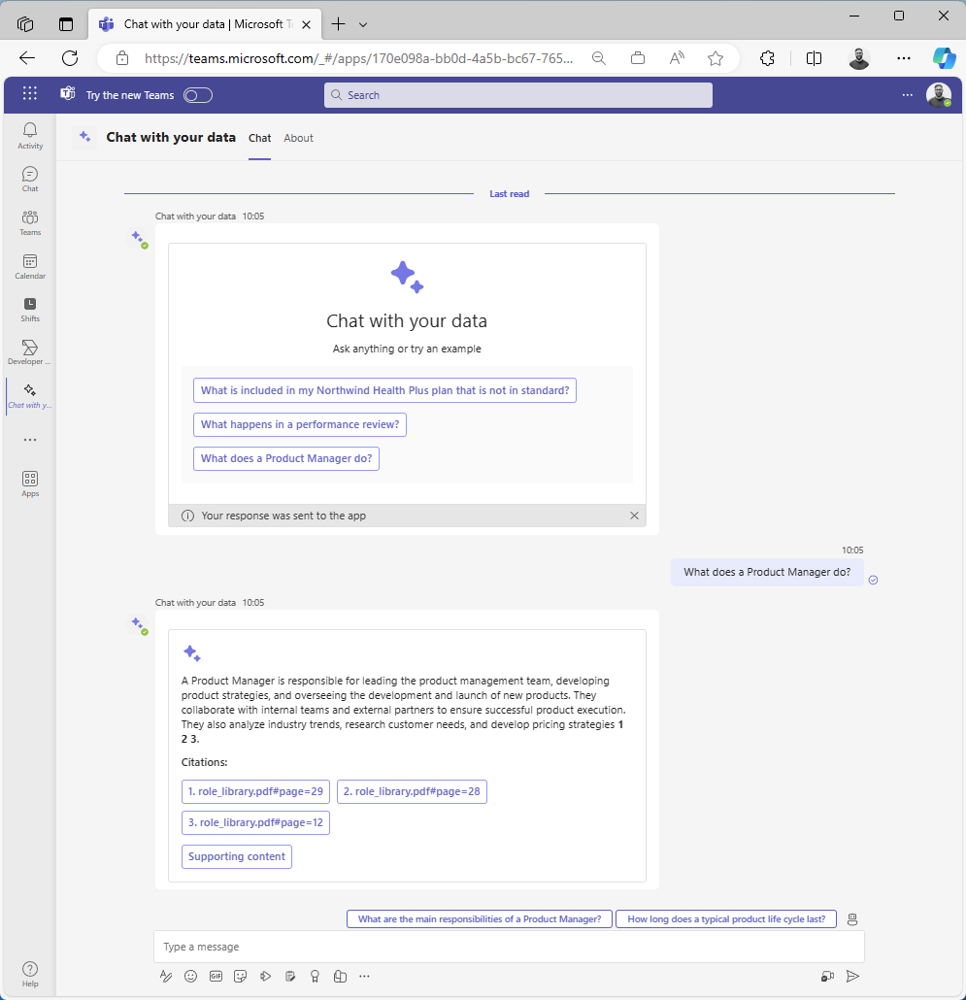

# ChatGPT + Enterprise data with Azure OpenAI and AI Search in Microsoft Teams

## Summary

This sample app demonstrates how to use a Microsoft Teams bot to chat with your data using natural language in the flow of work.

It builds on top of the [ChatGPT + Enterprise data with Azure OpenAI and AI Search](https://github.com/Azure-Samples/azure-search-openai-demo) sample which demonstrates how to create ChatGPT-like experiences over your own data using the Retrieval Augmented Generation pattern with Azure OpenAI Service to access a GPT model (gpt-35-turbo), and Azure AI Search for data indexing and retrieval.

## Tools and Frameworks

## Prerequisites

* [nodejs v18 LTS](https://nodejs.org/en)
* [Teams Toolkit for Visual Studio Code](https://learn.microsoft.com/microsoftteams/platform/toolkit/install-teams-toolkit?tabs=vscode)

You can run this sample locally using a simulated Microsoft 365 tenant, however if you wish to run the sample against live resources, you will need:

* [Microsoft 365 tenant with sideloading enabled](https://dev.office.com/sharepoint/docs/spfx/set-up-your-development-environment)
* Azure subscription

## Version history

Version|Date|Author|Comments
-------|----|----|--------
1.2|May 24, 2024|Garry Trinder|Updated prerequisites
1.1|April 2, 2024|Garry Trinder|Updated instructions
1.0|March 27, 2024|Garry Trinder|Initial release

## Disclaimer

**THIS CODE IS PROVIDED _AS IS_ WITHOUT WARRANTY OF ANY KIND, EITHER EXPRESS OR IMPLIED, INCLUDING ANY IMPLIED WARRANTIES OF FITNESS FOR A PARTICULAR PURPOSE, MERCHANTABILITY, OR NON-INFRINGEMENT.**

---

## Minimal Path to Awesome

First, prepare the project:

1. Clone or fork this repo locally
1. Open the sample project folder in Visual Studio Code
1. In the `env/samples` folder, copy the sample files to the parent folder `env`
1. In the `env` folder, rename all files removing `.sample` from the name

Then, choose a path to run the app:

1. **Run against a simulated Microsoft 365 tenant and bot service**, use this approach if you don't have access to a Microsoft 365 tenant, are unable to use a Dev Tunnel, are unable to sideload apps into your tenant,are unable provision Microsoft Entra ID or Bot Framework resources required to create a bot or deploy Azure resources. Teams App Test Tool is used to simulate the Microsoft Teams user interface and LLM responses are mocked using Dev Proxy.
1. **Run locally against a real Microsoft 365 tenant**, use this approach if you have access to a Microsoft 365 tenant with sideloading enabled, can use a Dev Tunnel, can provision Microsoft Entra ID or Bot Framework resources required to create a bot and can deploy Azure resources.
1. **Deploy and run from Azure**, use this when you want to provision resources and deploy the bot code to Azure and publish the app to the Microsoft Teams organisation app catalog.

### 1. Run locally against a simulated Microsoft 365 tenant and bot service

1. [Install](https://learn.microsoft.com/microsoft-cloud/dev/dev-proxy/get-started#install-dev-proxy) Dev Proxy on your local machine
1. Open a terminal in the root project folder
1. Execute `devproxy --config-file devProxy/use-mocks.json` to start Dev Proxy
1. Open the side bar in VS Code, select the `Run and Debug` panel
1. In the debug profile dropdown, select `Debug in Test Tool`
1. Press F5 to launch the Test Tool
1. In the `Welcome` message, select the first action button

### 2. Run locally against a real Microsoft 365 tenant

1. Follow the steps to deploy the [ChatGPT + Enterprise data with Azure OpenAI and Cognitive Search](https://github.com/Azure-Samples/azure-search-openai-demo#getting-started) sample to an Azure subscription.

> [!IMPORTANT]
> This sample has been tested against the 19th January 2024 [commit](https://github.com/Azure-Samples/azure-search-openai-demo/tree/5e9d142e50a624cd70e42c4c654097e2fb646d36) in the `ChatGPT + Enterprise data with Azure OpenAI and Cognitive Search` repo

1. Open the repo folder in Visual Studio Code.
1. In `.env.local`, update `APP_BACKEND_ENDPOINT` variable with the URL to your provisioned backend

### 3. Deploy and run from Azure

1. In `.env.dev`, update `APP_BACKEND_ENDPOINT` variable with the URL to your provisioned backend
1. On the side bar, select the `Teams Toolkit` icon
1. In the `Lifecycle` section, select `Provision` and follow steps to provision resources in Azure.
1. In the `Lifecycle` section, select `Deploy` and follow steps to build and deploy app code to Azure.
1. In the `Lifecycle` section, select `Publish` to publish to and approve the app in your Microsoft Teams organizational store.

The following resources will be deployed to Azure:

* Azure App Service Plan (B1)
* Azure Bot Service (Free)
* Microsoft Entra ID App Reg
* Azure Storage Account

> [!WARNING]
> The Azure App Service (B1) and Azure Storage Account resources incur a monthly cost. You should delete these resources when you no longer need them.

## Features

* Question and answer with your data
* Welcome message with example questions
* Citations
* Follow-up questions as suggested actions

