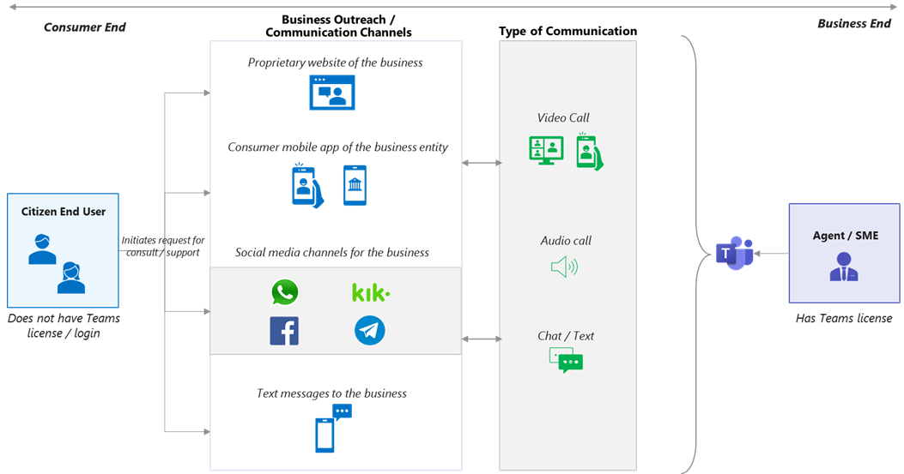
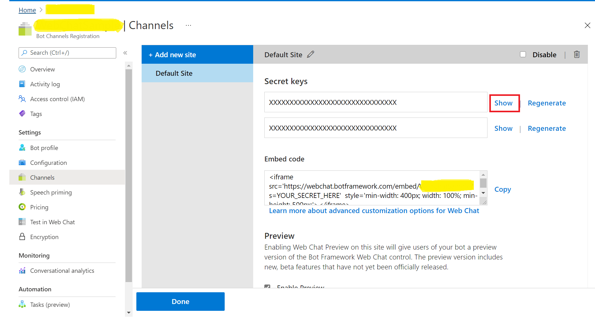
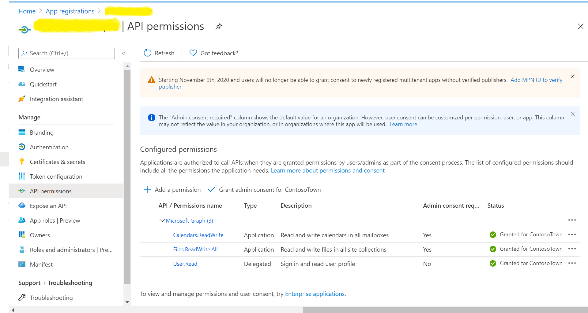
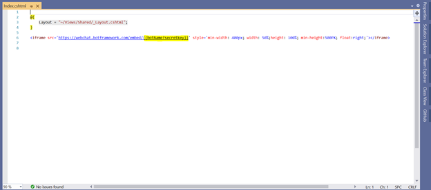
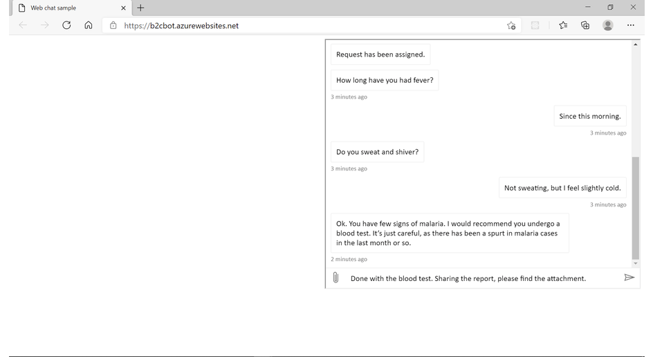
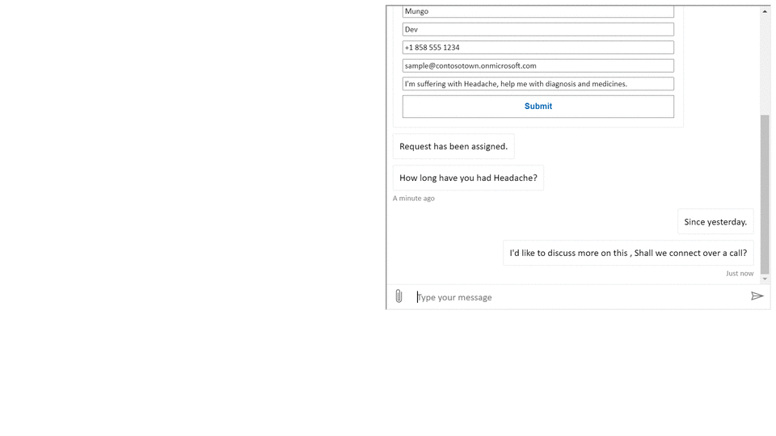

# Business to Citizen Consumer Communication Bot - Sample code.  

## Summary

Business to Citizen Consumer Communication Bot as the name suggests allows citizen end users get in touch with an SME / Support Agent belonging to a business entity to discuss and address an issue. It allows business users with a Teams license on one side, chat with a citizen   consumer who doesn’t have a Teams license / login.  
Samples are generally not production-ready or an out-of-the-box solution but are intended to show developers specific patterns for use in their applications. The functionality is bare bone sample code.   

## Architecture

Note: This sample app demonstrates only the bot interface on a website as the communication channel for citizen user.   
Business Outreach / Communication channels:  The citizen consumer user may use a bot interface on website (as showcased by this sample app) as a communication channel and interact seamlessly, in real time with a user on Teams. If required, the app can also be customized to have a bot inside native mobile app or use any other popular consumer communication channels as a way of reaching out to user on Teams. To configure your bot to connect to any other consumer facing channels refer to the documentation here. 

## Frameworks

## Prerequisites

* [Office 365 tenant](https://developer.microsoft.com/en-us/microsoft-365/dev-program)

* To test locally, you'll need [Ngrok](https://ngrok.com/download) and [Azure Cosmos DB Emulator](https://docs.microsoft.com/en-us/azure/cosmos-db/local-emulator?tabs=cli%2Cssl-netstd21) installed on your development machine. Make sure you've downloaded and installed both on your local machine. ngrok will tunnel requests from the Internet to your local computer and terminate the SSL connection from Teams.

    * ex: `https://subdomain.ngrok.io`.
    
	 NOTE: A free Ngrok plan will generate a new URL every time you run it, which requires you to update your Azure AD registration, the Teams app manifest, and the project configuration. A paid account with a permanent Ngrok URL is recommended.

## Version history

Version|Date|Author|Comments
-------|----|----|--------
1.0|Feb 18, 2021|Abtin Amini  Sathya Raveendran   Saikrishna Neeli   Arun Kumar Anaparthi  |Initial release

## Disclaimer

**THIS CODE IS PROVIDED *AS IS* WITHOUT WARRANTY OF ANY KIND, EITHER EXPRESS OR IMPLIED, INCLUDING ANY IMPLIED WARRANTIES OF FITNESS FOR A PARTICULAR PURPOSE, MERCHANTABILITY, OR NON-INFRINGEMENT.**

---

## Minimal Path to Awesome

Step 1: Setup bot in Service
====================================
1. Create new bot channel registration resource in Azure.

	* Remember the bot handle, you will need it while updating the index.cshtml file.

2. Create New Microsoft App ID and Password.

3. Go to App registrations and create a new app registration in a different tab.
4. Register an application.
	* Fill out name and select third option for supported account type and click "Register".

	* Copy and paste the App Id and Tenant ID somewhere safe. You will need it in a future step.

5. Create Client Secret.
   * Navigate to the "Certificates & secrets" blade and add a client secret by clicking "New Client Secret".

	* Copy and paste the secret somewhere safe. You will need it in a future step.
	
   * Paste the App Id and password in the respective blocks and click on OK.

   * Click on Create on the Bot Channel registration.
   
6. Go to the created resource, navigate to channels and add "Microsoft Teams" and “Web chat” channels.

7. Edit Web chat, click on the show under secret keys section in the right panel.

	* copy the secret, you will need it while updating the index.cshtml file.	

8. Add any necessary API permissions for downstream calls in the App registration.
	* Navigate to "API permissions" blade on the left-hand side.
	* Add following permissions to the application.
		* Application permissions - Calendars.ReadWrite, Files.ReadWrite.All
		* Delegated permissions - User.Read (enabled by default)

Step 2: Run the app locally 
====================================
1. Clone the repository.

  		git clone “https://github.com/pnp/teams-dev-samples.git”

2. If you are using Visual Studio
 	- Launch Visual Studio
 	- File -> Open -> Project/Solution
 	- Navigate to samples/bot-b2c-chat-bot/Source folder.
 	- Select B2CChatBot.csproj file.

3. The Azure Cosmos DB Emulator must be runnning before starting the service. To start the Azure Cosmos DB Emulator on Windows, select the Start button or press the Windows key. Begin typing Azure Cosmos DB Emulator, and select the emulator from the list of applications.When the emulator has started, you'll see an icon in the Windows taskbar notification area. It automatically opens the Azure Cosmos data explorer in your browser at this URL https://localhost:8081/_explorer/index.html URL. Make sure to copy the URI and Primary key values from the data explorer, update the same in the appsettings.json file. Cosmos Database and collection names can be anything of your choice. For more information, see the [Azure Cosmos DB Emulator reference](https://docs.microsoft.com/en-us/azure/cosmos-db/local-emulator?tabs=cli%2Cssl-netstd21) article.

4. Update the index.cshtml and appsettings.json files. 

5. Run Ngrok to expose your local web server via a public URL. Make sure to point it to your Ngrok URI. For example, if you're using port 3333 locally, run:

		Win: ./ngrok http 3333 -host-header=localhost:3333 -subdomain="contoso"
		Mac: /ngrok http 3333 -host-header=localhost:3333 -subdomain="contoso".

6. Update messaging endpoint in the Azure Bots Channel Registration. Open the Bot channel registration, click on Configuration/Settings on the left pane, whichever is available and update the messaging endpoint to the endpoint that bot app will be listening on. Update the ngrok URL in the below format for the messaging endpoint.

		ex: https://<subdomain>.ngrok.io/api/messages.

Step 3: Packaging and installing your app to Teams 
==================================================

Make sure the required values such ap App id, bot ids are populated in the manifest, Zip the manifest with the profile images and install/add it in Teams.

Step 4: Try out the app
==================================================

1: Citizen end users can raise a request to get in touch with an SME / support agent on Teams using bot interface on website. The users are asked to submit basic contact information, query details to aid in triage 

2: Agents may assign the incoming consumer requests to themselves and start chatting with the consumers.   

3. Real time chat between the citizen user and Teams user . The app shows the name of the citizen user on the bot name to add more clarity
 
 

4: The citizen user may also share documents in the chat that will be sent to Teams user and stored in a well-defined directory structure. The app creates a directory for each chat session.

5: If both parties require, they may also get on a call initiated by the Teams user. This is useful in cases where chat is not adequate, and a video / audio communication is required for the scenario.  

6: A single Teams user may chat with more than one citizen user at a time. Each request is posted as a conversation thread allowing Teams user to have multiple parallel conversations.   

## Take it Further

There is multiple real-world scenarios across different industries that can be brought to life with B2C chat forming the back bone of the solution. Following are few scenarios where a B2C chat bot would play crux of the solution.

<table>
<tbody>
<tr>
<td class="col-md-8" style="color:black;" align="center"><b>Industry</b></td>
<td class="col-md-8" style="color:black;" align="center"><b>Scenario Description</b></td>
<td class="col-md-8" style="color:black;" align="center"><b>Citizen end user</b></td>
<td class="col-md-8" style="color:black;" align="center"><b>Business SME</b></td>
</tr>
<tr>
<td>Finance & Banking</td>
<td>A bank’s customer is confused with the ideal policy that will suit his needs and wants to speak to an agent from the bank to go through his options in detail.</td>
<td>High net worth individuals, Banking customers, loan requesters</td>
<td>Relationship managers, Policy Sales Agents
</td>
</tr>
<tr>
<td>Healthcare</td>
<td>A patient would like to speak to a doctor for routine consultation but wants to avoid physical hospital visits and potential exposure to COVID 19 pandemic. </td>
<td>Patient</td>
<td>Doctor</td>
</tr>
<tr>
<td>Retail</td>
<td>An avid shopper likes a cleaning equipment they saw on the store’s website and would like to see video demo from store executive before placing an order</td>
<td>Shopping consumer</td>
<td>Sales Agent, Store FLW </td>
</tr>
<tr>
<td>Insurance</td>
<td>An insurance policy holder has met with an accident and has the damaged vehicle. He gets in touch with insurance firm to show vehicle and ask questions</td>
<td>Insurance policy customers</td>
<td>Insurance agent</td>
</tr>
<tr>
<td>Government</td>
<td>Residents of a city / state can ask questions and get answers from state officials regarding COVID 19 lockdowns, travel and other restrictions</td>
<td>Residents</td>
<td>Government support desk</td>
</tr>
</tbody>
</table>

Communication channels:  The citizen consumer may use a bot interface on website (as showcased by this sample app) as a communication channel and interact seamlessly, in real time with a user on Teams. If required, the app can also be customized to have a bot inside native mobile app or use any other popular consumer communication channels as a way of reaching out to user on Teams. 

