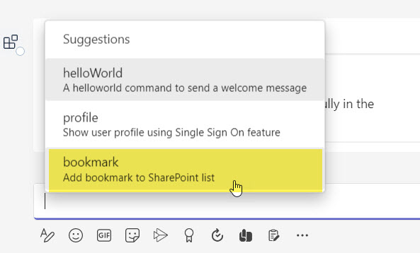
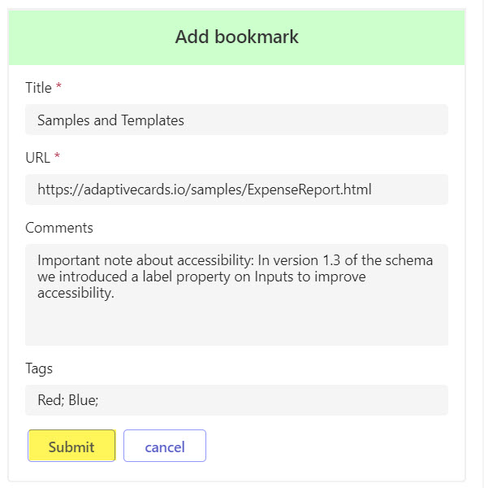
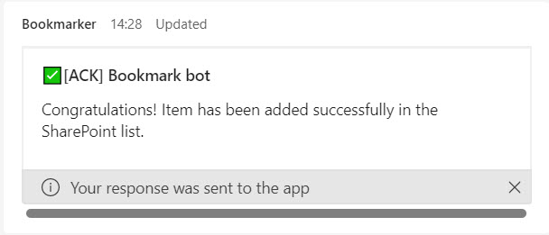
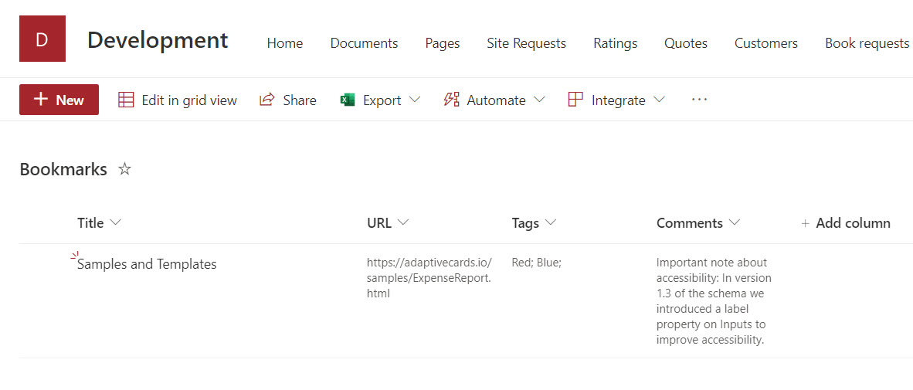

## Summary

This is a sample Bookmark bot for Microsoft Teams. It allows a user in Teams to create bookmark item in the SharePoint list using Microsoft Graph API. It also implements single sign-on authentication.

## Screenshots

## Frameworks

## Prerequisites

1. Set up and install Teams Toolkit for Visual Studio Code v5.0 pre-release version (4.99.2023041408) [How to install Teams Toolkit v5.0 pre-release](https://learn.microsoft.com/en-us/microsoftteams/platform/toolkit/install-teams-toolkit?tabs=vscode&pivots=visual-studio-code#install-a-pre-release-version).

2. [Node.js](https://nodejs.org/), supported versions: 14, 16, 18

3. An [Microsoft 365 account for development](https://docs.microsoft.com/microsoftteams/platform/toolkit/accounts)

## Version history

Version|Date|Author|Comments
-------|----|----|--------
1.0|May 16, 2023|Ejaz Hussain|Initial release

## Disclaimer

**THIS CODE IS PROVIDED _AS IS_ WITHOUT WARRANTY OF ANY KIND, EITHER EXPRESS OR IMPLIED, INCLUDING ANY IMPLIED WARRANTIES OF FITNESS FOR A PARTICULAR PURPOSE, MERCHANTABILITY, OR NON-INFRINGEMENT.**

---

## Minimal Path to Awesome

### Create SharePoint List

>Create SharePoint list called **Bookmarks**

 | Column name | Column type            |
|-------------|------------------------|
| Title       | Single line of text    |
| URL         | Single line of text    |
| Tags        | Multiple lines of text |
| Comments    | Multiple lines of text |

### Get SharePoint site Id and list Id using Microsoft Graph API

1. To get SharePoint site Id, use the below. Replace <mark>hostname</mark> and <mark>sitename</mark> with your hostname and sitename.

>https://graph.microsoft.com/v1.0/sites/`{hostname}`.sharepoint.com:/sites/`{sitename}`

2. To get the List ID, you can use the following query

>https://graph.microsoft.com/v1.0/sites/`{site-id}`/lists/`{list-title}`

3. Update SP_SITE_ID and SP_LIST_ID parameters in your ***.env.local*** file

### Debug application

1. First, select the Teams Toolkit icon on the left in the VS Code toolbar.
2. In the Account section, sign in with your [Microsoft 365 account](https://docs.microsoft.com/microsoftteams/platform/toolkit/accounts) if you haven't already.
3. Press F5 to start debugging which launches your app in Teams using a web browser. Select `Debug (Edge)` or `Debug (Chrome)`.
4. When Teams launches in the browser, select the Add button in the dialog to install your app to Teams.
5. Type or select `bookmark` or  `profile` in the chat to send it to your bot

