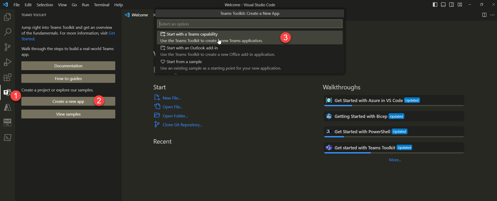
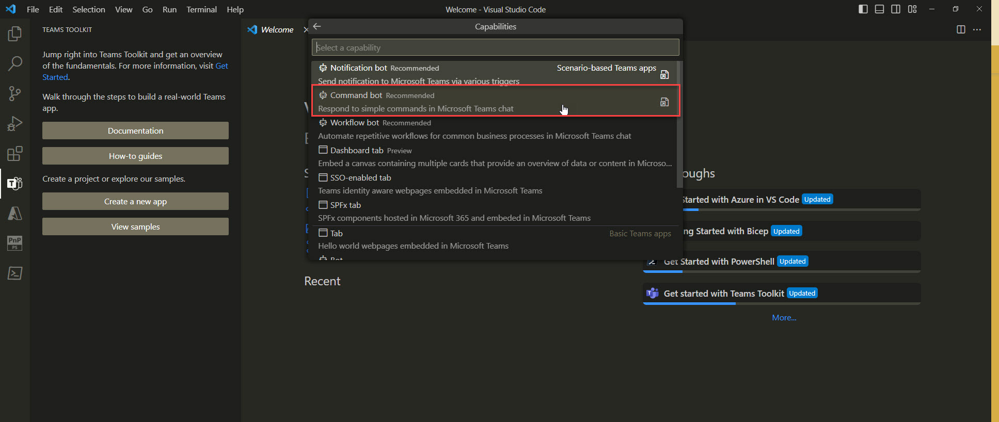
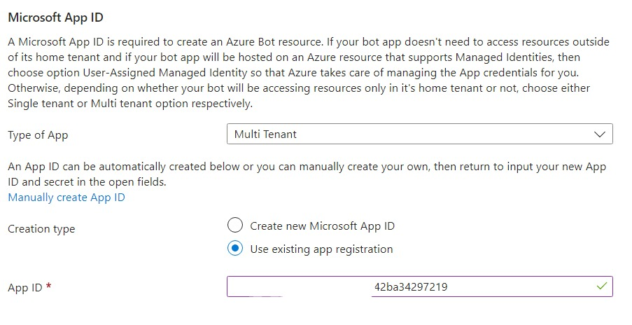
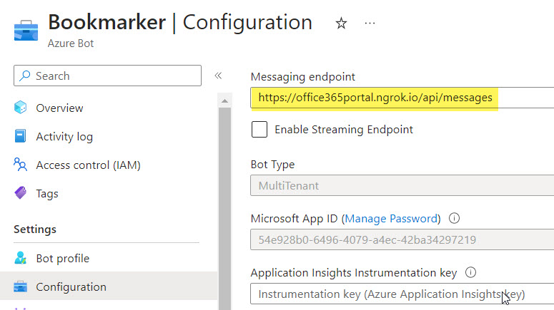
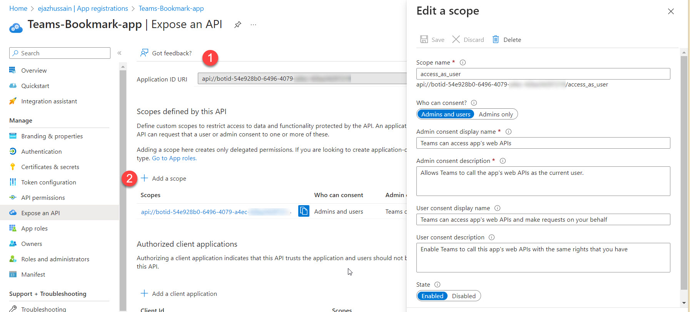
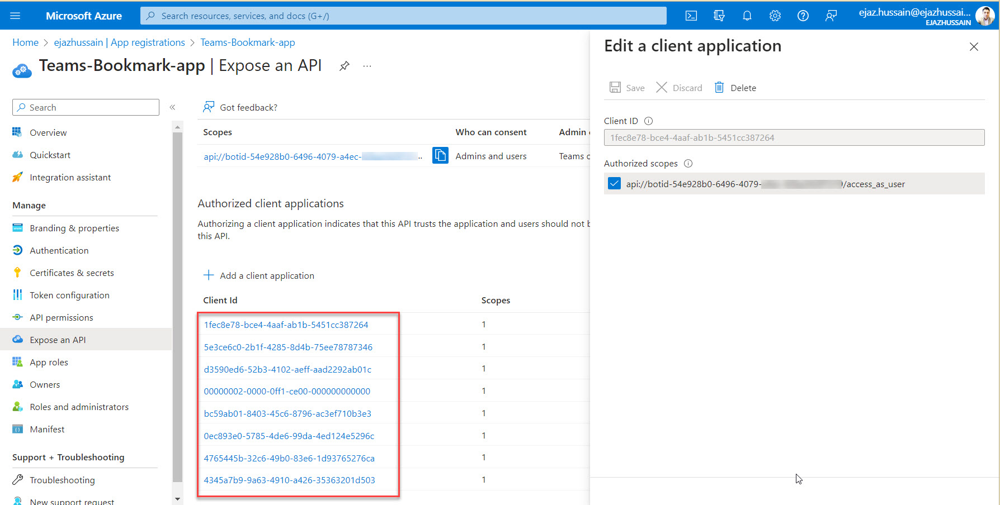
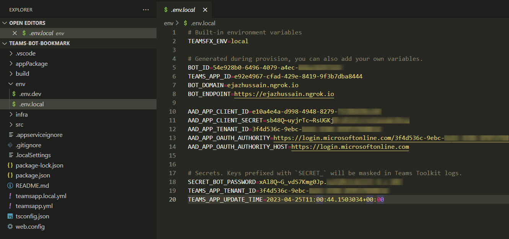
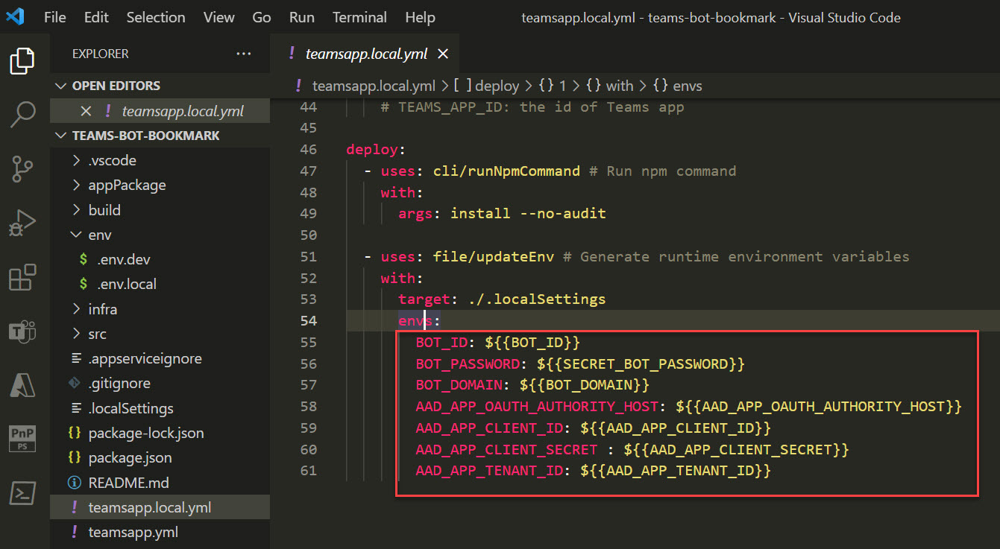

# Teams OpenAI Conversation Bot

## Summary

This is a sample Bookmark bot for Microsoft Teams. It allows a user in Teams to create bookmark item in the SharePoint list using Microsoft Graph API. It also implements single sign-on authentication.

## Screenshots


## Frameworks


## Prerequisites

> For detail steps: follow the blog post [Building bookmark bot using Teams Toolkit with SSO authentication](https://www.office365clinic.com/2023/04/22/build-sso-bot-using-teams-toolkit/)

* Create a command bot app using [Teams Toolkit v5.0 pre-release](https://learn.microsoft.com/en-us/microsoftteams/platform/toolkit/install-teams-toolkit?tabs=vscode&pivots=visual-studio-code#install-a-pre-release-version)


## Version history

Version|Date|Author|Comments
-------|----|----|--------
1.0|April 4, 2023|Ejaz Hussain|Initial release

## Disclaimer

**THIS CODE IS PROVIDED _AS IS_ WITHOUT WARRANTY OF ANY KIND, EITHER EXPRESS OR IMPLIED, INCLUDING ANY IMPLIED WARRANTIES OF FITNESS FOR A PARTICULAR PURPOSE, MERCHANTABILITY, OR NON-INFRINGEMENT.**

---

## Minimal Path to Awesome

### Create command bot app

<details>
<summary>Steps: Create command bot app</summary>

1. Open Visual Studio Code.

2. On the sidebar, select the Microsoft Teams icon to open the TEAMS TOOLKIT panel.

3. On the TEAMS TOOLKIT panel, select the Create a new app button.

4. On the Teams Toolkit: Create a new Teams app menu, and select Create a new Teams app.



5. On the Capabilities menu, select the command bot app template.



</details>

### Register an Azure AD app for a bot
<details>
<summary>Steps: Register an Azure AD app for bot</summary>

To register an Azure AD app for your bot, you need to follow these steps:

1. Go to the Azure portal and sign in with your Microsoft account.
2. Click on Azure Active Directory and then on App registrations.
3. Click on New registration and enter a name for your app. Select Accounts in any organizational directory (Any Azure AD directory - Multitenant) as the supported account type.
4. Under Redirect URI, select Web and enter https://token.botframework.com/.auth/web/redirect as the URI.
5. Click on Register to create your app registration.
6. Copy the Application (client) ID and Directory (tenant) ID from the Overview page. You will need them later.
7. Click on Certificates & secrets and then on New client secret. Enter a description and an expiration date for your secret and click on Add.
8. Copy the value of the client secret and save it somewhere secure. You will need it later. 
9. Go back to Visual Studio Code and open the .env file in your project folder.
10. Paste the Application (client) ID, client secret values you copied earlier as the values for the <mark>BOT_ID</mark>, <mark>SECRET_BOT_PASSWORD</mark> respectively. 

You have successfully registered an Azure AD app for your Microsoft Teams bot.
</details>

### Create an Azure Bot resource
<details>
<summary>Steps-Create an Azure Bot resource</summary>

To create an Azure Bot resource, you need to follow these steps:

1. Go to the Azure portal.
2. In the right pane, select Create a resource.
3. In the search box enter bot, then press Enter.
4. Select the Azure Bot card.
5. Select Create
6. Provide information under Project details.
7. Provide information under Microsoft App ID. Use the existing app registration option and provide the ClientID created in the previous step.

8. Select Review + create
9. If the validation passes, select Create.
10. Navigate to the Azure Bot resource and update the messaging endpoint. In my case, I am using the custom hostname provided by the [Ngrok](https://ngrok.com/). 


11. In the left pane, select Channels under Settings. Add the Microsoft Teams channel to your bot.
</details>

### Register an Azure Ad app for single sign-on and Graph API

<details>
<summary>Steps-Register an Azure Ad app for single sign-on and Graph API</summary>

To register an Azure AD app for single sign-on and Graph API, you can follow these steps:

1. Sign in to the Azure portal and select your Azure Active Directory tenant.
2. Select **App registrations** and then select **New registration**.
3. Enter a name for your app, and select the **Supported account types**.
4. Select **Register** to create your app.
5. In the app's registration page, select **Authentication** under **Manage**.
6. In the **Authentication** page, select **Add a platform** and then select **Web**.
7. Enter a redirect URI (https://office365portal.ngrok.io/auth-end.html) for your web application and then select **Configure**.
9. In the app's registration page, select **API permissions** under **Manage**.
10. Select **Add a permission**, then select **Microsoft Graph**, then select **Delegated permissions**, and then select the permissions you want to grant to your app. In my scenario, I need **Sites.ReadWrite.All** graph API permissions.
11. Select **Add permissions** to add the selected permissions to your app.
12. Add **Application ID URI** and Add a scope as below. <mark>**Please note:** Application ID URI using clientID from the Azure Ad app associated with BOT</mark>

     

13. Add **client applications** as below

    


You can find more detailed information about this process in [Microsoft's documentation](https://docs.microsoft.com/en-us/azure/active-directory/develop/quickstart-register-app).

</details>

### Update environment variables in the bot solution

<details>
<summary>Steps-Update environment variables in bot solution</summary>

1. Navigate to your environment file and update the variables below


2. Navigate to the **teamsapp.local.yml** file and expose the following environmental variables
  

</details>

### Configure Ngrok

<details>
<summary>Steps-Configure Ngrok</summary>

A Teams Toolkit generated project has pre-defined a set of VS Code tasks in its **.vscode/tasks.json**. These tasks are for debugging and have corresponding arguments as inputs.

### Update start local tunnel task

1. Navigate to **.vscode/tasks.json** file and update the start local tunnel task with the below Ngrok configurations
  ``` JSON

        {
              // Start the local tunnel service to forward the public ngrok URL to local port and inspect traffic.
              // See https://aka.ms/teamsfx-tasks/local-tunnel for the detailed args definitions,
              // as well as samples to:
              //   - use your own ngrok command / configuration / binary
              //   - use your own tunnel solution
              //   - provide alternatives if ngrok does not work on your dev machine
              "label": "Start local tunnel",
              "type": "teamsfx",
              "command": "debug-start-local-tunnel",
              "args": {                
                  "ngrokArgs": "http 3978 --host-header=rewrite --hostname=office365portal.ngrok.io --log=stdout --log-format=logfmt",
                  "env": "local",                
                  "ngrokPath": "C:/Tools/ngrok/ngrok.exe",                
                  "output": {
                      // output to .env.local
                      "endpoint": "BOT_ENDPOINT", // output tunnel endpoint as BOT_ENDPOINT
                      "domain": "BOT_DOMAIN" // output tunnel domain as BOT_DOMAIN
                  }
              },
              "isBackground": true,
              "problemMatcher": "$teamsfx-local-tunnel-watch"
          }

  ```

</details>

