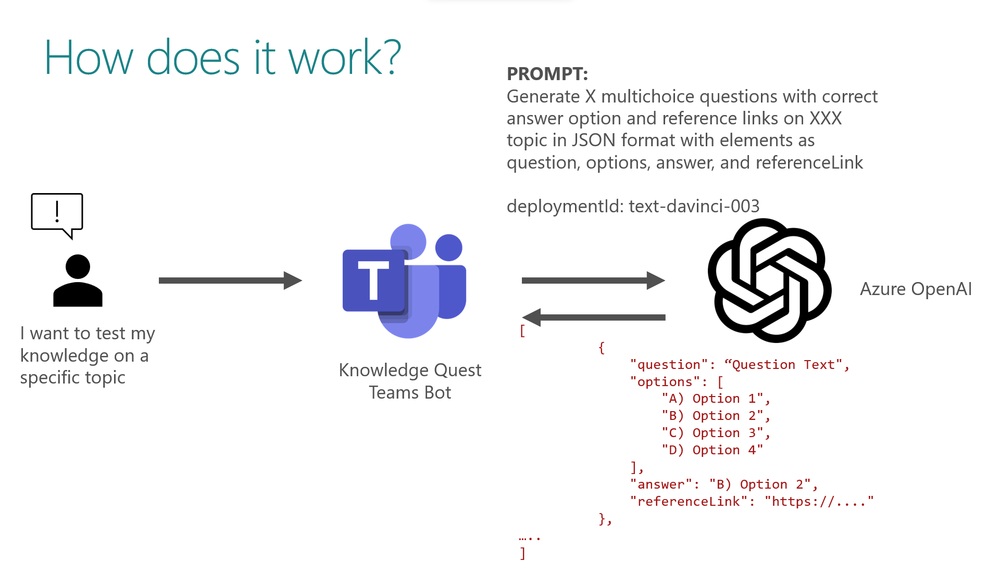

# Knowledge Quest Teams Bot

## Summary

The Knowledge Quest Teams Bot is an interactive Chat Bot application designed to allow users to test their knowledge on specific topics using the power of OpenAI. The app provides an engaging and educational experience where users can challenge themselves and expand their knowledge in various areas.

> This solution is awarded as the [Best AI-powered solution](https://devblogs.microsoft.com/microsoft365dev/announcing-the-hacktogether-microsoft-teams-global-hack-winners/) during Microsoft Teams Global Hack 2023.


The picture below shows how it works:



## Frameworks


## Prerequisites

* Set up and install [Teams Toolkit for Visual Studio Code](https://learn.microsoft.com/en-us/microsoftteams/platform/toolkit/install-teams-toolkit?tabs=vscode).

* [Node.js](https://nodejs.org/), supported versions: 16, 18

* A [Microsoft 365 account for development](https://learn.microsoft.com/microsoftteams/platform/toolkit/tools-prerequisites#accounts-to-build-your-teams-app)


## Version history

Version|Date|Authors|Comments
-------|----|----|--------
1.0|July 10, 2023|[Kunj Sangani](https://github.com/kunj-sangani), [Nanddeep Nachan](https://github.com/nanddeepn), [Siddharth Vaghasia](https://github.com/siddharth-vaghasia), [Smita Nachan](https://github.com/SmitaNachan)|Initial release

## Disclaimer

**THIS CODE IS PROVIDED *AS IS* WITHOUT WARRANTY OF ANY KIND, EITHER EXPRESS OR IMPLIED, INCLUDING ANY IMPLIED WARRANTIES OF FITNESS FOR A PARTICULAR PURPOSE, MERCHANTABILITY, OR NON-INFRINGEMENT.**

---

## Minimal Path to Awesome

_Include consise instructions to set up and run the sample. These are just an example!_

* Clone this repository
* Install OpenAI npm package.

  ```
  npm install @azure/openai
  ```

* Set the OpenAI API key/

  ```
  $env:OPENAI_KEY='<OPENAI-KEY>'
  ```

* Run your application the first time.

## Debug

- From Visual Studio Code: Start debugging the project by hitting the `F5` key in Visual Studio Code.
- Alternatively use the `Run and Debug Activity Panel` in Visual Studio Code and click the `Run and Debug` green arrow button.
- From TeamsFx CLI:
  - Install [ngrok](https://ngrok.com/download) and start your local tunnel service by running the command `ngrok http 3978`.
  - In the `env/.env.local` file, fill in the values for `BOT_DOMAIN` and `BOT_ENDPOINT` with your ngrok URL.
    ```
    BOT_DOMAIN=sample-id.ngrok.io
    BOT_ENDPOINT=https://sample-id.ngrok.io
    ```
  - Executing the command `teamsfx provision --env local` in your project directory.
  - Executing the command `teamsfx deploy --env local` in your project directory.
  - Executing the command `teamsfx preview --env local` in your project directory.

## Edit the manifest

You can find the Teams app manifest in `./appPackage` folder. The folder contains one manifest file:
* `manifest.json`: Manifest file for Teams app running locally or running remotely (After deployed to Azure).

This file contains template arguments with `${{...}}` statements which will be replaced at build time. You may add any extra properties or permissions you require to this file. See the [schema reference](https://docs.microsoft.com/en-us/microsoftteams/platform/resources/schema/manifest-schema) for more information.

## Deploy to Azure

Deploy your project to Azure by following these steps:

| From Visual Studio Code                                                                                                                                                                                                                                                                                                                                                  | From TeamsFx CLI                                                                                                                                                                                                                    |
| :----------------------------------------------------------------------------------------------------------------------------------------------------------------------------------------------------------------------------------------------------------------------------------------------------------------------------------------------------------------------- | :---------------------------------------------------------------------------------------------------------------------------------------------------------------------------------------------------------------------------------- |
| <ul><li>Open Teams Toolkit, and sign into Azure by clicking the `Sign in to Azure` under the `ACCOUNTS` section from sidebar.</li> <li>After you signed in, select a subscription under your account.</li><li>Open the Teams Toolkit and click `Provision` from DEPLOYMENT section or open the command palette and select: `Teams: Provision`.</li><li>Open the Teams Toolkit and click `Deploy` or open the command palette and select: `Teams: Deploy`.</li></ul> | <ul> <li>Run command `teamsfx account login azure`.</li> <li>Run command `teamsfx provision --env dev`.</li> <li>Run command: `teamsfx deploy --env dev`. </li></ul> |

> Note: Provisioning and deployment may incur charges to your Azure Subscription.

## Preview

Once the provisioning and deployment steps are finished, you can preview your app:

- From Visual Studio Code

  1. Open the `Run and Debug Activity Panel`.
  1. Select `Launch Remote (Edge)` or `Launch Remote (Chrome)` from the launch configuration drop-down.
  1. Press the Play (green arrow) button to launch your app - now running remotely from Azure.

- From TeamsFx CLI: execute `teamsfx preview --env dev` in your project directory to launch your application.

## Validate manifest file

To check that your manifest file is valid:

- From Visual Studio Code: open the command palette and select: `Teams: Validate Application`.
- From TeamsFx CLI: run command `teamsfx validate` in your project directory.

## Package

- From Visual Studio Code: open the Teams Toolkit and click `Zip Teams App Package` or open the command palette and select `Teams: Zip Teams App Package`.
- Alternatively, from the command line run `teamsfx package` in the project directory.

## Publish to Teams

Once deployed, you may want to distribute your application to your organization's internal app store in Teams. Your app will be submitted for admin approval.

- From Visual Studio Code: open the Teams Toolkit and click `Publish` or open the command palette and select: `Teams: Publish`.
- From TeamsFx CLI: run command `teamsfx publish` in your project directory.

## Features

* Topic Selection: Users can choose from a wide range of topics available within the app. These topics can include subjects like technology(Azure, SharePoint, Teams, .NET, AWS etc.) it can also generate Questions on science, history, geography, literature, mathematics, and more.

* Dynamic Question Generation: The bot leverages the capabilities of OpenAI to generate relevant and challenging questions based on the selected topic. The questions are designed to test the user's understanding and depth of knowledge in the chosen subject.

* Interactive Quiz Experience: Users engage in an interactive quiz session where they receive questions one at a time from the bot. They can provide their answers, and the bot evaluates them to determine correctness at the end.

* User-Friendly Interface: The app provides a user-friendly and intuitive interface via Adaptive Cards, ensuring a seamless and enjoyable user experience. The interface is designed to be visually appealing and easy to navigate, allowing users to focus on the quiz content.

* My Stats: The app also offers statistics regarding the quizzes you have taken in the past, including your scores. This feature provides valuable insights into your knowledge and learning progress based on your previous quiz performances. It's an excellent tool to assess how well you're doing and track your growth over time.


