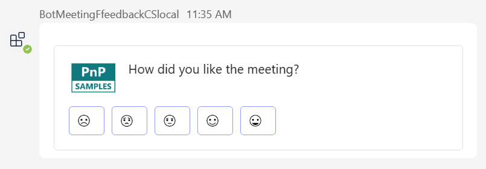
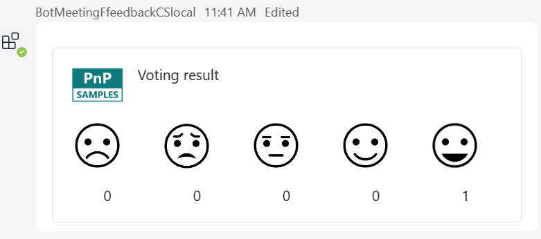
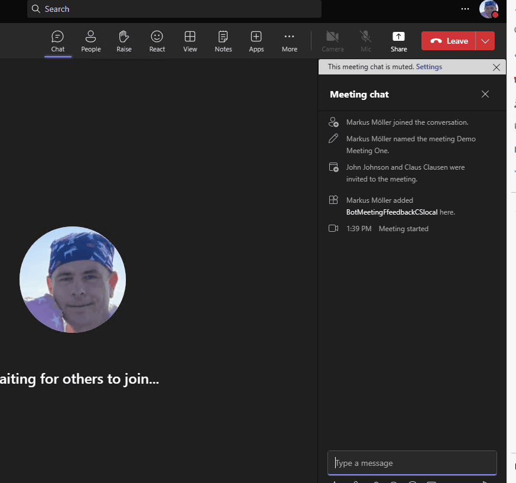

# bot meeting lifecycle feedback - Microsoft Teams App
Teams meeting bot app handling lifecycle events by requesting feedback from the user

## Summary
This sample is a Teams Bot meeting app  created using the Teams Toolkit with Visual Studio 2022. It acts on the real end date (not the scheduled ones) and posts an adaptive card requesting user feedback to the meeting's chat once each event is fired.
Once voted each (already voted) user sees the overall feedback result from all participating users.
App result:

|Meeting ended - Feedback request posted|
:-------------------------:


|Feedback given - Refreshed card shows result|
:-------------------------:


|App in action - Feedback roundtrip|
:-------------------------:


For further details see the author's [blog post](https://mmsharepoint.wordpress.com//01/02/meeting-feedback-with-microsoft-teams-meeting-app-and-teams-toolkit-for-visual-studio-c/)

## Applies to

This sample was created [using the Teams Toolkit with Visual Studio 2022](https://learn.microsoft.com/en-us/microsoftteams/platform/toolkit/teams-toolkit-fundamentals?pivots=visual-studio&WT.mc_id=M365-MVP-5004617). Nearly the same sample was also realized with the [Yeoman Generator for Teams](https://github.com/pnp/generator-teams) and can be found [here](https://github.com/pnp/teams-dev-samples/samples/bot-meeting-lifecycle-feedback).).

## Frameworks


## Prerequisites

* [Office 365 tenant](https://dev.office.com/sharepoint/docs/spfx/set-up-your-development-environment)

## Version history

Version|Date|Author|Comments
-------|----|--------|--------
1.0|January 02, 2024|[Markus Moeller](http://www.twitter.com/moeller2_0)|Initial release

## Disclaimer

**THIS CODE IS PROVIDED *AS IS* WITHOUT WARRANTY OF ANY KIND, EITHER EXPRESS OR IMPLIED, INCLUDING ANY IMPLIED WARRANTIES OF FITNESS FOR A PARTICULAR PURPOSE, MERCHANTABILITY, OR NON-INFRINGEMENT.**

---
## Minimal Path to Awesome
- Clone the repository
    ```bash
    git clone https://github.com/pnp/teams-dev-samples.git
- Open /samples/bot-meeting-lifecycle-feedback-csharp/bot-meeting-lifecycle-feedback-csharp.sln in Visual Studio 2022
- Perform first actions in GettingStarted.txt (before hitting F5)
- Now you should have prepared your app (will try local first)
- In your Teams calendar have a "real" meeting prepared ("real" means with at least +1 real partcipant)
- When starting debug by F5 or "Microsoft Teams (browser)"
  - Âdd the app to that meeting (eventually search for it)
  - Join the meeting to start it
  - Leave and end the meeting


## Features
* Teams Toolkit for Visual Studio 2022 Bot Development 
* [Bot Meeting Lifecycle methods](https://learn.microsoft.com/en-us/microsoftteams/platform/apps-in-teams-meetings/meeting-apps-apis?tabs=channel-meeting%2Cguest-user%2Cone-on-one-call%2Cdotnet%2Cparticipant-join-event%2Cparticipant-join-event1#receive-real-time-teams-meeting-events&WT.mc_id=M365-MVP-5004617)
* [Post an adaptive card](https://adaptivecards.io/)
* Using the [Adaptive Cards Universal Action Model](https://learn.microsoft.com/en-us/adaptive-cards/authoring-cards/universal-action-model?WT.mc_id=M365-MVP-5004617)
* Considerations on [Dev tunnels in Visual Studio 2022](https://learn.microsoft.com/en-us/aspnet/core/test/dev-tunnels?WT.mc_id=M365-MVP-5004617)


