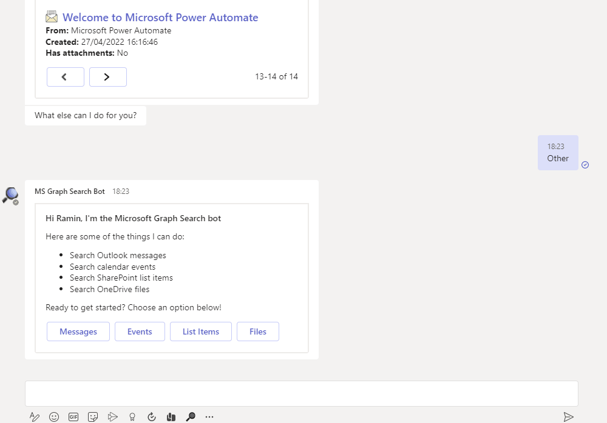
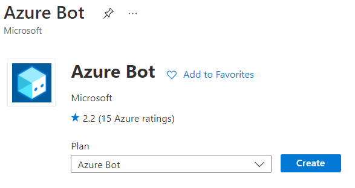
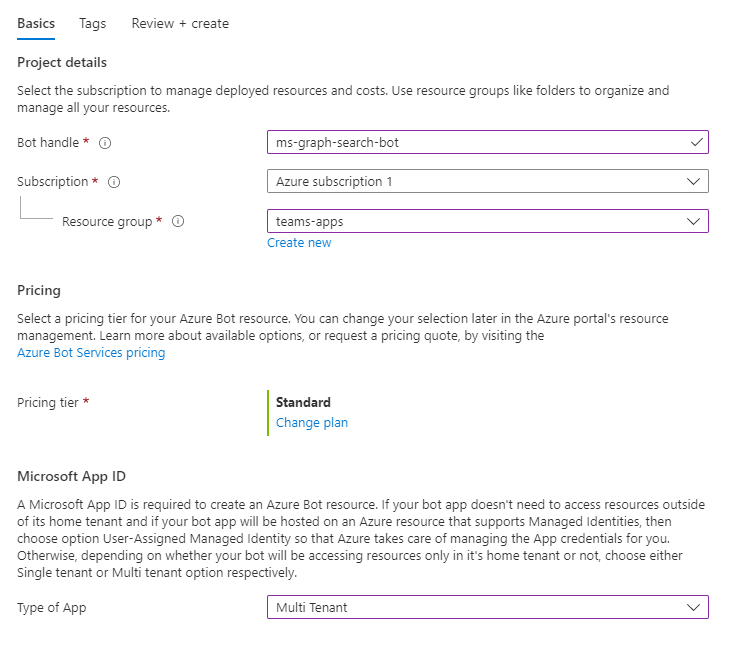
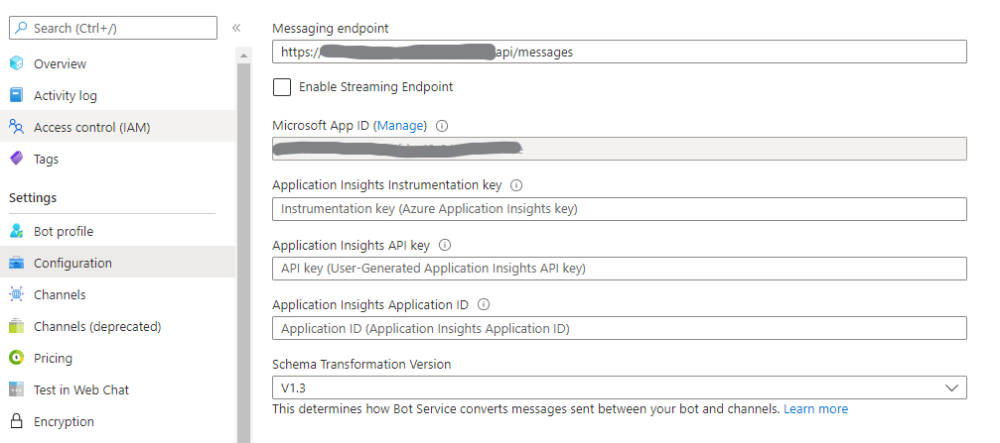
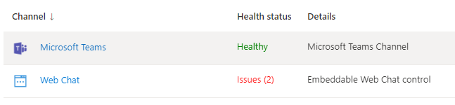
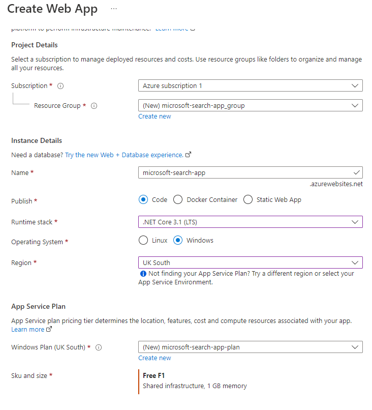

# Microsoft Graph Search API Bot

Using this C# sample, a bot can retreive different entities such as messages, events, files, and SharePoint list items using Microsoft Graph Search API, and display the resutls in adaptive cards with paging capability.



## Summary

This bot has been created using [Bot Framework](https://dev.botframework.com/), it shows how to use Microsoft Search API to search through the Office 365 entities, and how to implement pagination on Adaptive Cards.

Some of the bot's features:

* Search different office 365 entities


* Split the results into configurable pages (Adaptive Cards with pagination):


* Messaging extension


## Frameworks


## Prerequisites

* [Office 365 tenant](https://developer.microsoft.com/en-us/microsoft-365/dev-program)
* Microsoft Teams is installed and you have an account.
* [.NET Core SDK](https://dotnet.microsoft.com/download) version 3.1

  ```bash
  # determine dotnet version
  dotnet --version
  ```
  
* To test locally, you'll need [Ngrok](https://ngrok.com/download) or equivalent tunnelling solution.
Make sure you've downloaded and installed the ngrok on your local machine. ngrok will tunnel requests from the Internet to your local computer and terminate the SSL connection from Teams.

    * ex: `https://subdomain.ngrok.io`.
    
	 NOTE: A free Ngrok plan will generate a new URL every time you run it, which requires you to update your Azure AD registration, the Teams app manifest, and the project configuration. A paid account with a permanent Ngrok URL is recommended.

## Solution

Solution|Author(s)
--------|---------
bot-microsoft-search-api | [Ramin Ahmadi](https://ramin.expert)

## Version history

Version|Date|Comments
-------|----|--------
1.0|May 5, 2022|Initial release

## Disclaimer

**THIS CODE IS PROVIDED *AS IS* WITHOUT WARRANTY OF ANY KIND, EITHER EXPRESS OR IMPLIED, INCLUDING ANY IMPLIED WARRANTIES OF FITNESS FOR A PARTICULAR PURPOSE, MERCHANTABILITY, OR NON-INFRINGEMENT.**

---

## Minimal Path to Awesome


### Step 1: Setup bot in Service
1. In the [Azure portal](https://portal.azure.com), start by creating new `Azure Bot` resource.

  

2. In the Azure Bot creation wizard, 
    - Specify the Bot handle. 
    - Select existing or create a new resource group. 
    - Choose the Pricing tier.
    - Choose to create New Microsoft App ID.



3. Navigate to `Configuration` and note down the `Microsoft App ID` for the future reference.

  

4. Also, note down the location of `Messaging endpoint` which needs to be updated in Step 3 (A) or (B).
5. Click `Manage` link next to the `Microsoft App ID`.
6. Under `Certificates & secrets`, select `+ New client secret` to generate a new client secret.
7. Note down the client secret value for the future reference.

8. Navigate to `Channels` and add `Microsoft Teams` channel.

  

9. [Setup SSO](https://github.com/OfficeDev/Microsoft-Teams-Samples/blob/main/samples/bot-conversation-sso-quickstart/BotSSOSetup.md)

### Step 2: Update configuration
1. **Edit** the `manifest.json` contained in the `Manifest` folder for below changes: 
  - Replace your `Microsoft App Id` (from step 1.3) *everywhere* you see the place holder string `<<YOUR-MICROSOFT-APP-ID>>` (depending on the scenario the Microsoft App Id may occur multiple times in the `manifest.json`). 
  - Replace the occurances of `<<YOUR-Site-URL>>` with web site where you have hosted the solution. It could be an Azure web site or Ngrok URI.
2. Modify the `appsettings.json` and fill in the following details:
   - `{{MicrosoftAppId}}` - Generated from Step 1 is the application app id
   - `{{MicrosoftAppPassword}}` - Generated from Step 1, also referred to as Client secret
   - `{{MicrosoftAppTenantId}}` - Your tenant id
   - `{{ConnectionName}}` - Generated from SSO setup
   - `{{SearchPageSize}}` - Number of items in each page (default is 4)
   - `{{SearchSizeThreshold}}` - Threshold to get next set of results (default is 20)
3. **Zip** up the contents of the `Manifest` folder to create a `manifest.zip`
4. **Upload** the `manifest.zip` to Teams (in the Apps view click `Upload a custom app`).

### Step 3 (A): Run and debug the app locally using Ngrok 
1. Run the bot from a terminal or from Visual Studio:

    A) From a terminal, navigate to `bot-teams-incidentmanagement` folder.

    ```bash
    # run the bot
    dotnet run
    ```

    B) Or from Visual Studio

    - Launch Visual Studio.
    - File -> Open -> Project/Solution.
    - Navigate to `bot-teams-incidentmanagement\IncidentManagement` folder.
    - Select `IncidentManagement.csproj` file.
    - Press `F5` to run the project.

2. Update the `appsettings.json` file. 

    - "MicrosoftAppId: `<<Your Microsoft Bot_Id>>`
    - "MicrosoftAppPassword": `<<Your Microsoft Bot_Secret>>`
    - "ImageBasePath": `<<Path where images are stored>>`

3. Press `F5` to run the project in the Visual studio.

4. Run `Ngrok` to expose your local web server via a public URL. Make sure to point it to your Ngrok URI. For example, if you're using port 3978 locally, run:

		ngrok.exe http 3978 -host-header=localhost:3978

5. Update `Messaging endpoint` to a place specified in `step 1.4`, to the endpoint that bot app will be listening on. Update the ngrok URL in the below format for the messaging endpoint.

		ex: https://<subdomain>.ngrok.io/api/messages

### Step 3 (B): Deploy to Azure Web App
1. In the [Azure portal](https://portal.azure.com), create new `Web App` resource.
    - Select `Runtime stack` as `.NET Core 3.1 (LTS)`.

  

2. Publish the code to above created Azure web app by downloading the publishing profile or using the Deployment Center.

3. Update `Messaging endpoint` to a place specified in `step 1.4`, to the endpoint that bot app will be listening on. Update the Azure Web App URL in the below format for the messaging endpoint.

    ```
    ex: https://YOURWEBAPPNAME.azurewebsites.net/api/messages
    ```
---

## References

Below are the references used while developing this sample:

- [Adaptive Cards](https://adaptivecards.io/)
- [Microsoft Search API Overview](https://docs.microsoft.com/en-us/graph/search-concept-overview)
- [Search Messages](https://docs.microsoft.com/en-us/graph/search-concept-messages)
- [Search Events](https://docs.microsoft.com/en-us/graph/search-concept-events)
- [Search content in OneDrive and SharePoint ](https://docs.microsoft.com/en-us/graph/search-concept-files)