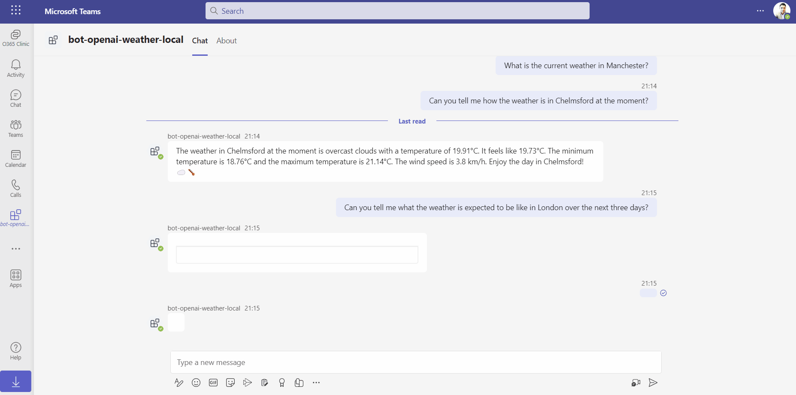

# Teams OpenAI Weather Bot

## Summary

- This sample is a bot for Microsoft Teams that provides information about current weather as well as daily forecast weather for given city.
- The information is based on the response from [OpenWeather API](https://openweathermap.org/) API.
- The information exchanged between the user and the bot is in natural language.
- The bot uses [OpenAI's function calling feature](https://openai.com/blog/function-calling-and-other-api-updates) to understand whether a function in the code needs to be called based on user's query.
- The bot calls OpenAI API which transforms the JSON reponse from [OpenWeather API](https://openweathermap.org/) to natural language.



## Further details

- This sample shows how use [OpenAI's function calling feature](https://openai.com/blog/function-calling-and-other-api-updates). A Teams bot is used to show this feature in action.
- The bot sends the user's message to [OpenAI API](https://platform.openai.com/docs/api-reference).
- Based on user's message, OpenAI determines whether a function (in our code) needs to be called.
- If so, based on the response from OpenAI, the bot calls the function (in our code i.e. a typescript function in this sample) - which in turn uses [OpenWeather API](https://openweathermap.org/) to get the weather information about the given city.
- The result of the function (raw JSON) is then sent back to OpenAI. OpenAI then uses the result to generate a response based on user's message/query.
- That response is then formatted as an adaptive card and sent back to the user.

## Frameworks


## Prerequisites

- Create [OpenAI account](https://beta.openai.com/) and get API key
- Creat OpenWeather API account and get API key
  - For this project, we are using the free subscription of [OpenWeather API](https://openweathermap.org/). Go to [this link](https://home.openweathermap.org/users/sign_up) and sign up for an account to get the free API key.
- [Office 365 tenant](https://dev.office.com/sharepoint/docs/spfx/set-up-your-development-environment)
- [Node.js](https://nodejs.org) version 16 or higher

  ```bash
  # determine node version
  node --version
  ```

- [Teams Toolkit Visual Studio Code Extension](https://aka.ms/teams-toolkit) version 5.0.0 and higher or [TeamsFx CLI](https://aka.ms/teamsfx-cli)

## Version history

| Version | Date          | Author       | Comments        |
| ------- | ------------- | ------------ | --------------- |
| 1.0     | July 09, 2023 | Ejaz Hussain | Initial release |

## Credits

1. Credit goes to [Anoop T](https://twitter.com/anooptells) for creating bot-openai-tf sample [Teams bot sample](https://github.com/pnp/teams-dev-samples/tree/main/samples/bot-openai-tfl-status) that demonstrates OpenAI function calling feature.

## Disclaimer

**THIS CODE IS PROVIDED _AS IS_ WITHOUT WARRANTY OF ANY KIND, EITHER EXPRESS OR IMPLIED, INCLUDING ANY IMPLIED WARRANTIES OF FITNESS FOR A PARTICULAR PURPOSE, MERCHANTABILITY, OR NON-INFRINGEMENT.**

---

## Minimal Path to Awesome

## Run the app locally

- Update the following two parameters in the **env.local** file under **env** folder

```JSON
OPENAI_API_KEY=""
WEATHER_API_KEY=""
```

- Install server side packages

```sh
npm install
```

- From VS Code:
    1. hit `F5` to start debugging. Alternatively open the `Run and Debug Activity` Panel and select `Debug (Edge)` or `Debug (Chrome)`.    
- Once the weather bot is up and running, Ask the bot about the weather in any city. See below some sample questions

  1.  Can you tell me how the weather is in Chelmsford at the moment?
  2.  Can you tell me what the weather is expected to be like in London over the next three days?
  3. Can you tell me what the weather is expected to be like in London over the next five days?

