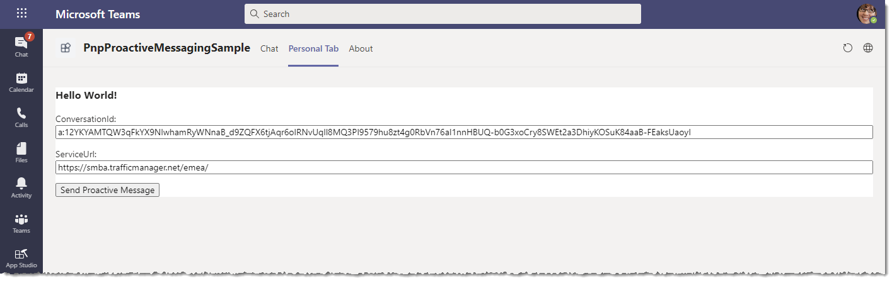
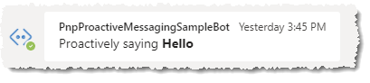

# Teams Proactive Bot Messaging Sample

## Summary

Bot interaction typically starts with the user messaging the Bot, with the Bot then processing the message and replying. At times, however, we want the Bot to *start* the conversation, something known as [Pro-active messaging](https://docs.microsoft.com/en-us/microsoftteams/platform/bots/how-to/conversations/send-proactive-messages?tabs=dotnet). More on this topic can be found in the *Further Reading* section at the bottom of this document. 

The purpose of this particular sample is to show (a) how to gather the minimum information required to send a proactive messaging, and then (b) to show how to do the actual sending. The sample consists of three aspects:

1. A Bot that captures the required conversation properties (this sample contains both a .NET and a Node.js version of this Bot)
2. A Tab that acts as a basic user interface to call the backend API, to send the actual Proactive message
3. A backend API to, on demand, send the Proactive message (this sample contains both a .NET and a Node.js version of this API). Note that, while this API lives in the same project as the Bot, in both the .Net and Node.js examples, this is merely for convenience - it is entirely possible for this Proactive message sending to take place in another backend entirely, e.g. inside an Azure Function triggered on a daily schedule.

Below is a screenshot of the Tab hosting the UI, and the resulting Proactive message sent to the user.





**React note** that this sample actually contains three separate projects:

1. A react front end, in the form of a Teams tab, as shown in the screenshot above. This can be found inside [`tab-frontend`](src/tab-frontend) folder inside this sample's `src` folder.
2. A Node.Js version of the backend, which hosts both the Bot and an API that the tab calls to send the actual Proactive message, which can found inside [`nodejs-backend`](src/nodejs-backend) folder inside this sample's `src` folder.
3. A .NET version of the backend, which can found inside [`dotnet-backend`](src/dotnet-backend) folder inside this sample's `src` folder.

## Frameworks

**Dotnet Version**


**Node.js Version**


**React Tab**


## Prerequisites

**React Front End & Node.js Backend**
* [Node.js](https://nodejs.org) version 12.6.1 or higher

```bash
    # determine node version
    node --version
```

**Dotnet Alternate Backend**
* [Dotnet Core](https://dotnet.microsoft.com/) version 3.1 or higher

**Both Versions**
* [Office 365 tenant](https://dev.office.com/sharepoint/docs/spfx/set-up-your-development-environment)
* Optional: Static hosting such as [github pages](https://pages.github.com/)

## Version history

Version|Date|Author|Comments
-------|----|----|--------
1.0|January 18, 2021|Hilton Giesenow|Initial release

## Disclaimer

**THIS CODE IS PROVIDED *AS IS* WITHOUT WARRANTY OF ANY KIND, EITHER EXPRESS OR IMPLIED, INCLUDING ANY IMPLIED WARRANTIES OF FITNESS FOR A PARTICULAR PURPOSE, MERCHANTABILITY, OR NON-INFRINGEMENT.**

---

## Minimal Path to Awesome

### 1. Create a new Bot registration in Azure

It's possible to create a Web App Bot if you want to host your Bot in an Azure Web App later, but for this sample just a simple Bot Channels Registration is enough, so follow [these steps](https://docs.microsoft.com/en-us/azure/bot-service/bot-service-quickstart-registration?view=azure-bot-service-4.0). Take note of the App Id (a.k.a. Client Id) and App Password (a.k.a Client Secret) for later, and note also that you'll need to come back to the Settings page later to update the endpoint for your bot once you're running locally with ngrok or similar.

### 2. Generate a new Id for your Teams app manifest
You can do this in various ways depending on your platform of choice, but a simple PowerShell command is: 
```powershell
    PS> New-Guid
```

### 3. Clone this repository

```bash
    git clone https://github.com/pnp/teams-dev-samples.git
```

### 4. Launch NGrok (or similar tunneling service)
You need to run two projects at the same time - one to host the bot itself, and one for the tab that you can use to send a pro-active test. To do this in NGrok, you need to supply a yaml file indicating both endpoints you want to tunnel at the same time. A sample yaml file is included in this sample in the [pnpBotProactiveSample.yml](src/pnpBotProactiveSample.yml) file, and a sample command to start NGrok using it is supplied below (update to match the relevant path on your workstation):

```
    ngrok.exe start --config C:\Dev\teams-dev-samples\samples\bot-proactive-messaging\src\pnpBotProactiveSample.yml --all
```

### 5. Update React front end configuration & run the application

Using the address for your *backend* registered in NGrok, update the React front end application's .env file so that the tab knows where to call the backend. To do this:

1. Note the address in NGrok mapped to the `http://localhost:7071` **backend**. It will look something like ('https://2bc07464c937.ngrok.io' is the part you want to copy):

```
Forwarding                    https://2bc07464c937.ngrok.io -> http://localhost:7071
```

2. Update the [.env](src/tab-frontend/.env) file and set the value for the backed API address. It will look something like this when you're done:

```
REACT_APP_API_URLBASE=https://2bc07464c937.ngrok.io
```

3. Save your changes and prepare to run the application by restoring its dependencies by executing the `npm install` command in a console window with the path inside the src/tab-frontend folder, as in the following example:

```
    PS C:\Dev\teams-dev-samples\samples\bot-proactive-messaging\src\tab-frontend> npm install
```

4. Run the React front end application by executing the `npm start` command from a console window with the path inside the src/tab-frontend folder, as in the following example:

```
    PS C:\Dev\teams-dev-samples\samples\bot-proactive-messaging\src\tab-frontend> npm start
```

### 6. Update Node.Js or .Net backend configuration & run the application

Using the address for your *front end* registered in NGrok, update either the Node.Js or the .NET backed application's configuration file so that the bot knows the location of the front end (this is to be able to accept CORS requests from the tab to the backend API). To do this:

1. Note the address in NGrok mapped to the `http://localhost:3000` **fronend**. It will look something like ('https://2bc07464c937.ngrok.io' is the part you want to copy):

```
Forwarding                    https://fe19513a6a07.ngrok.io -> http://localhost:3000
```

2. Update the backend configuration file as follows:

**Dotnet Version**

* Open the [appsettings.json](src/dotnet-backend/appsettings.json) file and update the 'allowedDomains' to the address of your NGrok route, as in the sample below:

```"allowedDomains": [ "https://fe19513a6a07.ngrok.io" ],```

(note that the syntax must match exactly as per above).

* Update the `TeamsAppId` value with the Guid you generated in step 2 above. It should look similar to the following:

```"TeamsAppId": "9f1a47a3-ef9f-4bf6-9755-cf0c544c9149",```

* Start the application (e.g. by pressing F5 in Visual Studio)

**Node.js Version**

* Open the [.env](src/nodejs-backend/.env) file and update the 'FrontEndAddress' to the address of your NGrok route, as in the sample below:

```FrontEndAddress=https://fe19513a6a07.ngrok.io```

(note that the syntax must match exactly as per above).

* Update the `TeamsAppId` value with the Guid you generated in step 2 above. It should look similar to the following:

```TeamsAppId=9f1a47a3-ef9f-4bf6-9755-cf0c544c9149```

* Restore the application's dependencies by executing the `npm install` command in a new, separate console window with the path inside the src/nodejs-backend folder, as in the following example:

```
    PS C:\Dev\teams-dev-samples\samples\bot-proactive-messaging\src\nodejs-backend> npm install
```

* Run the React front end by executing the `npm start` command, as in the following example:

```
    PS C:\Dev\teams-dev-samples\samples\bot-proactive-messaging\src\nodejs-backend> npm start
```

### 7. Update & package the Teams app manifest

Inside the [`src`](src) folder for this sample is a [`manifest.json`](src/manifest.json) file. The following needs to be changed in this file:

1. The `"id"` value must be populated with the Guid value you generated in step 2 above. 

3. The `{ngrokSubdomain}` value must be replaced with the NGrok subdomain for the **front end**, as it is registering the React tab we want to show the user. If you are using another tunneling tool, you might need to replace the entire `{ngrokSubdomain}.ngrok.io` value, and when you create a Production version of your application you will similarly need to supply a complete production URL.

4. From within the [`src`](src) folder, in the command line, run the `gulp` command (you will need the [gulp.js](https://gulpjs.com/) task runner installed to do this). This will generate a .zip manifest file that can be easily uploaded to Microsoft Teams (note that you will need to run `npm install` in this folder first to download the build dependencies).

### 8. Upload the manifest to Teams

There are a few possible options to do this, depending on your development tools and platform. The easiest is simple to use Teams' [App Studio](https://docs.microsoft.com/en-us/microsoftteams/platform/concepts/build-and-test/app-studio-overview) tool, in particular the [`manifest editor`](https://docs.microsoft.com/en-us/microsoftteams/platform/concepts/build-and-test/app-studio-overview#manifest-editor) tab which allows you to import a manifest (i.e. the one you created in step 4 above) and immediately install it.

### 9. Update the Bot Channels registration with the NGrok tunnel address

Using the tunnel address from NGrok for your backend (`https://fe19513a6a07.ngrok.io` in this example), update the Bot Channels registration in Azure, as follows:

1. Go to the 'Settings' pane for your bot and update the endpoint to your NGrok domain, as follows:

```https://fe19513a6a07.ngrok.io/api/messages```

(The actual value for `fe19513a6a07` must match your backend tunnel in NGrok, which you got in step 5 above.

2. Save the changes using the 'Save' button on the menu.

## Testing the application

If you have installed the app into the Personal scope inside Teams, it will show a welcome message that will include the following command:

```
Click _here_ to go to the tab for this app, where you can send a test pro-active message.
```

Follow the link, which will load the tab already pre-set with the conversation id and service Url you need, so you can simply click the "Send Proactive Message" button in order to receive the proactive message in the bot's Chat context.

Alternatively, to test proactive messaging from a channel or group chat, you can install the bot to that context (e.g. from App Studio select the option to install the bot to a channel). Inside the channel, message the bot by @mentioning it, and sending a `GetInfo` command, as follows:

```@PnpProactiveMessagingSampleBot GetInfo```

(note that the name of the bot will depend on what you called it in the Bot Channels registration in step 1 above).

The bot will reply with the proactive messaging information, but you can simply click the link in the final message ('Click _here_ to go ...') to go straight to the tab, pre-set with the proactive values required.

Note that in this channel context, by default the proactive message will actually reply to the thread it was @mentioned on. This is because the conversation id includes a `messageid` parameter at the end, similar to the one below:

```19:026d269e2a1a4ecc8872a52d36958a55@thread.skype;messageid=1510220714196```

If you want the bot to start a completely new thread instead, simply remove the `messageid`, as follows:

```19:026d269e2a1a4ecc8872a52d36958a55@thread.skype```

and then click the "Send Proactive Message" button.

## Features

This sample demonstrates how to obtain the required values from within your bot in order to send the user proactive messages, and then how to send these messages to a 1-1, group chat, or channel conversation.

## Further Reading

* [Build a bot for Microsoft Teams](https://docs.microsoft.com/en-us/microsoftteams/platform/build-your-first-app/build-bot)
* [Send proactive messages](https://docs.microsoft.com/en-us/microsoftteams/platform/bots/how-to/conversations/send-proactive-messages?tabs=dotnet)
* [Send proactive notifications to users](https://docs.microsoft.com/en-us/azure/bot-service/bot-builder-howto-proactive-message?view=azure-bot-service-4.0&tabs=csharp)
* [How Bot Calls Actually Work](https://hilton.giesenow.com/how-bot-calls-actually-work)