# Microsoft Teams Bot Single Sign-On Sample code 

## Summary

This sample shows you how to implement AZURE AD single-sign-on support for Teams Bots. Samples are generally not production-ready or an out-of-the-box solution but are intended to show developers specific patterns for use in their applications. The functionality is bare bone, all it does is to retrieve the Bot application token and authenticate it with Teams, then extracts the user’s information, such as email address.

## Frameworks

## Prerequisites

* [Office 365 tenant](https://developer.microsoft.com/en-us/microsoft-365/dev-program)

* To test locally, you'll need Ngrok installed on your development machine. Make sure you've downloaded and installed Ngrok on your local machine. ngrok will tunnel requests from the Internet to your local computer and terminate the SSL connection from Teams.

    * ex: `https://subdomain.ngrok.io`.

	 NOTE: A free Ngrok plan will generate a new URL every time you run it, which requires you to update your Azure AD registration, the Teams app manifest, and the project configuration. A paid account with a permanent Ngrok URL is recommended.

## Version history

Version|Date|Author|Comments
-------|----|----|--------
1.0|December 18, 2020|Abtin Amini  Arun Kumar Anaparthi|Initial release

## Disclaimer

**THIS CODE IS PROVIDED *AS IS* WITHOUT WARRANTY OF ANY KIND, EITHER EXPRESS OR IMPLIED, INCLUDING ANY IMPLIED WARRANTIES OF FITNESS FOR A PARTICULAR PURPOSE, MERCHANTABILITY, OR NON-INFRINGEMENT.**

---

## Minimal Path to Awesome

Step 1: Setup bot in Service
====================================
1. Create new bot channel registration resource in Azure.

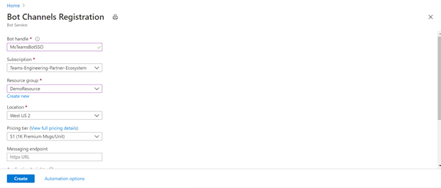

2. Create New Microsoft App ID and Password.

3. Go to App registrations and create a new app registration in a different tab.
4. Register an application.
      * Fill out name and select third option for supported account type and click "Register".
      
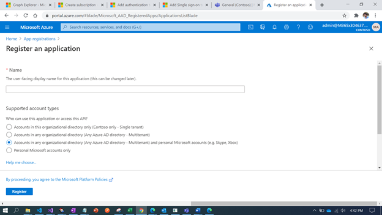      
      
5. Create Client Secret.
      *	Navigate to the "Certificates & secrets" blade and add a client secret by clicking "New Client Secret".
      *	Copy and paste the secret somewhere safe. You will need it in a future step.

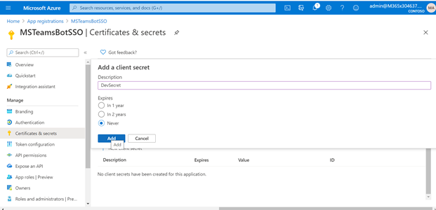

      • Paste the App Id and password in the respective blocks and click on OK.

      •	Click on Create on the Bot Channel registration
      •	Go to the created resource, navigate to channels and add "Microsoft Teams" channel.

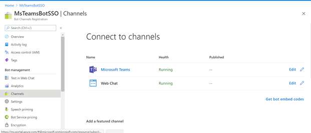

Step 2: Configure AAD app
====================================
1. Expose API endpoint.
      *	Click "Expose an API" in the left rail
      	- Update your application ID URL to include your bot id - api://botid-<your_bot_id>, where <your_bot_id> is the id of the bot that will be making the SSO request and found in your Teams Application Manifest.

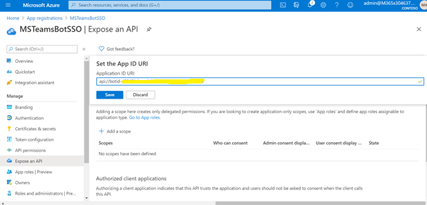

2. Click "Add a scope"
      - access_as_user as the Scope name.
      - Set Who can consent? to Admins and users.
      - Fill in the fields for configuring the admin and user consent prompts with values that are appropriate for the access_as_user scope. Suggestions:
      	  -   Admin consent title: Teams can access the user’s profile
      	  -   Admin consent description: Allows Teams to call the app’s web APIs as the current user.
      	  -   User consent title: Teams can access your user profile and make requests on your behalf
      	  -   User consent description: Enable Teams to call this app’s APIs with the same rights that you have 
      -   Ensure that State is set to Enabled.
      -	Select Add scope (Note: The domain part of the Scope name displayed just below the text field should automatically match the Application ID URI set in the previous step, with /access_as_user appended to the end).

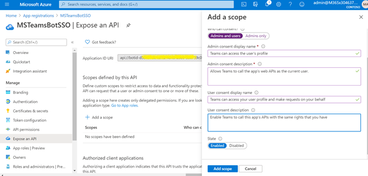

3. Authorize client applications.
      - Add the following Ids as authorized clients for your application.
      	- 1fec8e78-bce4-4aaf-ab1b-5451cc387264 (Teams mobile/desktop application).
      	- 5e3ce6c0-2b1f-4285-8d4b-75ee78787346 (Teams web application).

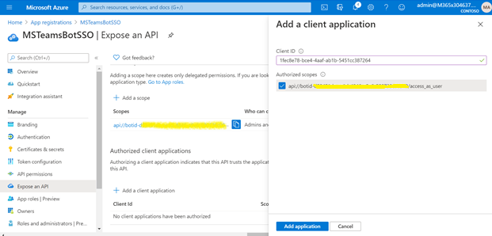

4. Add any necessary API permissions for downstream calls
      - Navigate to "API permissions" blade on the left hand side.
      -	Add any user delegated permissions that your app will need to downstream APIs, (like Microsoft Graph).

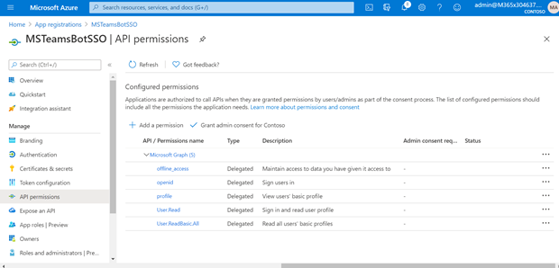

5. Redirect UI
     -	Set the following URI in the web platform. (https://token.botframework.com/.auth/web/redirect).

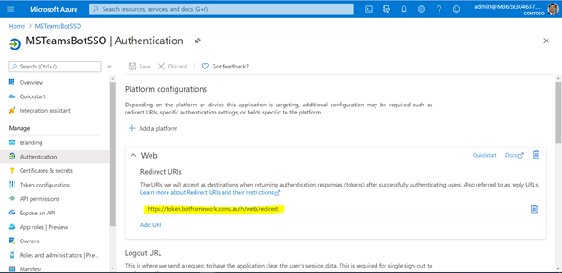

Step 3: Setup Bot Service Connection (TokenStore)
================================================
1. In the Azure Portal, navigate back to the Bot Channels Registration.
2. Switch to the "Settings" blade and click "Add Setting" under the OAuth Connection Settings section.
3. Fill out the Connection Setting form.
      -	Enter a name for your new Connection setting (Save the connection setting name, would need it soon)
      -	In the Service Provider dropdown, select Azure Active Directory V2
      -	Enter in the client id and client secret obtained in step 2
      -	For the Token Exchange URL use the Application ID URL obtained in step 2
      -	Specify "common" as the Tenant ID
      -	Add all the scopes configured when specifying permissions to downstream APIs in step 2
      - Click Save.

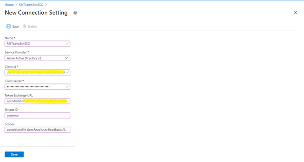

Step 4: Run the app locally 
====================================

1. Clone the repository.

  		git clone “https://github.com/pnp/teams-dev-samples.git”
  
2. If you are using Visual Studio
 	- Launch Visual Studio
 	- File -> Open -> Project/Solution
 	- Navigate to samples/bot-sso-azuread/Source folder.
 	- Select TeamsBotSSO.csproj file.

3. Update Connection Name and Bot credentials in the appsettings.json file.
 
4. Run Ngrok to expose your local web server via a public URL. Make sure to point it to your Ngrok URI. For example, if you're using port 3333 locally, run:

		Win: ./ngrok http 3333 -host-header=localhost:3333 -subdomain="contoso"
		Mac: /ngrok http 3333 -host-header=localhost:3333 -subdomain="contoso".
5. Update messaging endpoint in the Azure Bots Channel Registration-Settings to the endpoint that will bot app will be listening on

Step 5: Packaging and installing your app to Teams 
====================================

1. Make sure "bots" section is added to Teams App Manifest if using newly created bot from step 1.

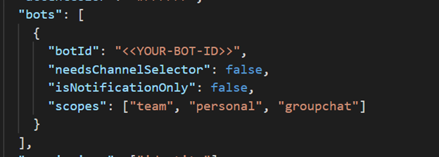

2. Update valid domains to include "token.botframework.com" and "ngrok.io" for testing.

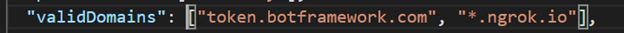

3. Add webApplicationInfo section
    - Update "id" to the Application (client) ID of the AAD app 
    - Update "resource" value to the Application ID URI 

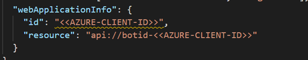

Zip the manifest with the profile images and install it in Teams. 

Step 6: Trying out the app 
====================================
1. Once you have installed the app, You will get a welcome message as follows.

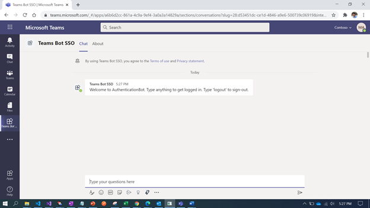

2. Type something to initiate the login process, you will see a consent prompt, you need to do it only once, after which you’ll be automatically get logged in.

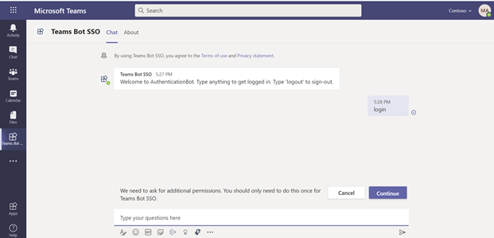

3. Once you click on the consent button, a pop-up window will display the consent dialog from Azure AD.

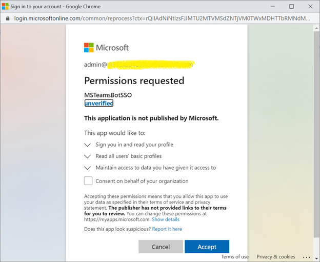

4. Once you have granted required consent, you’ll get logged and the logged in user’s information will be displayed in the chat window.

