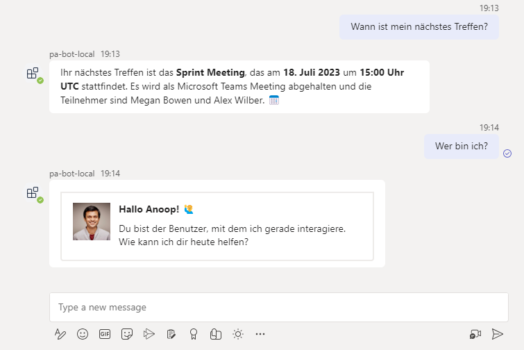

# Teams SSO Bot - Personal Assistant - OpenAI Function Calling with Microsoft Graph

## Summary

- This sample is a Teams bot that provides information to the current logged in user. 
- The information can be the user's basic details or user's calendar details or user's tasks. - The information exchanged between the user and the chatbot is in natural language. 
- The chatbot uses [OpenAI's function calling feature](https://openai.com/blog/function-calling-and-other-api-updates) to understand whether a function in the code needs to be called based on user's query. 
- The chatbot uses Microsoft Graph API to get the user's details or details from calendar or tasks.
- Single Sign-on is implemented using `botbuilder` and Teams Framework to call Microsoft Graph API.
- The JSON response from Microsoft Graph is the transformed into a natural language response by OpenAI and sent back to the user.


### Multi lingual support

- The chatbot supports multi lingual responses which is provided out of the box by OpenAI.



## Further details
- This sample shows how use [OpenAI's function calling feature](https://openai.com/blog/function-calling-and-other-api-updates). A Teams bot is used to show this feature in action. 
- The bot sends the user's message to [OpenAI API](https://platform.openai.com/docs/api-reference). 
- Based on user's message, OpenAI determines whether a function (in our code) needs to be called. 
- If so, based on the response from OpenAI, the bot calls the function (in our code i.e. a typescript function in this sample) - which in turn uses Microsoft Graph API to get the details of the user or their calendar or their tasks. 
- The result of the function (raw JSON) is then sent back to OpenAI. OpenAI then uses the result to generate a response based on user's message/query.
- That response is then shown as text or formatted as an adaptive card and sent back to the user.

## Prerequisites
- [Node.js](https://nodejs.org/), supported versions: 16, 18
- A Microsoft 365 tenant in which you have permission to upload Teams apps. You can get a free Microsoft 365 developer tenant by joining the [Microsoft 365 developer program](https://developer.microsoft.com/en-us/microsoft-365/dev-program).
- [Teams Toolkit Visual Studio Code Extension](https://aka.ms/teams-toolkit) version 5.0.0 and higher or [TeamsFx CLI](https://aka.ms/teamsfx-cli)
- Open AI API key. You can get a key from <https://platform.openai.com/account/api-keys>

## Version history

Version|Date|Author|Comments
-------|----|----|--------
1.0|July 10, 2023|Anoop T|Initial release

## Credits

Credits to Microsoft for creating a the [Teams Bot SSO sample](https://github.com/OfficeDev/TeamsFx-Samples/blob/dev/command-bot-with-sso) that demonstrates using SSO in a Teams bot.

## Disclaimer

**THIS CODE IS PROVIDED _AS IS_ WITHOUT WARRANTY OF ANY KIND, EITHER EXPRESS OR IMPLIED, INCLUDING ANY IMPLIED WARRANTIES OF FITNESS FOR A PARTICULAR PURPOSE, MERCHANTABILITY, OR NON-INFRINGEMENT.**

---

## Minimal path to awesome
- In the `env/.env.local` and `env/.env.dev` file, fill in the value for `OPENAI_API_KEY` with your Open AI API key.
       ```
       OPENAI_API_KEY=<your-openai-api-key>
       ```

- If your OpenAI subscription doesn't include GPT-4, change the GPT_MODEL_TO_USE in `env/.env.local` and `env/.env.dev` to gpt-3.5-turbo

### Run the app locally
- From VS Code:
    1. Clone the repo to your local workspace or directly download the source code.
    1. Open the project in Visual Studio Code.
    1. Open Debug View (`Ctrl+Shift+D`) and select "Debug (Edge)" or "Debug (Chrome)" in dropdown list.
    1. Press "F5" to open a browser window and then select your package to view the app.
- From TeamsFx CLI:
    1. Install [dev tunnel cli](https://aka.ms/teamsfx-install-dev-tunnel).
    1. Login with your M365 Account using the command `devtunnel user login`.
    1. Start your local tunnel service by running the command `devtunnel host -p 3978 --protocol http --allow-anonymous`.
    1. In the `env/.env.local` file, fill in the values for `BOT_DOMAIN` and `BOT_ENDPOINT` with your dev tunnel URL.
    
        ```
        BOT_DOMAIN=sample-id-3978.devtunnels.ms
        BOT_ENDPOINT=https://sample-id-3978.devtunnels.ms
        ```
    1. Run command: `teamsfx provision --env local` .
    1. Run command: `teamsfx deploy --env local` .
    1. Run command: `teamsfx preview --env local` .

### Deploy the app to Azure

> If you don't have an Azure subscription, create [a free account](https://azure.microsoft.com/en-us/free/) before you begin

- From VSCode
    1. Sign in to Azure by clicking `Sign in to Azure` under the `ACCOUNTS` section from sidebar.
    1. Click `Provision` from `LIFECYCLE` section or open the command palette and select: `Teams: Provision`.
    1. Click `Deploy` or open the command palette and select: `Teams: Deploy`.

- From TeamsFx CLI
    1. Run command: `teamsfx account login azure`.
    1. Run command: `teamsfx provision --env dev`.
    1. Run command: `teamsfx deploy --env dev`.

### Preview the app in Teams

- From VSCode:
    1. Once deployment is completed, you can preview the APP running in Azure. In Visual Studio Code, open `Run and Debug` and select `Launch Remote (Edge)` or `Launch Remote (Chrome)` in the dropdown list and Press `F5` or green arrow button to open a browser.
  - From TeamsFx CLI:
    1. Run command: `teamsfx preview --env dev`.

