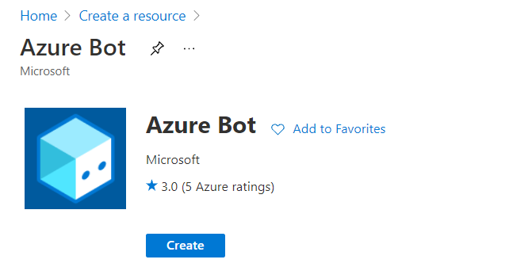
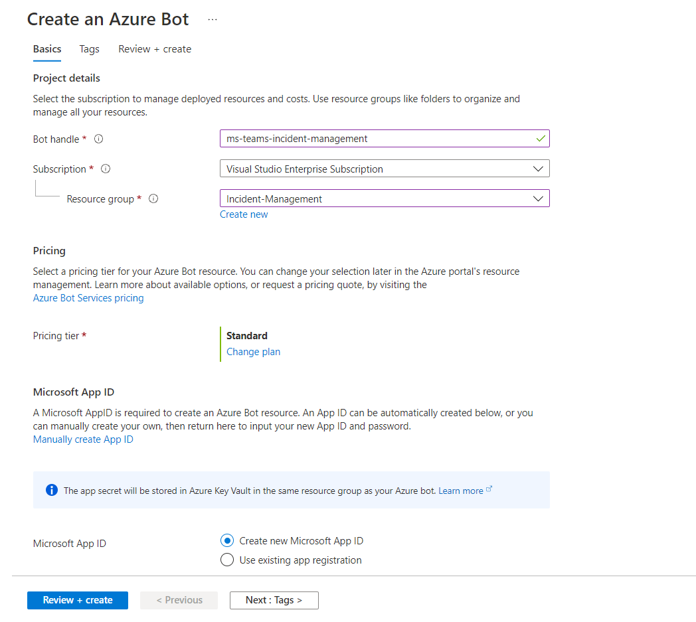
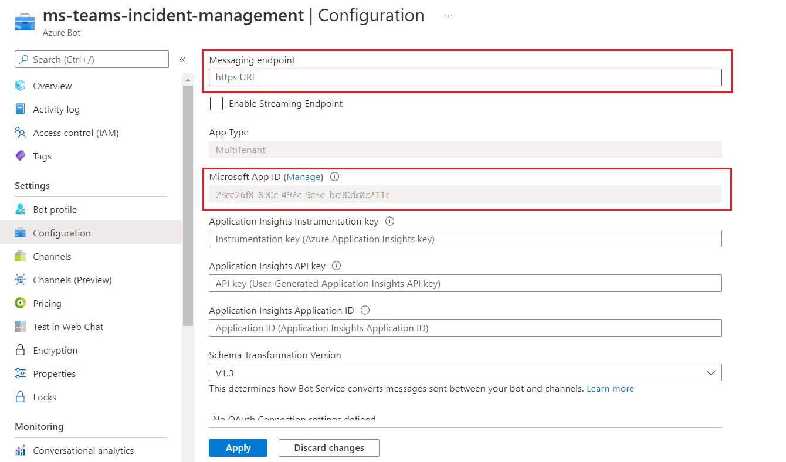
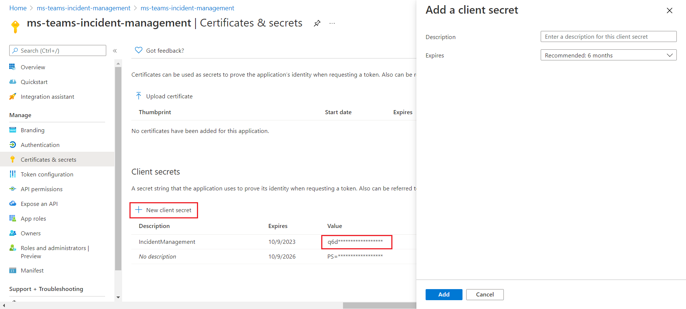
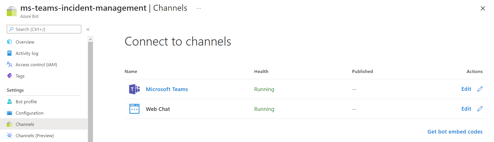
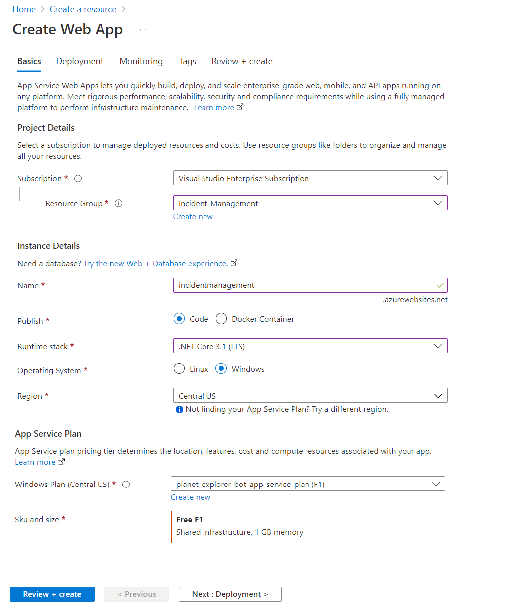

# MS Teams Incident Management Bot

This sample illustrates `sequential workflow`, `user specific views`, and `upto date adaptive cards` bot.
This bot has been created using [Bot Framework](https://dev.botframework.com), it shows how to create a simple incidence and resolution using Adaptive Cards `v1.4`.

## Summary
Teams Incident Management bot is a sample app for handling incidents in Microsoft Teams using Adaptive Cards. Below are the actors on this:
- Nanddeep Nachan (Left window): Incident creator
- Debra Berger (middle window): Incident resolver
- Smita Nachan (right window): Member of Microsoft Teams channel. 


Below are examples of how the Bot can be called:

Raise an incident for SharePoint:
```
@IncidentManagement raise SharePoint
```

Raise an incident for MS Teams:
```
@IncidentManagement raise Teams
```

Raise an incident for other services:
```
@IncidentManagement raise O365
```

## Frameworks


## Prerequisites

* [Office 365 tenant](https://developer.microsoft.com/en-us/microsoft-365/dev-program)
* Microsoft Teams is installed and you have an account.
* [.NET Core SDK](https://dotnet.microsoft.com/download) version 3.1

  ```bash
  # determine dotnet version
  dotnet --version
  ```
  
* To test locally, you'll need [Ngrok](https://ngrok.com/download) or equivalent tunnelling solution.
Make sure you've downloaded and installed the ngrok on your local machine. ngrok will tunnel requests from the Internet to your local computer and terminate the SSL connection from Teams.

    * ex: `https://subdomain.ngrok.io`.
    
	 NOTE: A free Ngrok plan will generate a new URL every time you run it, which requires you to update your Azure AD registration, the Teams app manifest, and the project configuration. A paid account with a permanent Ngrok URL is recommended.

## Solution

Solution|Author(s)
--------|---------
bot-teams-incidentmanagement | [Nanddeep Nachan](https://www.linkedin.com/in/nanddeepnachan/) (O365 Consultant, [@NanddeepNachan](https://twitter.com/NanddeepNachan))
bot-teams-incidentmanagement | [Smita Nachan](https://www.linkedin.com/in/smitanachan/) (O365 Consultant, [@SmitaNachan](https://twitter.com/SmitaNachan))

## Version history

Version|Date|Comments
-------|----|--------
1.0|July 12, 2021|Initial release

## Disclaimer

**THIS CODE IS PROVIDED *AS IS* WITHOUT WARRANTY OF ANY KIND, EITHER EXPRESS OR IMPLIED, INCLUDING ANY IMPLIED WARRANTIES OF FITNESS FOR A PARTICULAR PURPOSE, MERCHANTABILITY, OR NON-INFRINGEMENT.**

---

## Minimal Path to Awesome

### Step 1: Setup bot in Service
1. In the [Azure portal](https://portal.azure.com), start by creating new `Azure Bot` resource.

  

2. In the Azure Bot creation wizard, 
    - Specify the Bot handle. 
    - Select existing or create a new resource group. 
    - Choose the Pricing tier.
    - Choose to create New Microsoft App ID.

  

3. Navigate to `Configuration` and note down the `Microsoft App ID` for the future reference.

  

4. Also, note down the location of `Messaging endpoint` which needs to be updated in Step 3 (A) or (B).
5. Click `Manage` link next to the `Microsoft App ID`.
6. Under `Certificates & secrets`, select `+ New client secret` to generate a new client secret.
7. Note down the client secret value for the future reference.

  

8. Navigate to `Channels` and add `Microsoft Teams` channel.

  


### Step 2: Update configuration
1. **Edit** the `manifest.json` contained in the `Manifest` folder for below changes: 
  - Replace your `Microsoft App Id` (from step 1.3) *everywhere* you see the place holder string `<<YOUR-MICROSOFT-APP-ID>>` (depending on the scenario the Microsoft App Id may occur multiple times in the `manifest.json`). 
  - Replace the occurances of `<<YOUR-Site-URL>>` with web site where you have hosted the solution. It could be an Azure web site or Ngrok URI.
2. Update `appsettings.json` file with the `Microsoft App Id` and `App Secret`.
3. **Zip** up the contents of the `Manifest` folder to create a `manifest.zip`
4. **Upload** the `manifest.zip` to Teams (in the Apps view click `Upload a custom app`).

### Step 3 (A): Run and debug the app locally using Ngrok 
1. Run the bot from a terminal or from Visual Studio:

    A) From a terminal, navigate to `bot-teams-incidentmanagement` folder.

    ```bash
    # run the bot
    dotnet run
    ```

    B) Or from Visual Studio

    - Launch Visual Studio.
    - File -> Open -> Project/Solution.
    - Navigate to `bot-teams-incidentmanagement\IncidentManagement` folder.
    - Select `IncidentManagement.csproj` file.
    - Press `F5` to run the project.

2. Update the `appsettings.json` file. 

    - "MicrosoftAppId: `<<Your Microsoft Bot_Id>>`
    - "MicrosoftAppPassword": `<<Your Microsoft Bot_Secret>>`
    - "ImageBasePath": `<<Path where images are stored>>`

3. Press `F5` to run the project in the Visual studio.

4. Run `Ngrok` to expose your local web server via a public URL. Make sure to point it to your Ngrok URI. For example, if you're using port 3978 locally, run:

		ngrok.exe http 3978 -host-header=localhost:3978

5. Update `Messaging endpoint` to a place specified in `step 1.4`, to the endpoint that bot app will be listening on. Update the ngrok URL in the below format for the messaging endpoint.

		ex: https://<subdomain>.ngrok.io/api/messages

### Step 3 (B): Deploy to Azure Web App
1. In the [Azure portal](https://portal.azure.com), create new `Web App` resource.
    - Select `Runtime stack` as `.NET Core 3.1 (LTS)`.

  

2. Publish the code to above created Azure web app by downloading the publishing profile or using the Deployment Center.

3. Update `Messaging endpoint` to a place specified in `step 1.4`, to the endpoint that bot app will be listening on. Update the Azure Web App URL in the below format for the messaging endpoint.

    ```
    ex: https://incidentmanagement.azurewebsites.net/api/messages
    ```
---

## References

Below are the references used while developing this sample:

- [Adaptive Cards](https://adaptivecards.io/)
- [Universal Actions for Adaptive Cards](https://docs.microsoft.com/en-us/microsoftteams/platform/task-modules-and-cards/cards/universal-actions-for-adaptive-cards/overview)
- [User Specific Views](https://docs.microsoft.com/en-us/microsoftteams/platform/task-modules-and-cards/cards/universal-actions-for-adaptive-cards/user-specific-views/)
- [Sequential Workflows](https://docs.microsoft.com/en-us/microsoftteams/platform/task-modules-and-cards/cards/universal-actions-for-adaptive-cards/sequential-workflows/)
- [Up to date cards](https://docs.microsoft.com/en-us/microsoftteams/platform/task-modules-and-cards/cards/universal-actions-for-adaptive-cards/up-to-date-views/)
- [Universal Action Model](https://docs.microsoft.com/en-us/adaptive-cards/authoring-cards/universal-action-model/)
- [sequential-workflow-adaptive-card](https://github.com/OfficeDev/Microsoft-Teams-Samples/tree/main/samples/bot-sequential-flow-adaptive-cards/csharp)


## Video Refences

- [Deep dive into Universal Actions for Microsoft Teams and Outlook](https://www.youtube.com/watch?v=mwWAFw8df50) by [Shiladitya Saha](https://www.linkedin.com/in/shiladityasaha/) (Microsoft - Teams) and [Karan Thapar](https://www.linkedin.com/in/karanthapar91/) (Microsoft - Outlook)

## Thank You!

Special thanks to [Shiladitya Saha](https://www.linkedin.com/in/shiladityasaha/), [Wictor Wilen](https://www.linkedin.com/in/wictorw/), and [Rabia Williams](https://www.linkedin.com/in/rabiawilliams/) (Microsoft) for their valuable discussions and guidance on this interesting topic.


