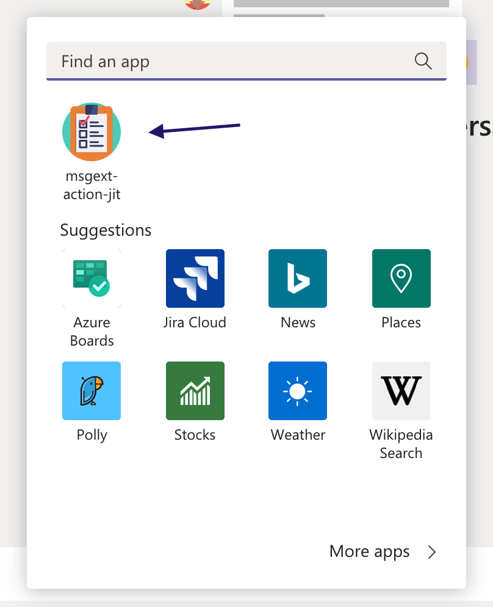

# Messaging Extension with Just in time installer

## Summary

This sample is an Action messaging extension created using the [Teams Yeoman Generator](https://docs.microsoft.com/en-us/microsoftteams/platform/tutorials/get-started-yeoman).

 1. How to post an adaptive card response directly into the conversation
 2. How to use Just In Time Installer with an adaptive card to install an app to teams/personal/group chat.

It checks whether the app is installed first, if not then prompts for installation with an adaptive card with just in time installer.


... on continue installs the app


... when invoked after install, shows adaptive card action form


... adaptive card response posted directly in the conversation. If not JIT, you might get an error "This bot is not part of the conversation roster"


For project structure see the [Yo Teams wiki for the project structure](https://github.com/PnP/generator-teams/wiki/Project-Structure)

## Frameworks


## Prerequisites

* [Office 365 tenant](https://github.com/pnp/generator-teams/wiki/Setup-Tenant)
* [Node.js](https://nodejs.org) version 10.14.1 or higher
* [ngrok](https://ngrok.com) or similar tunneling application is required for local testing

    ```bash
    # determine node version
    node --version
    ```
---

## Minimal Path to Awesome

- Clone the repository

    ```bash
    git clone https://github.com/PnP/teams-dev-samples.git
    ```

- In a console, navigate to `samples/msgext-action-jit`

    ```bash
    cd samples/msgext-action-jit
    ```

- Install modules

    ```bash
    npm install
    ```

    or

    ```bash
    yarn
    ```

- Run ngrok - point to port 3007

    ```bash
    ngrok http -host-header=rewrite 3007
    ```

- Since messaging extensions utilize the Azure Bot Framework, you will need to register a new bot.
[These instructions](https://docs.microsoft.com/en-us/microsoftteams/platform/bots/how-to/create-a-bot-for-teams#register-your-web-service-with-the-bot-framework) provide options for registering with or without an Azure subscription. 
  - Be sure to enable the Microsoft Teams bot channel so your solution can communicate with Microsoft Teams
  - For local testing, set the messaging endpoint to the https URL returned by ngrok plus "/api/messages"
  - Note the bot's Application ID and password (also called the Client Secret) assigned to your bot during the registration process. In the Azure portal this is under the Bot Registration settings; in the legacy portal it's in the Settings tab. Click Manage to go to Azure AD to obtain the Client Secret. You may need to create a new Application Secret in order to have an opportunity to copy it out of the Azure portal.

- Update the `.env`(create from `.env.development`) configuration for the bot to use the Microsoft App Id and App Password (aka Client Secret) from the previous step. Hostname with the ngrok returned hostname like `071b0791d531.ngrok.io`

- Run the bot locally
    ```bash
    gulp dev-serve
    ```

- Upload the application package (./package folder)
  Upload the resulting zip file into Teams [using these instructions](https://docs.microsoft.com/en-us/microsoftteams/platform/concepts/deploy-and-publish/apps-upload).

- Test in Microsoft Teams by clicking the ... beneath the compose box in a Team

    

## Features

This is a simple Action messaging extension


## Version history

Version|Date|Author|Comments
-------|----|----|--------
1.0|Sep 10, 2020|Rajesh Sitaraman|Initial release


## Disclaimer

**THIS CODE IS PROVIDED *AS IS* WITHOUT WARRANTY OF ANY KIND, EITHER EXPRESS OR IMPLIED, INCLUDING ANY IMPLIED WARRANTIES OF FITNESS FOR A PARTICULAR PURPOSE, MERCHANTABILITY, OR NON-INFRINGEMENT.**