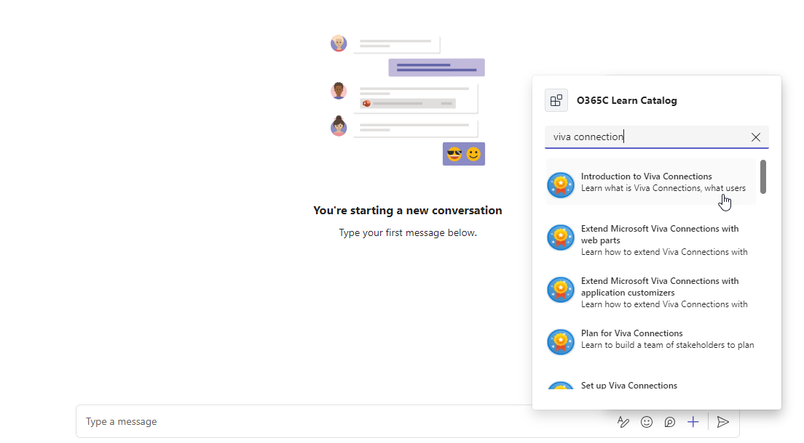
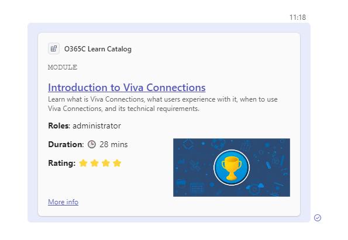

# Microsoft Learn Catalog Message Extension (API Based)

## Summary

This project is an API-based Microsoft Teams message extension that fetches data from the Microsoft Learn Catalog API. It allows users to browse and select modules directly within Teams. Upon selection, the extension displays an adaptive card to the user, providing detailed information about the chosen module. This seamless integration enhances the learning experience by providing relevant module data in a user-friendly format, without the need to leave the Teams environment.

## Demo

## Prerequisites
>
> >
> To run this app in your local dev machine, you will need:
>
> - [Node.js](https://nodejs.org/), supported versions: 16, 18
> - A [Microsoft 365 account for development](https://docs.microsoft.com/microsoftteams/platform/toolkit/accounts)
> - [Teams Toolkit Visual Studio Code Extension](https://aka.ms/teams-toolkit) version 5.0.0 and higher or [Teams Toolkit CLI](https://aka.ms/teams-toolkit-cli)

## Version history

Version|Date|Author|Comments
-------|----|----|--------
1.0|April 30, 2024|Ejaz Hussain|Initial release

## Minimal Path to Awesome

### Run Locally

1. Clone this repository
2. Open the cloned copy of this folder with Visual Studio Code
3. First, select the Teams Toolkit icon on the left in the VS Code toolbar.
4. In the Account section, sign in with your [Microsoft 365 account](https://docs.microsoft.com/microsoftteams/platform/toolkit/accounts) if you haven't already.
5. Select `Debug in Teams (Edge)` or `Debug in Teams (Chrome)` from the launch configuration dropdown.
6. When Teams launches in the browser, you can navigate to a chat message and [trigger your search commands from compose message area](https://learn.microsoft.com/microsoftteams/platform/messaging-extensions/what-are-messaging-extensions?tabs=dotnet#search-commands). App name is **O365C Learn Catalog**
7. Type an Microsoft Learn module title in the search box to search
   

## Addition information and references

- [Extend Teams platform with APIs](https://aka.ms/teamsfx-api-plugin)

## Features

1. API-based Microsoft Teams message extension
2. Microsoft Learn Catalog Integration with Microsoft Teams
3. No bot integration required

