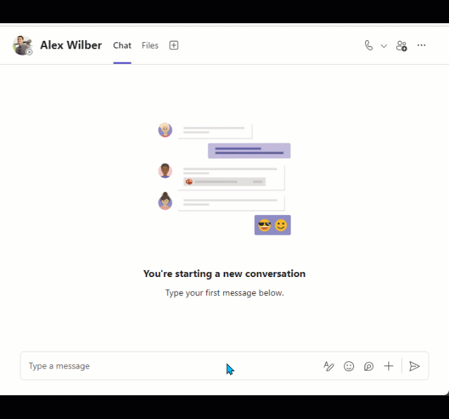

# Transport for London Line Status API based Message Extension

## Summary

API-based message extensions are a Microsoft Teams app capability that integrates external APIs directly into Teams without the need for bot registration. 
This sample API based message extension uses the `Transport for London (TfL) API` to featch the information directly from TfL about the status of the London Underground lines. The user can search for a specific line and get the status of the line and send the information in a chat.

## Demo

## Version history

Version|Date|Author|Comments
-------|----|----|--------
1.0|August 05, 2024|Anoop T|Initial release

## Get started with the template

> **Prerequisites**
>
> To run this app template in your local dev machine, you will need:
>
> - [Node.js](https://nodejs.org/), supported versions: 16, 18
> - A [Microsoft 365 account for development](https://docs.microsoft.com/microsoftteams/platform/toolkit/accounts).
> - [Teams Toolkit Visual Studio Code Extension](https://aka.ms/teams-toolkit) version 5.0.0 and higher or [Teams Toolkit CLI](https://aka.ms/teamsfx-toolkit-cli)

1. First, select the Teams Toolkit icon on the left in the VS Code toolbar.
2. In the Account section, sign in with your [Microsoft 365 account](https://docs.microsoft.com/microsoftteams/platform/toolkit/accounts) if you haven't already.
3. Create an account in [Transport for London Unified API](https://api-portal.tfl.gov.uk) and get an API key.
4. Open the `env.dev.user` file in the `env` folder and add `TFL_APP_KEY` with the API key you got from the previous step.
5. Create Teams app by clicking `Provision` in "Lifecycle" section.
6. Select `Preview in Teams (Edge)` or `Preview in Teams (Chrome)` from the launch configuration dropdown.
7. To trigger the Message Extension, you can click the `+` under compose message area to find your message extension.

## Addition information and references

- [Extend Teams platform with APIs](https://aka.ms/teamsfx-api-plugin)
