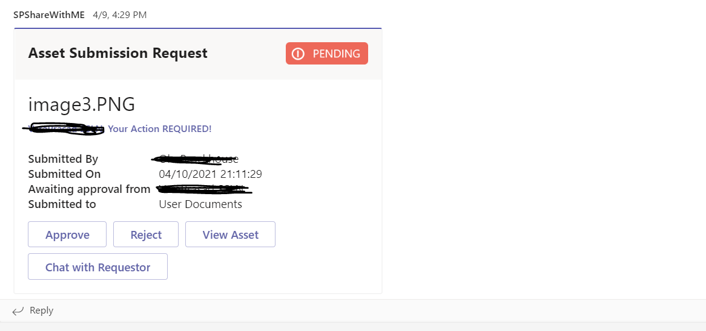
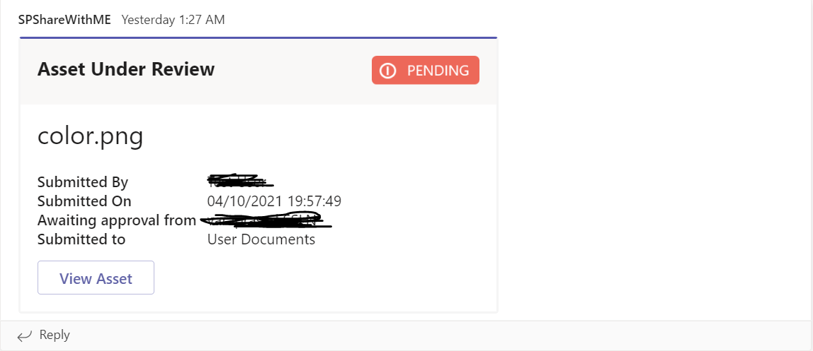
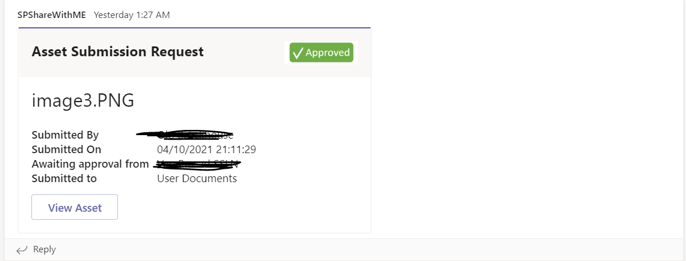
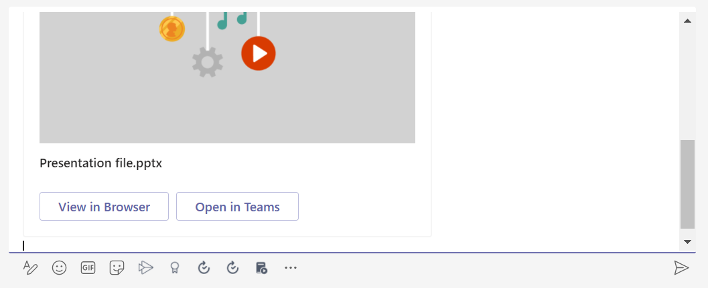

# SPUploader

This sample shows how to build a simple digital asset management system using a Microsoft Teams messaging extension and a SharePoint library. Users can upload new assets via an action messaging extension; a simple approval step is implemented using adaptive cards. Users can insert approved assets into the conversation using a search messaging extension.

This bot has been created using [Bot Framework](https://dev.botframework.com), it shows how to create a simple bot that uses message extension search for the uploaded documents and action based to upload a document to sharepoint document library.


## Prerequisites

- [.NET Core SDK](https://dotnet.microsoft.com/download) version 3.1

  ```bash
  # determine dotnet version
  dotnet --version
  ```

## To try this sample

### Step 1: Build the project

- Clone the repository

    ```bash
    git clone https://github.com/pnp/teams-dev-samples.git
    ```

- Run the bot from a terminal or from Visual Studio:

  A) From a terminal, navigate to the `teams-dev-samples/samples/msgext-bot-SPUploader/SPUploader` folder

  ```bash
  # run the project
  dotnet run
  ```

  B) Or from Visual Studio

  - Launch Visual Studio
  - File -> Open -> Project/Solution
  - Navigate to `samples/SPUploader` folder
  - Select `MessageExtension_SP.csproj` file
  - Press `F5` to run the project

  ### Step 2: Register a new sharepoint app

    You need to register a new addin/app in your Sharepoint site, this will generate a ClientID and a Client Secret,  which we will use to authenticate. Lets see how to do it.

    Go to `_layouts/15/appregnew.aspx` under the SP Online site which you want to use as document repository.

  ### Step 3: Know your Tenant ID and Resource ID

    It is very important to know your tenant ID for triggering any kind of service calls.
    You can get your Tenant ID, Resource Id by following below points:

    1. Navigate to `https//{SharePointDomain}/_layouts/15/appprincipals.aspx`
    2. You will see Site Collection App Permissions under site settings.
    3. You can check your any App and get the Tenant Id and Resource Id from `App Identifier`. The   part after "@" is your `tenant ID` and the part before @ is `Resource ID`.
    4. Create Two document libraries to upload the files into sharepoint doc library

    

    ### Step 4: Grant permissions

    New Client app has been created in SP Online site, now its time to decide what permissions this app should have on your site. You can grant Site collection, web or even at list level read or write permissions.

    Go to `/_layouts/15/appinv.aspx` and serach with ClientID we generated earlier. The application will fetch all other details based on your ClientID.
 
  ### Step 5: Using Graph API
  
    Register a bot in Microsoft Azure and add these Microsoft Graph permissions to the bot application:

     - User.Read.All, User.ReadWrite.All, Directory.Read.All, Directory.ReadWrite.All
     - GroupMember.Read.All, Group.Read.All, GroupMember.ReadWrite.All, Group.ReadWrite.All, Directory.Read.All, Directory.AccessAsUser.All
  
  ### Step 6: Update your appSetting.json
  
   - "MicrosoftAppId": `<<Your Microsoft Bot_Id>>` 
   - "MicrosoftAppPassword": `<<Your Microsoft Bot_Secret>>` 
   - "TenantId": `<< Tenant Id>>`
   - "BaseUri": `<<ngrok url>>`
   - "ChannelId": `<<channel Id>>`
   - "TeamId": `<<Team Id>>`
   - "TenantDomain":`<<Sharepoint Tenant domain>>`
   - "SPTenantId": `<<Sharepoint Tenant Id>>`
   - "SharePointClientID": `<<Sharepoint Client Id>>`
   - "SharePointClientSecret": `<<Sharepoint Client Secret>>`
   - "SharePointEndPoint": `<<Sharepoint Endpoint>>`
   - "SharePointResource": `<<SharepointResources>>`
   - "SharePointBaseURL": `<<Sharepoint Baseurl>>`
   - "BotServiceUrl": `<<Bot service url>>`
   - "BaseURL": `<<Sharepoint baseurl>>`
   - "AccessTokenUrl": `<<access token>>`
   - "AllowedHosts": "*"


### Step 7 (This steps is specific to Microsoft Teams)

- Navigate to `Manifest` folder
- Select the `Manifest.json` and update it with your `Your Bot Id`
- Now zip the manifest.json along with icons
- Go to teams and do `Upload a Custom App` 
- Add the Bot to to microsoft team
- Start the message extension for search and action based

## Interaction with the MessageExtension

  - Action Based
       - Select three dots of the message and click on extension and select the "upload a file to SP"       
        
        
       - Task module will open up with the Title and Description along with Uploader control, upload the document 
         and submit
         
         
       - Selected file initially uploaded to `UserDocuments` folder under sharepoint and sends a message in a channel 
       
       - Role based adaptive card will post a card in channel, Owner of the team member will have the approve option to 
            submit the file.
            

       - Memebrs of the team will be notified with the View option.
           

       - Once Owner of the team member approved, it will be moved to `UploadedDocuments`
            


   - Search Based
        - Select the message extension and Click on "SPSharewithME"
          
          
        - Type the file name to search from the approved document library
         
         
        - Recently added files will be displayed in the tab
        

        

        


