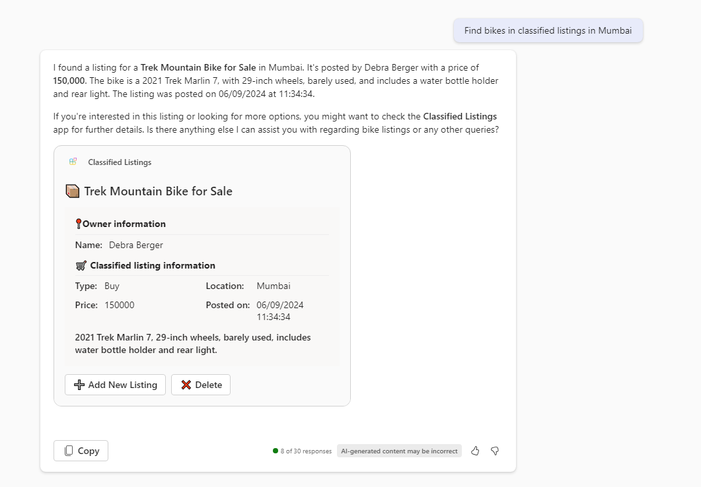
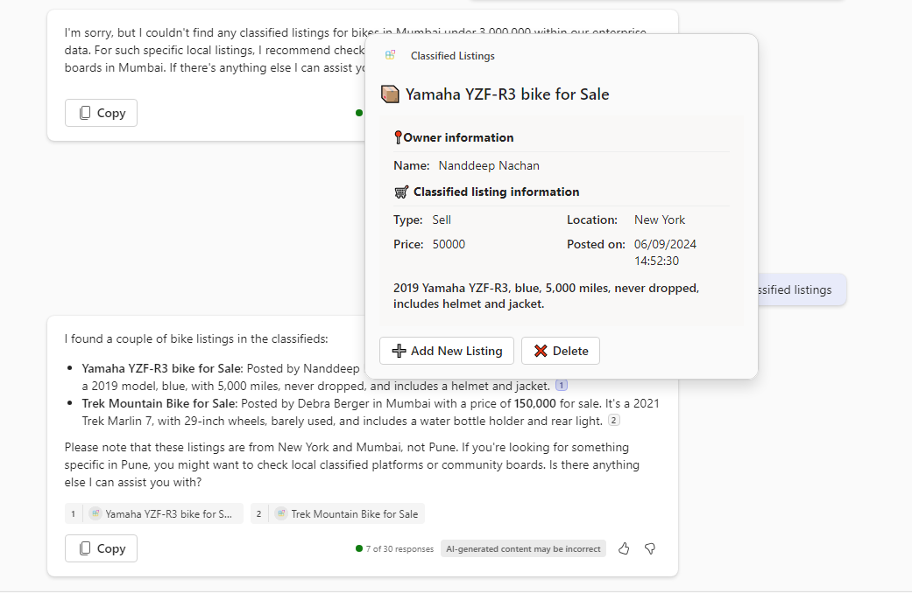
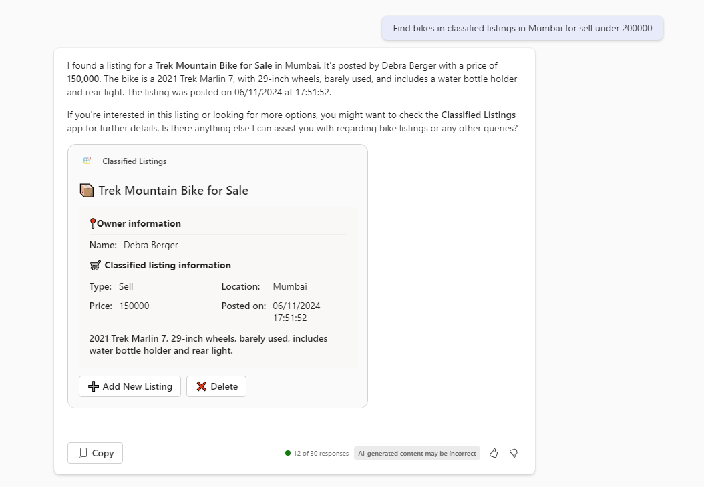

# Classified Listings Copilot

This sample implements a Teams message extension that can be used as a plugin for Microsoft Copilot for Microsoft 365. It allows users to post the classified listings of items they want to sell, buy, or rent. Users can search listings posted by others.

This sample is inspired from the existing awesome [Northwind inventory message extension sample](https://github.com/OfficeDev/Copilot-for-M365-Plugins-Samples/tree/main/samples/msgext-northwind-inventory-ts).

## Version history

Version|Manifest version|Date|Author|Comments
-------|--|--|----|--------
1.0|1.16|June 12, 2024 |Nanddeep Nachan   Smita Nachan|Initial release

## Prerequisites

- [Node.js 18.x](https://nodejs.org/download/release/v18.18.2/)
- [Visual Studio Code](https://code.visualstudio.com/)
- [Teams Toolkit](https://marketplace.visualstudio.com/items?itemName=TeamsDevApp.ms-teams-vscode-extension)
- You will need a Microsoft work or school account with [permissions to upload custom Teams applications](https://learn.microsoft.com/microsoftteams/platform/concepts/build-and-test/prepare-your-o365-tenant#enable-custom-teams-apps-and-turn-on-custom-app-uploading). The account will also need a Microsoft Copilot for Microsoft 365 license to use the extension in Copilot.
- You will need to create [Blob Storage](https://learn.microsoft.com/en-us/azure/storage/blobs/storage-quickstart-blobs-portal) resource on Azure portal.
- [Azure Storage Explorer](https://azure.microsoft.com/products/storage/storage-explorer/) (OPTIONAL) - Download this if you want to view and edit the Azure tables used in this sample.

## Minimal path to awesome

- Clone repo
- Open repo in VSCode
- Press <kbd>F5</kbd> and follow the prompts

## Setup and use the sample

This sample requires a manual step to 

1. If your project doesn't yet have a file **env/.env.local.user**, then create one by copying **env/.env.local.user.sample**. If you do have such a file, ensure it includes these lines.

~~~text
SECRET_STORAGE_ACCOUNT_CONNECTION_STRING=xxxxxxxxxxxxxxxxxxxxxxx
~~~

2. If your project doesn't yet have a file **env/.env.local**, then create one by copying **env/.env.local.sample**. If you do have such a file, ensure it includes these lines. Please replace "Contoso" with your desired prefix for the Azure table.

~~~text
AZURE_TABLE_PREFIX=Contoso
~~~

3. Create below 3 tables in your Blob storage (Replace `AZURE_TABLE_PREFIX` with your prefix):
    1. `AZURE_TABLE_PREFIX`Listing
    2. `AZURE_TABLE_PREFIX`ListingCity
    3. `AZURE_TABLE_PREFIX`ListingType

### Azure Table Schema 

The solution uses below 3 tables:

1. `AZURE_TABLE_PREFIX`Listing

    This table stores the classified listings information posted by users with below schema:

    | # | Name | Description |
    |---|------|-------------|
    | 1 | PartitionKey | Set as `Listing` |
    | 2 | RowKey | Set as the conversation id |
    | 3 | Title |  |
    | 4 | Description |  |
    | 5 | Price |  |
    | 6 | CityID | Referenced from `AZURE_TABLE_PREFIX`ListingCity |
    | 7 | TypeID | Referenced from `AZURE_TABLE_PREFIX`ListingType |
    | 8 | OwnerID | AAD ID of user |
    | 9 | OwnerName | Display name of user |

2. `AZURE_TABLE_PREFIX`ListingCity

    This table stores the city information with below schema:

    | # | Name | Description |
    |---|------|-------------|
    | 1 | PartitionKey | Set as `City` |
    | 2 | RowKey | ID of city (e.g. 1, 2, 3) |
    | 3 | Name | Name of city |

    Below is a sample data:

    | PartitionKey | RowKey | Name |
    |--------------|--------|------|
    | City | 1 | Pune |
    | City | 2 | Mumbai |
    | City | 3 | New York |
    | City | 4 | Sydney |
    | City | 5 | Chicago |
    | City | 6 | London |

3. `AZURE_TABLE_PREFIX`ListingType

    This table stores the information about type of classified listing with below schema:

    | # | Name | Description |
    |---|------|-------------|
    | 1 | PartitionKey | Set as `Type` |
    | 2 | RowKey | ID of listing type (e.g. 1, 2, 3) |
    | 3 | Name | Name of listing type |

    Below is a sample data:

    | PartitionKey | RowKey | Name |
    |--------------|--------|------|
    | Type | 1 | Buy |
    | Type | 2 | Rent |
    | Type | 3 | Sell |

## Test in Copilot

- Enable the plugin
- Use a basic prompt: `Find bikes in classified listings`

- Use an advanced prompt: `Find bikes in classified listings in Mumbai for sell under 200000`

