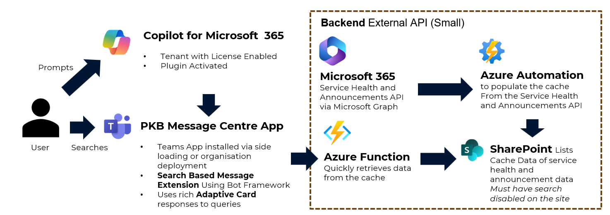

# Setup Instructions



For this sample to work, the following backend components are needed to ensure the API can return data as fast as possible to Copilot.
The list of components are:

- SharePoint Site and List - to store the cached data
- Azure Automation - to retrieve the data from the Microsoft 365 Tenant Service Health and Announcements API and store in SharePoint.
- Azure Function - to retrieve the data from SharePoint and return to the Teams Message Extension.

_There is the intention to automate this but current environment is used for demoing to various audiences atm. If you get stuck feel free to reach out to Paul Bullock on Twitter @pkbullock and/or LinkedIn https://www.linkedin.com/in/pkbullock/_

## SharePoint Site and List

1. Create a new SharePoint site in your Microsoft 365 tenant.
2. Run the following PowerShell script to create the list in the SharePoint site:

> Note: replace `<tenant>` with your tenant name and if you call the site something different in the path then, you will need to update the Azure Function environment variables to match the new site name.

```powershell  

# navigate to .\setup\sharepoint folder

$siteUrl = "https://<tenant>.sharepoint.com/sites/tenant-status"
Connect-PnPOnline -Url $siteUrl -Interactive
Invoke-PnPSiteTemplate -Path setup.xml

```

## Azure Automation

1. Create a new Azure Automation account in the Azure portal.
2. Create a new PowerShell Runbook in the Azure Automation account (see table below for optional names)
3. Add the following modules to the Runbook under the modules section in the Azure Automation account:
   - PnP.PowerShell
4. Run the following PowerShell script in the Runbook to retrieve the data from the Microsoft 365 Tenant Service Health and Announcements API and store in SharePoint:

| Name | Location | Purpose |
| --- | --- | --- |
| Invoke-PurgeCacheLists | `setup\function\using-sharepoint-as-cache\Invoke-PurgeCacheLists.ps1` | Purges the cache lists by deleting all the items (useful for testing only) |
| Populate-ServiceHealthSPCache | `setup\function\using-sharepoint-as-cache\Populate-ServiceHealthCache.ps1` | Updates the Service Health list with the latest data from the Microsoft 365 Tenant Service Health API |
| Populate-ServiceAnnouncementsSPCache | `setup\function\using-sharepoint-as-cache\Populate-ServiceAnnouncementsCache.ps1` | Updates the Service Announcements list with the latest data from the Microsoft 365 Tenant Service Announcements API |
| Invoke-SharePointConnectionTest | `setup\function\using-sharepoint-as-cache\Invoke-SharePointConnectionTest.ps1` | Tests the connection to the SharePoint site |


### Configure the authentication and permissions of the managed identity app for Azure Automation

1. In the Azure portal, navigate to the Azure Automation account.
2. In the left-hand menu, click on `Identity`.
3. Click on `System assigned` and then click on `On` to enable the system assigned managed identity.
4. Next we need to assign permissions to the new identity, first we need to find the application ID of the identity but navigating to Microsoft Entra ID then Enterprise Registrations or navigate here ([Portal](https://portal.azure.com/#view/Microsoft_AAD_IAM/StartboardApplicationsMenuBlade/~/AppAppsPreview/menuId~/null)), change the `Application Type` to `Managed Identities` and find the application ID.
5. Then run the follow PnP PowerShell script to assign the permissions (least principal) to the SharePoint site:

    ```powershell
    Connect-PnPOnline https://<tenant>.sharepoint.com -Interactive

    $appId = "<app-id>" # replace with the application ID of the managed identity
    $appName = "<function-app-identity-name>" # replace with the name of the managed identity
    $spUrl = "https://<tenant>.sharepoint.com/sites/tenant-status"

    Add-PnPAzureADServicePrincipalAppRole -Principal $appId -AppRole "ServiceHealth.Read.All" -BuiltInType MicrosoftGraph
    Add-PnPAzureADServicePrincipalAppRole -Principal $appId -AppRole "ServiceMessage.Read.All" -BuiltInType MicrosoftGraph
    
    Add-PnPAzureADServicePrincipalAppRole -Principal $appId -AppRole "Sites.Selected" -BuiltInType SharePointOnline
    Add-PnPAzureADServicePrincipalAppRole -Principal $appId -AppRole "Sites.Selected" -BuiltInType MicrosoftGraph
    Grant-PnPAzureADAppSitePermission -AppId $appId -DisplayName $appName -Permissions Write -Site $spUrl
    Get-PnPAzureADAppSitePermission -Site $spUrl
    ```

### Final points for Azure Automation

1. Run the runbook `Invoke-SharePointConnectionTest` to test the connection to the SharePoint site which validates your managed identity permissions.
2. Run the runbook `Populate-ServiceHealthSPCache` to populate the Service Health list with the latest data from the Microsoft 365 Tenant Service Health API.
3. Run the runbook `Populate-ServiceAnnouncementsSPCache` to populate the Service Announcements list with the latest data from the Microsoft 365 Tenant Service Announcements API.
4. **Optional** Create a schedule for the above runbooks to run at a regular interval to keep the SharePoint list up to date.


## Azure Function

The Azure Function is used to read the SharePoint site and return the data to the Teams Message Extension.

1. Create a new Azure Function in the Azure portal, if you have provisioned the Teams Message app, there will already be a App Service Plan and Storage Account created, that you can leverage for the Azure Function. I have used this to avoid the app warm up time. Ensure you use
   1. Runtime Stack: PowerShell Core
   2. Version: 7.2 (note this is going EOL at end of 2024, so mgiht be a later version by the time you read this) 
2. Create a new Function App in the Azure portal called `GetCachedServiceMessages` with a HTTP trigger using Authorisation level of `Function`.
3. Use the PowerShell script to create the following functions:
   - In `setup\function\using-sharepoint-as-cache\GetCachedServiceMessages.ps1` to create the function.
   - In `setup\function\using-sharepoint-as-cache\FollowServiceMessage.ps1` to create the function.
4. For both scripts, ensure you configure the Function App to load the PnP PowerShell Module, by navigating to Functions > App Files > Add New File and update the `requirements.psd1` file to replace with the following:

    ```powershell
    @{
        'PnP.PowerShell' = '2.4.0'
    }
    ```
    then Save the settings.


5. Configure the following environment variables for the Function App:
   
   | Key | Value |
   | --- | --- |
   | `Cfg_TenantUrl` | The URL of the Microsoft 365 tenant e.g. https://<tenant>.sharepoint.com |
   | `Cfg_CacheSiteUrl` | The URL of the SharePoint site where the list is stored e.g. https://<tenant>.sharepoint.com/sites/tenant-status |
   | `Cfg_CacheListName_ServiceHealth` | The name of the SharePoint list e.g. "Cache Service Health" |
   | `Cfg_CacheListName_Announcements` | The name of the SharePoint list e.g. "Cache Service Announcements" |
   | `Cfg_CacheListName_ServiceFollow` | The name of the SharePoint list e.g. "Follow" |


### Configure the permissions on the Azure Function to allow it to read the SharePoint list by the Azure Function

   1. In the Azure portal, navigate to the Azure Function.
   2. In the left-hand menu, click on `Identity`.
   3. Click on `System assigned` and then click on `On` to enable the system assigned managed identity.
   4. Next we need to assign permissions to the new identity, first we need to find the application ID of the identity but navigating to Microsoft Entra ID then Enterprise Registrations or navigate here ([Portal](https://portal.azure.com/#view/Microsoft_AAD_IAM/StartboardApplicationsMenuBlade/~/AppAppsPreview/menuId~/null)), change the `Application Type` to `Managed Identities` and find the application ID.
   5. Then run the follow PnP PowerShell script to assign the permissions (least principal) to the SharePoint site:

        ```powershell
        Connect-PnPOnline https://pkbmvp.sharepoint.com -Interactive

        $appId = "<app-id>" # replace with the application ID of the managed identity
        $appName = "<function-app-identity-name>" # replace with the name of the managed identity
        $spUrl = "https://<tenant>.sharepoint.com/sites/tenant-status"
      
        Add-PnPAzureADServicePrincipalAppRole -Principal $appId -AppRole "Sites.Selected" -BuiltInType SharePointOnline
        Add-PnPAzureADServicePrincipalAppRole -Principal $appId -AppRole "Sites.Selected" -BuiltInType MicrosoftGraph
        Grant-PnPAzureADAppSitePermission -AppId $appId -DisplayName $appName -Permissions Write -Site $spUrl
        Get-PnPAzureADAppSitePermission -Site $spUrl
        ```
   
   ### Final points for Azure Function

   1. Use the test pane to either gather the function URL for GetCachedServiceMessages and test in a terminal or use the test pane in the Azure Function to test the function.
   2. Within the `env` folder ensure that you app has the correct environment variables set for the Function App for the following parameters:
   
   ```
   FUNCTION_APP_URL=https://<function>.azurewebsites.net/api/GetCachedServiceMessages
   FUNCTION_APP_URL=https://<function>.azurewebsites.net/api/FollowServiceMessage
   FUNCTION_APP_KEY=a7sd98a7s9d79a7g9d97d9879d8f7
   ```

   See `.env.dev.user.sample` as an example.