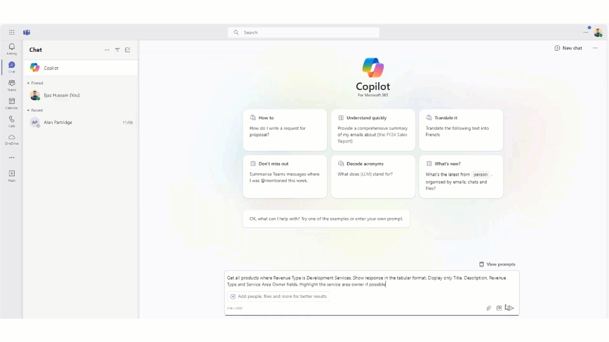
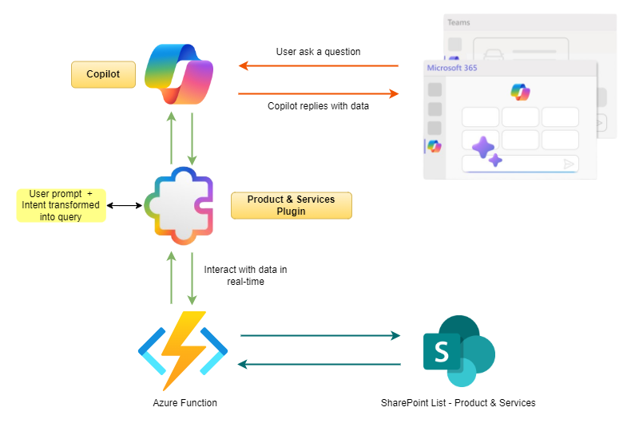

# Microsoft Copilot Product Catalog Plugin

Demo app that shows how to use a Teams Message extension and extend to Copilot for Microsoft 365. This app uses SharePoint list as the backend datasource to get the data and display it in Teams Messaging extension

## Summary

This application, crafted with the Teams Toolkit, leverages an Azure Function to facilitate communication with a SharePoint list, serving as its backend data source. It has been further enhanced for integration with Copilot for Microsoft 365, incorporating a variety of command parameters and enriched semantic descriptions to elevate the user experience.

Upon successful deployment, users will experience enhanced functionalities within the Teams Message Extension and Copilot for Microsoft 365, showcasing the seamless interaction between Microsoft Copilot Plugin and SharePoint data, powered by the underlying Azure function. This integration not only streamlines data access but also enriches the collaborative environment within Microsoft Teams by providing immediate, context-aware information retrieval and manipulation capabilities.

## Demo




> *Note: Video have been speed up for brevity.*

## Solution architecture



## Prerequisites

1. [Node.js 18.x](https://nodejs.org/download/release/v18.18.2/)
2. [Visual Studio](https://visualstudio.microsoft.com/)
3.  [Visual Studio Code](https://code.visualstudio.com/)
4. [Teams Toolkit](https://marketplace.visualstudio.com/items?itemName=TeamsDevApp.ms-teams-vscode-extension)
5. You will need a Microsoft work or school account with [permissions to upload custom Teams applications](https://learn.microsoft.com/microsoftteams/platform/concepts/build-and-test/prepare-your-o365-tenant#enable-custom-teams-apps-and-turn-on-custom-app-uploading). 
6. The account will also need a Microsoft Copilot for Microsoft 365 license to use the extension in Copilot.
7. Create Product & Services SharePoint list with sample data
8. Azure Function (.NET) -  PnP Core SDK - published to an Azure function app.
 
## Setting up backend


### 1. Create and configure the Azure AD application

Below cmdlet will create a new Azure AD application, will create a new self-signed certificate and will configure that cert with the Azure AD application. Finally the right permissions are configured and you're prompted to consent these permissions.

```PowerShell
# Ensure you replace contoso.onmicrosoft.com with your Azure AD tenant name
# Ensure you replace joe@contoso.onmicrosoft.com with the user id that's an Azure AD admin (or global admin)

Register-PnPAzureADApp -ApplicationName FunctionDemoSiteProvisiong -Tenant contoso.onmicrosoft.com -Store CurrentUser -SharePointApplicationPermissions "Sites.FullControl.All" -Username "joe@contoso.onmicrosoft.com" -Interactive
```

>**Once this cmdlet is done you do need to to copy certificate thumbprint, base64 encoded certificate and ClientId values as these will be needed for the configuration step**

> Please note. base64 encoded certificate value can be replaced with Azure Key Vault for PROD deployments


### 2. Deploy Azure function app

1. Create an Azure function app. [Creating Azure Function App](https://learn.microsoft.com/en-us/azure/azure-functions/functions-create-function-app-portal?pivots=programming-language-csharp)
2. Navigate to `/api/O365C.FuncApp.ProductCatalog` folder
3. Run the following commands to publish the azure function app to azure


```ps
#publish the code

dotnet publish -c Release
$publishFolder = "O365C.FuncApp.ProductCatalog/bin/Release/net8.0/publish"
``` 

```ps
# create the zip

$publishZip = "publish.zip"
if(Test-path $publishZip) {Remove-item $publishZip}
Add-Type -assembly "system.io.compression.filesystem"
[io.compression.zipfile]::CreateFromDirectory($publishFolder, $publishZip)
``` 

```ps
# deploy the zipped package

az functionapp deployment source config-zip `
 -g $resourceGroup -n $functionAppName --src $publishZip
``` 
### 3. Configure an Azure function app

1. **Open Function App:** Locate and select your Function App from the "Function Apps" section.
2. **Access Configuration:** Navigate to the "Configuration" section under "Settings".
3. **Add Application Settings:** Use the "+ New application setting" button to add new environment variables.

```JSON
[
  
  
  {
    "name": "Base64EncodedCert",
    "value": "",    
  },
  {
    "name": "CertificateThumbprint",
    "value": "",    
  },
  {
    "name": "ClientId",
    "value": ""    
  }    
  {
    "name": "SiteUrl",
    "value": "https://yourtenant.sharepoint.com/sites/dev"    
  },
  {
    "name": "TenantId",
    "value": ""    
  } 
]

```
5. **Save Changes:** After adding your variables, save the changes.
6. **Restart Function App:** Optionally, restart your Function App to ensure the new settings are applied.
   
### 4. Get function app endpoint

Retrieve the function URL for the `ProductCatalogInfo` function from the previously deployed function app and save it for later use in the messaging extension app.


### 5. Creating SharePoint list adding data

1. Go to the `SampleData` folder.
2. Execute `Create-ProductAndServicesList.ps1` to generate a list named `Product and Services` and populate it with sample data from the specified CSV file.

## Version history

Version|Date|Author|Comments
-------|----|----|--------
1.0 | July 14, 2024 | Ejaz Hussain |Initial release

## Disclaimer

**THIS CODE IS PROVIDED *AS IS* WITHOUT WARRANTY OF ANY KIND, EITHER EXPRESS OR IMPLIED, INCLUDING ANY IMPLIED WARRANTIES OF FITNESS FOR A PARTICULAR PURPOSE, MERCHANTABILITY, OR NON-INFRINGEMENT.**

---

## Minimal path to awesome

- Clone repo
- Open repo in VSCode
- Add FUNCTION_ENDPOINT (copied in above steps) to `env.local` file

```
FUNCTION_ENDPOINT=https://functionapp-productcatalog.azurewebsites.net/api/ProductCatalogInfo
```
- Press <kbd>F5</kbd> and follow the prompts
- 
## Test in Copilot

- Enable the plugin (`[O365C] Products Catalog`)
- Use a basic prompt: `Get all products related to Power BI`


## Features of the ProductCatalog Copilot Plugin

- **Seamless Integration with Teams:** Access product and services information directly within Microsoft Teams, providing a seamless experience without the need to switch between applications using natural language user query.

- **Data Centralization:** Utilizes a SharePoint list for storing product and services data, making it readily accessible and easy to manage.

- **Advanced Search Functionality:** Enables detailed searches by Product Name, Product Description, Revenue Type, or Service Area, ensuring users can find the exact information they need.

- **Productivity Enhancement:** Designed to boost productivity by providing quick and easy access to essential information, empowering users to make informed decisions efficiently.


