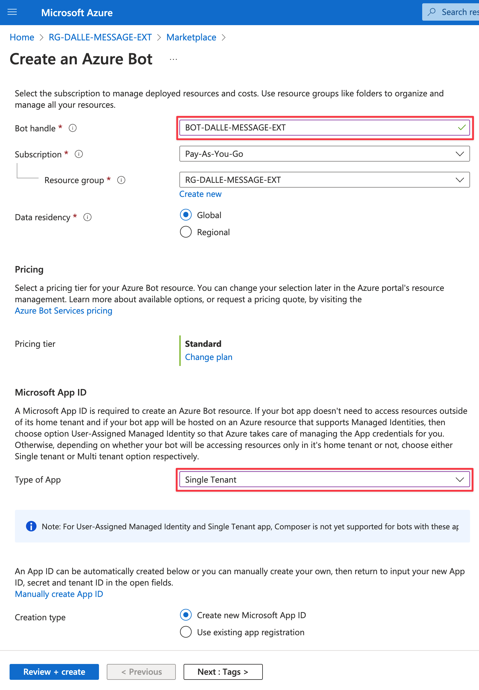
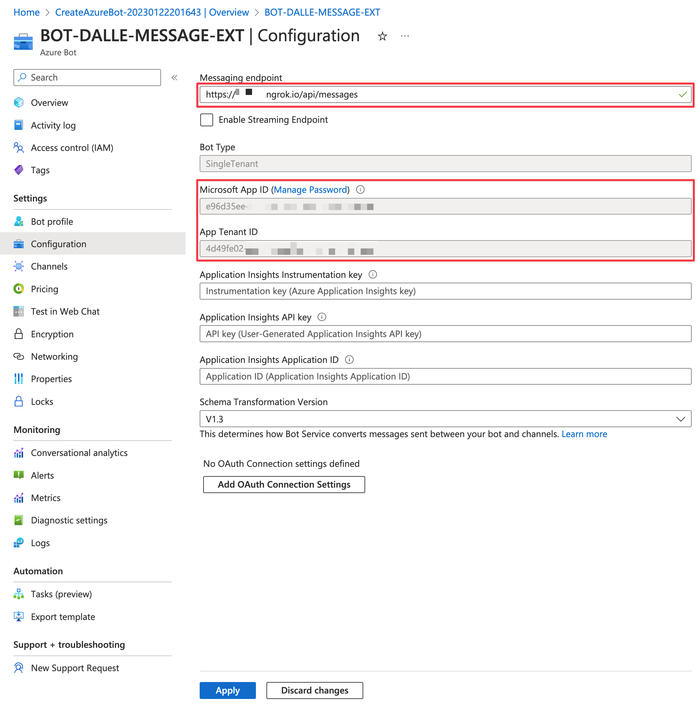
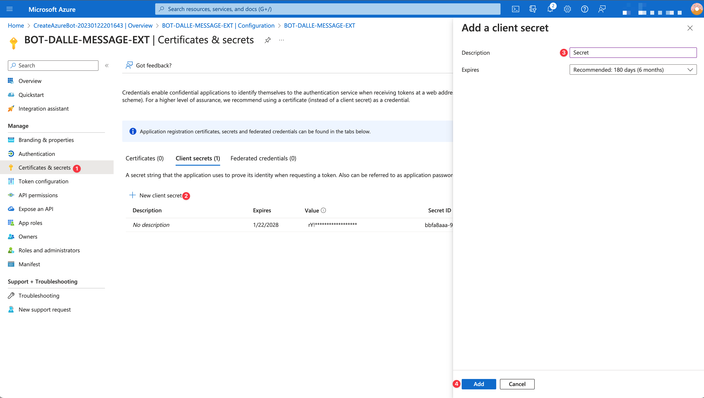
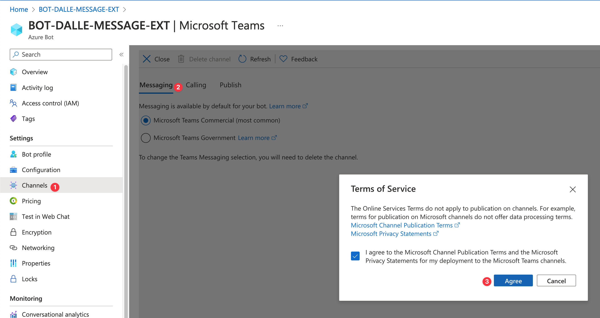

# Teams DALL·E 2 Messaging Extension

## Summary

This is a sample of using [DALL·E 2](https://openai.com/dall-e-2/) inside of Microsoft Teams conversations by using a messaging extension. It allows a user in Teams to describe an image then uses the [OpenAI API](https://beta.openai.com/overview) to have DALL·E 2 generate an image, which can then be added to the conversation.


## Frameworks


## Prerequisites

* [OpenAI account](https://beta.openai.com/) and API key
* [Office 365 tenant](https://dev.office.com/sharepoint/docs/spfx/set-up-your-development-environment)
* [Node.js](https://nodejs.org) version 14 or higher

    ```bash
    # determine node version
    node --version
    ```

* [Azure Functions Core Tools](https://github.com/Azure/azure-functions-core-tools) version 4 or higher

    ```bash
    # determine core tools version
    func --version
    ```

* [ngrok](https://ngrok.com/) - Although a free account will work with this sample, the tunnel subdomain will change each time you run ngrok, requiring a change to the Azure Bot messaging endpoint and the Teams app manifest. A paid account with a permanent subdomain is recommended.

## Version history

Version|Date|Author|Comments
-------|----|----|--------
1.0|Jan 22, 2023|Lee Ford|Initial release

## Disclaimer

**THIS CODE IS PROVIDED _AS IS_ WITHOUT WARRANTY OF ANY KIND, EITHER EXPRESS OR IMPLIED, INCLUDING ANY IMPLIED WARRANTIES OF FITNESS FOR A PARTICULAR PURPOSE, MERCHANTABILITY, OR NON-INFRINGEMENT.**

---

## Minimal Path to Awesome

### Start ngrok

Start ngrok listening on port 7071 (or whatever port you are running the Azure Function on)

```bash
ngrok http 7071
```

If you have a paid account, add the subdomain:

```bash
# Replace 12345678 with your ngrok subdomain
ngrok http 7071 -subdomain=12345678
```

Take a note of the forwarding URL, as you will need it later.

### Create an Azure Bot

1. Go to the [Azure Portal](https://portal.azure.com)
2. Search for **Azure Bot** and choose **Create**
3. Populate the bot with the following:
   * **Bot handle**: A unique bot name (the display name can be changed later)
   * **Type of App**: Single tenant (in a production scenario, you would be running in Azure and use Managed Identity)
    
4. With the bot created, under **Configuration**:
   * Take a note of the **Microsoft App ID** and **Microsoft App Tenant ID** (you will need these later)
   * Populate the **Messaging endpoint** with the ngrok forwarding URL (with `/api/messages` appended). Note: if you are not using a paid account, you will need to update this each time you restart ngrok.
    
   * Click on **Manage Password** and create a **New client secret**. Specify a name and when it expires. Take a copy of the **Secret value** (you will need this later)
    
    
    > Note in a production environment, you should be using a Managed Identity to authenticate to the Azure Bot, rather than a client secret.
5. Under **Channels**, add the **Microsoft Teams** channel and enable messaging
   

### Run Locally

1. Clone this repository
2. Create and populate a `local.settings.json` file in the `source` folder with the following (with your own values):

    ```json
    {
    "IsEncrypted": false,
    "Values": {
        "FUNCTIONS_WORKER_RUNTIME": "node",
        "AzureWebJobsStorage": "",
        "OPENAI_API_KEY": "<YOUR OPENAI API KEY>",
        "MicrosoftAppId": "<YOUR MICROSOFT APP REGISTRATION ID>",
        "MicrosoftAppPassword": "<YOUR MICROSOFT APP REGISTRATION CLIENT SECRET>",
        "MicrosoftAppTenantId": "<YOUR MICROSOFT APP REGISTRATION TENANT ID>",
        "MicrosoftAppType": "SingleTenant"
        }
    }
    ```

3. Run the following to install, build and run the code (from the `source` folder):

    ```bash
    npm install
    npm run build
    func host start
    ```

### Teams App Manifest

1. Edit the `manifest.json` file and replace the `id` and both `botId` values with the **Microsoft App ID** from the Azure Bot
2. Zip the `manifest` folder into a `manifest.zip` file
3. Upload the `manifest.zip` file to Teams (side load the or upload in Teams Admin Center)


