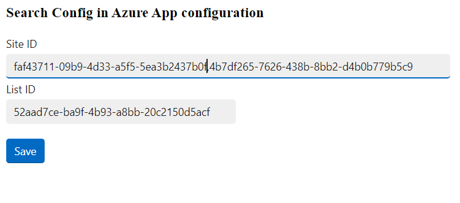
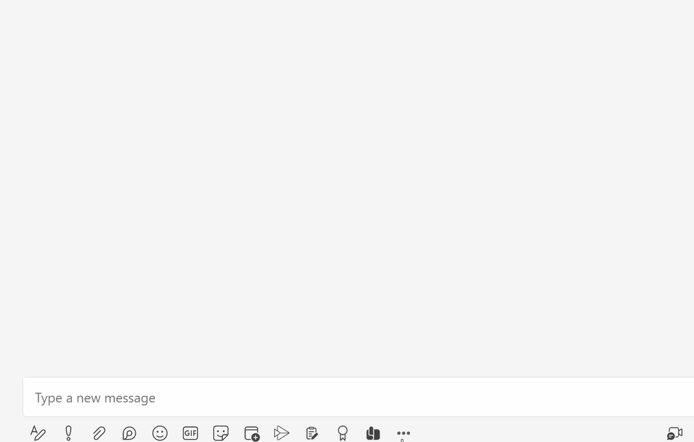

# msgext-graph-srch-config-csharp
A Microsoft Teams search-based messaging extension using SSO with Microsoft Graph and Azure App Configuration

## Summmary

This sample is a search-based messaging extension created using the Teams Toolkit with Visual Studio 2022. It authenticates against Microsoft Graph via SSO and receives documents to be posted as adaptive card to the message compose box of a channel or conversation. The essential thing is that it is configurable and persists it's configuration to an Azure App Configuration resource.

Configuration Page



Message Extension



For further details see the author's [blog post](https://mmsharepoint.wordpress.com/2023/04/13/configure-teams-applications-with-azure-app-configuration-c/)

## Applies to

This sample was created [using the Teams Toolkit with Visual Studio 2022](https://learn.microsoft.com/en-us/microsoftteams/platform/toolkit/teams-toolkit-fundamentals?pivots=visual-studio&WT.mc_id=M365-MVP-5004617). Nearly the same sample was also realized with the [Yeoman Generator for Teams](https://github.com/pnp/generator-teams) and can be found [here](https://github.com/pnp/teams-dev-samples/tree/main/samples/msgext-graph-action-config).

## Version history

Version|Date|Author|Comments
-------|----|--------|--------
1.0|May 09, 2023|[Markus Moeller](http://www.twitter.com/moeller2_0)|Initial release

## Disclaimer

**THIS CODE IS PROVIDED *AS IS* WITHOUT WARRANTY OF ANY KIND, EITHER EXPRESS OR IMPLIED, INCLUDING ANY IMPLIED WARRANTIES OF FITNESS FOR A PARTICULAR PURPOSE, MERCHANTABILITY, OR NON-INFRINGEMENT.**

---
## Minimal Path to Awesome
- Clone the repository
    ```bash
    git clone https://github.com/pnp/teams-dev-samples.git
- Open samples\msgext-graph-action-config-csharp\msgext-graph-search-config.sln in Visual Studio
- Perform first actions in GettingStarted.txt (before hitting F5)
- Copy .\msgext-graph-action-config-csharp\MsgextGraphActCfg\.fx\states\state.local.json to .\msgext-graph-action-config-csharp\MsgextGraphActCfg\.fx\states\state.dev.json
Nevertheless, even when debugging locally Bot Emulator does not support SSO with OAuthConnection so a Bot Service is needed
- So execute Teams Toolkit \ Provision in the Cloud
- This should [provison a Bot in Azure](https://learn.microsoft.com/en-us/microsoftteams/platform/toolkit/provision?pivots=visual-studio&WT.mc_id=M365-MVP-5004617#create-resources-1)
- Ensure there is an app registration for the bot
  - with redirect uri https://token.botframework.com/.auth/web/redirect
  - with SignInAudience multi-tenant
  - with client secret
  - with **delegated** permission Sites.Read.All
  - With exposed Api "access_as_user" and App ID Uri api://~YourNgrokUrl~/<App ID>
  - With the client IDs for Teams App and Teams Web App 1fec8e78-bce4-4aaf-ab1b-5451cc387264 and 5e3ce6c0-2b1f-4285-8d4b-75ee78787346
- Find/Add the app registration ClientId, ClientSecret as BOT_ID, BOT_PASSWORD to your appsettings.json (or a appsettings.Development.json)
- Also add to .\msgext-graph-action-config-csharp\MsgextGraphActCfg\.fx\states\state.dev.json
- Generate an Azure App Configuration resource and copy the Primary Key Connection String to appsettings.json (or a appsettings.Development.json) as "AZURE_CONFIG_CONNECTION_STRING": 
- Execute Teams Toolkit \ ZIP App Package \ For Azure
- Press F5
- When Teams opens in Browser and tries to add the app, skip that
- Instead manually upload .\msgext-graph-action-config-csharp\MsgextGraphActCfg\build\appPackage\appPackage.dev as app to a Team
- In channel conversation open "Messaging extensions ..."
- Right click the app icon and configure with valid siteID, listID to a document library of your choice
- Left click app icon to retrieve and select document as Adaptive Card


## Features
This is a simple search-based messaging extension. It offers documents retrieved from Microsoft Graph for selection and to be posted to the current Team's news channel.
* SSO access token generation to access Microsoft Graph
    * Retrieves documents either via listItems from site / list or
    * Uses search to retrieve them independently from sites / lists [Blog post](https://mmsharepoint.wordpress.com/2021/06/16/query-sharepoint-items-with-microsoft-graph-and-search/)
* [Post an adaptive card](https://adaptivecards.io/)
* A configuration page to offer self service configuration of the SiteID and ListID where the documents reside
* Configuraton storage in [Azure App Configuration](https://learn.microsoft.com/en-us/azure/azure-app-configuration/overview?WT.mc_id=M365-MVP-5004617)
* Secret Storage and consumption in [Azure Key Vault](https://learn.microsoft.com/en-us/azure/key-vault/general/overview?WT.mc_id=M365-MVP-5004617)

