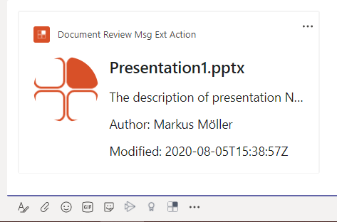

# Document Review Msg Extension Action - Microsoft Teams App

## Summary

This sample is a **action** based messaging extension created using the Teams Yeoman Generator as featured in [this video](https://www.youtube.com/watch?v=S1eANUbqaRs&list=PLR9nK3mnD-OUeDoawdmYJJsTlRHd6p5DB&index=7&t=7s). It authenticates against Microsoft Graph via SSO and on-behalf flow from the frontend and recieves doduments due for review.


... and an adaptive card with document details is inserted into the conversation


For further details see the [Yo Teams wiki for the project structure](https://github.com/PnP/generator-teams/wiki/Project-Structure)
The example is documented in
- The author's [blog series part V](https://mmsharepoint.wordpress.com/2020/08/25/a-microsoft-teams-messaging-extension-with-authentication-and-access-to-microsoft-graph-v/)

## Frameworks


## Prerequisites

* [Office 365 tenant](https://dev.office.com/sharepoint/docs/spfx/set-up-your-development-environment)
* [Node.js](https://nodejs.org) version 10.14.1 or higher
* [ngrok](https://ngrok.com) or similar tunneling application is required for local testing

    ```bash
    # determine node version
    node --version
    ```

## Version history

Version|Date|Author|Comments
-------|----|----|--------
1.0|August 28, 2020|Markus Moeller|Initial release

## Disclaimer

**THIS CODE IS PROVIDED *AS IS* WITHOUT WARRANTY OF ANY KIND, EITHER EXPRESS OR IMPLIED, INCLUDING ANY IMPLIED WARRANTIES OF FITNESS FOR A PARTICULAR PURPOSE, MERCHANTABILITY, OR NON-INFRINGEMENT.**

---
## Minimal Path to Awesome
- Clone the repository

    ```bash
    git clone https://github.com/PnP/teams-dev-samples.git
    ```

- In a console, navigate to `samples/msgext-customer-search`

    ```bash
    cd samples/msgext-customer-search
    ```

- Install modules

    ```bash
    npm install
    ```
- Run ngrok and note down the given url

    ```bash
    gulp start-ngrok
    ```
- Since messaging extensions utilize the Azure Bot Framework, you will need to register a new bot. 
[These instructions](https://docs.microsoft.com/en-us/microsoftteams/platform/bots/how-to/create-a-bot-for-teams#register-your-web-service-with-the-bot-framework) provide options for registering with or without an Azure subscription. 
  - Be sure to enable the Microsoft Teams bot channel so your solution can communicate with Microsoft Teams
  - For local testing, set the messaging endpoint to the https URL returned by ngrok plus "/api/messages"
  - Note the bot's Application ID and password (also called the Client Secret) assigned to your bot during the registration process. In the Azure portal this is under the Bot Registration settings; in the legacy portal it's in the Settings tab. Click Manage to go to Azure AD to obtain the Client Secret. You may need to create a new Application Secret in order to have an opportunity to copy it out of the Azure portal. 
- Update the `.env` configuration for the bot to use the Microsoft App Id and App Password (aka Client Secret) from the previous step.
- You will furthermore need to register an app in Azure AD [also describe here](https://mmsharepoint.wordpress.com/2020/07/03/a-microsoft-teams-messaging-extension-with-authentication-and-access-to-microsoft-graph-i/)
  - with client secret
  - with **delegated** permissions email, offline_access, openid, profile, Sites.ReadWrite.All
  - With exposed Api "access_as_user" and App ID Uri api://<NGrok-Url>/<App ID>
  - With the client IDs for Teams App and Teams Web App 1fec8e78-bce4-4aaf-ab1b-5451cc387264 and 5e3ce6c0-2b1f-4285-8d4b-75ee78787346
- Also add the app ID and its secret to .env as GRAPH_APP_ID= and GRAPH_APP_SECRET=


- Deploy columns and content type to a SharePoint site of your choice. Use [PnP Provisioning Template](https://github.com/mmsharepoint/teams-docreview/blob/master/templates/DocReview.xml) and Apply-PnPProvisioningTemplate for this.
- Via Graph Explorer retrieve and not down the ID of the chosen site and corresponding documents library. Ref [here](https://mmsharepoint.wordpress.com/2020/07/03/a-microsoft-teams-messaging-extension-with-authentication-and-access-to-microsoft-graph-i-i/) for instructions.

- Generate and upload the application package
  ```bash
  gulp manifest
  ```
  Upload the resulting zip file into Teams [using these instructions](https://docs.microsoft.com/en-us/microsoftteams/platform/concepts/deploy-and-publish/apps-upload).

- Run the bot locally
    ```bash
    gulp serve
    ```

- Test in Microsoft Teams by clicking the ... beneath the compose box in a Team where the application has been installed.

## Features

This is a simple Action based messaging extension

## Debug and test locally

To debug and test the solution locally you use the `serve` Gulp task. This will first build the app and then start a local web server on port 3007, where you can test your Tabs, Bots or other extensions. Also this command will rebuild the App if you change any file in the `/src` directory.

``` bash
gulp serve
```

To debug the code you can append the argument `debug` to the `serve` command as follows. This allows you to step through your code using your preferred code editor.

``` bash
gulp serve --debug
```

To step through code in Visual Studio Code you need to add the following snippet in the `./.vscode/launch.json` file. Once done, you can easily attach to the node process after running the `gulp server --debug` command.

``` json
{
    "type": "node",
    "request": "attach",
    "name": "Attach Node",
    "port": 9229,
    "sourceMaps": true,
    "outFiles": [
        "${workspaceRoot}/dist/**/*.js"
    ]
},
```

### Using ngrok for local development and hosting

In order to make development locally a great experience it is recommended to use [ngrok](https://ngrok.io), which allows you to publish the localhost on a public DNS, so that you can consume the bot and the other resources in Microsoft Teams. 

To use ngrok, it is recommended to use the `gulp ngrok-serve` command, which will read your ngrok settings from the `.env` file and automatically create a correct manifest file and finally start a local development server using the ngrok settings.

For an even better expereince you can
- Fire up **two** command prompts
- Both switch to local directory of your solution
- In one call gulp start-ngrok
- In the other only run gulp serve --debug
  - This one you can now start and stop as often as you want without losing your temp. Url
- [Further details on this](https://mmsharepoint.wordpress.com/2020/06/27/microsoft-teams-app-yeoman-generator-split-ngrok-serve/)

### Additional build options

You can use the following flags for the `serve`, `ngrok-serve` and build commands:

* `--no-linting` - skips the linting of Typescript during build to improve build times
* `--debug` - builds in debug mode


