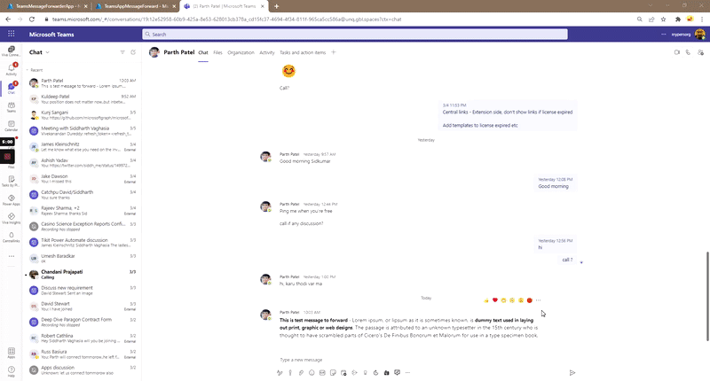
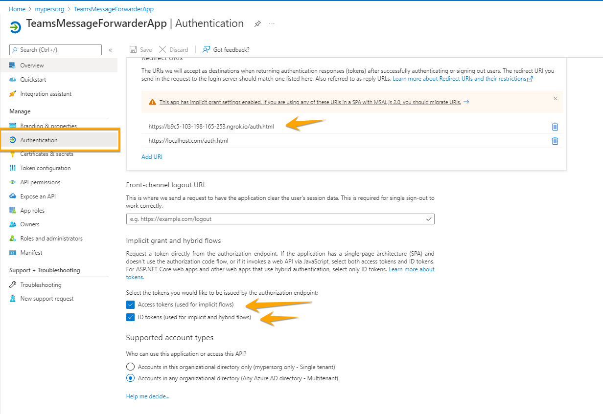
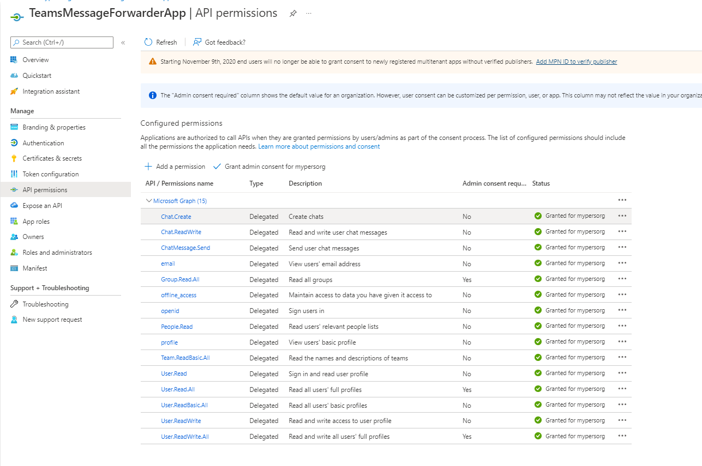
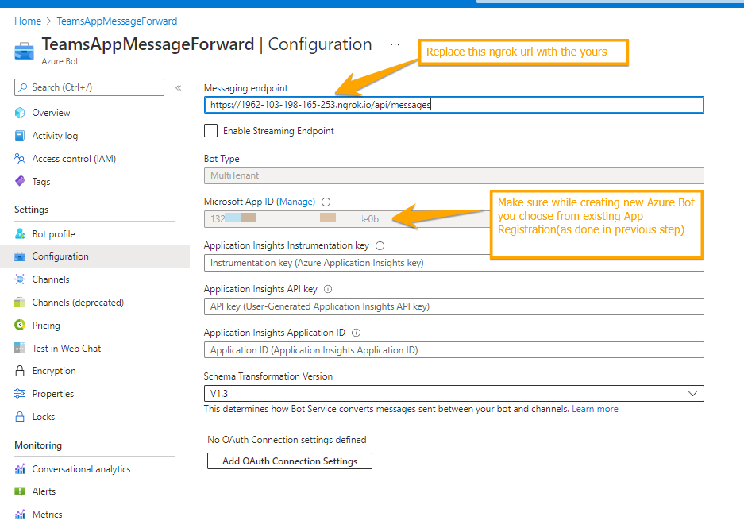

# Message Forwarder Messaging extension

## Summary

This Teams messaging extension will allow use to Forward a Message to User/s or Teams Channel using Graph API. Teams Messaging forward functionality is not available in teams desktop. 



## Prerequisites

* [Office 365 tenant](https://dev.office.com/sharepoint/docs/spfx/set-up-your-development-environment)
* [Azure subscription](https://azure.microsoft.com/en-us/free/) (only needed if you want to deploy your bot to Azure)
* [Node.js](https://nodejs.org) version 10.14.1 or higher

## Version history

Version|Date|Author|Comments
-------|----|----|--------
1.0|March 03, 2022|[Siddharth Vaghasia](https://siddharthvaghasia.com)|Initial release

## Disclaimer

**THIS CODE IS PROVIDED *AS IS* WITHOUT WARRANTY OF ANY KIND, EITHER EXPRESS OR IMPLIED, INCLUDING ANY IMPLIED WARRANTIES OF FITNESS FOR A PARTICULAR PURPOSE, MERCHANTABILITY, OR NON-INFRINGEMENT.**

---

## Minimal Path to Awesome

* Clone this repository
* in the command line run:
  * `npm install`
  * `npm i -g gulp-cli`
  * `gulp ngrok-serve`
* This will give your ngrok url, which can  be used in below steps
* Register a bot and Azure AD application (Steps mentoined below)
* With gulp ngrok-serve, it will auto create teams app manifest file package. Just make sure that the manifest file correct reference to your ngrok url.
* Upload the manifest package to Teams App to test the app.

## Features
This Teams app will provide way to forward a message to any users or teamms channel directly from current chat converstion. This Teams App sample illustrates the following concepts:

* Action based Messaging Extension Teams App (Task Module)
* Implementing SSO in Action based Messaging Extension
* Using MGT Graph Toolkit inside Messaging Extension Task Module
* Making Graph API calls using MGT Provider with SSO

## Create Azure AD App Registration
As we are using Graph API and SSO, we need to setup new Azure AD app registration. 

* To create a new Azure AD App registration with SSO refer this [link](https://pnp.github.io/generator-teams/tutorials/build-a-tab-with-sso-support/#set-up-your-azure-ad-application) 
* For making graph call using Microsoft Graph Toolkit with SSO, we would need to do addtional steps in Azure AD app to make sure Graph API token is retrieved and we get required constent and permissoins. You can refer this [link](https://blog.mastykarz.nl/securely-connect-microsoft-graph-teams-tabs-sso/) from Waldek on same to understand the concept. Please note that the code is already implemented in this solution. so you need to just do configuration in Azure AD app registration.



* Required Permissions for this solution.

* ['User.Read','Mail.ReadBasic', 'User.ReadBasic.All','ChatMessage.Send', 'User.Read.All', 'Chat.ReadWrite','People.Read','Team.ReadBasic.All','Group.Read.All','Channel.ReadBasic.all','Chat.Create','Chat.ReadWrite']



## Create Azure Bot Regisration
As we have to use messaging extension, we need to register a Azure Bot.

* Go to portal.azure.com
* Create new Azure Bot
* When Asked for Azure App ID choose existing one and enter Azure App Regisration client id and secret from previous step
* Enable Bot channel for Teams
* Replace the API messaging endpoint with your ngrok url after you ran.



## Replace client ID for provider

* Inside the file msgext-msg-forwarder\src\client\forwardMessageMessageExtension\ForwardMessageMessageExtensionAction.tsx
* Replace the clientId with your client ID

## Enviornment Variable file

Create a .env file at the root of the solution(when you will clone, this file won't be created automatically) and then copy below content in this file. If you are deploying to Azure, make sure you have below variable entries in configuration.

```
# The public domain name of where you host your application
PUBLIC_HOSTNAME=xxx.azurewebsites.net

# Id of the Microsoft Teams application
APPLICATION_ID=00000000-0000-0000-0000-000000000000
# Package name of the Microsoft Teams application
PACKAGE_NAME=teamsmsgforward

# App Id and App Password for the Bot Framework bot
MICROSOFT_APP_ID=00000000-0000-0000-0000-000000000000
MICROSOFT_APP_PASSWORD=k1723712738612836217123823373B

# Port for local debugging
PORT=3007

# Security token for the default outgoing webhook
SECURITY_TOKEN=

# ID of the Outlook Connector
CONNECTOR_ID=

# Application Insights instrumentation key
APPINSIGHTS_INSTRUMENTATIONKEY=00000000-0000-0000-0000-000000000000

# NGROK configuration for development
# NGROK authentication token (leave empty for anonymous)
NGROK_AUTH=
# NGROK sub domain. ex "myapp" or  (leave empty for random)
NGROK_SUBDOMAIN=
# NGROK region. (us, eu, au, ap - default is us)
NGROK_REGION=

# Debug settings, default logging "msteams"
DEBUG=msteams

TAB_APP_ID=00000000-0000-0000-0000-000000000000
TAB_APP_URI=api://b9c5-103-198-165-253.ngrok.io/00000000-0000-0000-0000-000000000000
MICROSOFT_APP_ID=13000000-0000-0000-0000-00000000b59d

```

