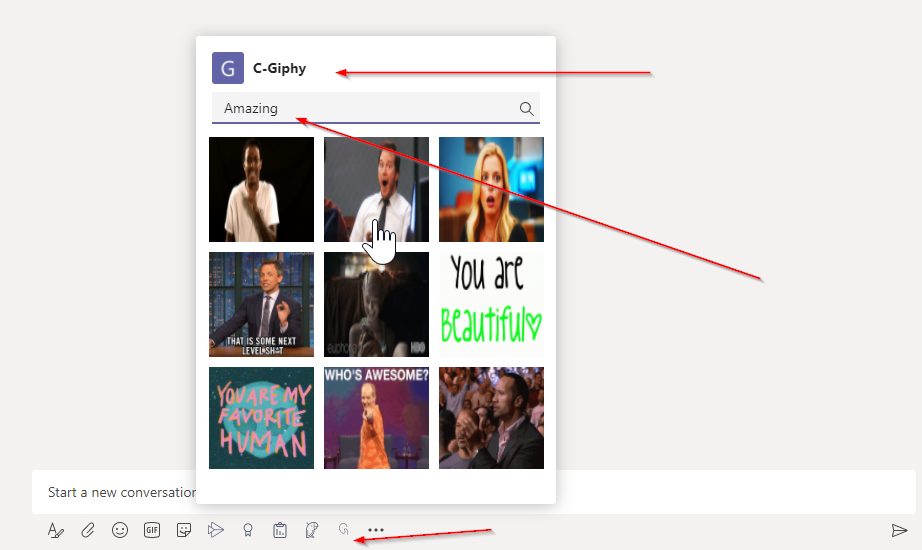
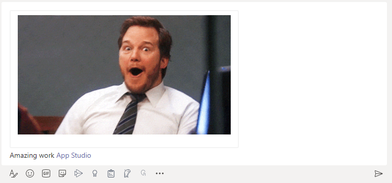
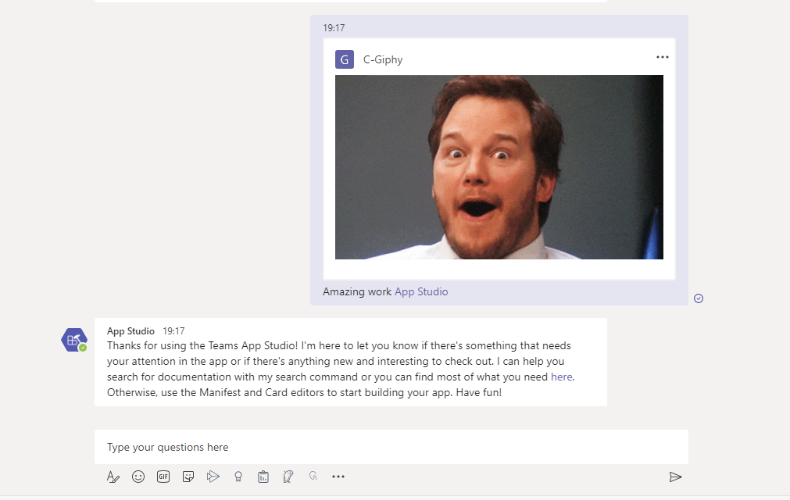

# Giphy Search Messaging Extension


Search based *Messaging extensions* allow users to interact with your web service through buttons and forms in the Microsoft Teams client. They can search, in an external system from the compose message area.

## Summary

This sample is a search-based messaging extension created using the [Microsoft Teams Toolkit](https://marketplace.visualstudio.com/items?itemName=TeamsDevApp.ms-teams-vscode-extension).
This app will allow searching a GIF based on a search keyword and can tap on an item to add it into the message composing area.
This is the same functionlity as GIPHY app, although the search api can be more regulated. IT could also decide if the app needs to be installed in certain Teams or not.

Find the app and invoke it, then search 



...compose message with the selected GIF



Finally the card and the message that is sent.




## Frameworks


## Prerequisites


* [Office 365 tenant](https://dev.office.com/sharepoint/docs/spfx/set-up-your-development-environment)
* [Node.js](https://nodejs.org) version 10.14.1 or higher
* [ngrok](https://ngrok.com) or similar tunneling application is required for local testing

    ```bash
    # determine node version
    node --version
    ```


## Version history

Version|Date|Author|Comments
-------|----|----|--------
1.0|October 29, 2020|Rabia Williams|Initial release


**Configure Ngrok**

Your app will be run from a localhost server. You will need to setup Ngrok in order to tunnel from the Teams client to localhost. 

**Run Ngrok**

Run ngrok - point to port 3978

`ngrok http -host-header=rewrite 3978`

**Update Bot Framework Messaging Endpoint**

  Note: You can also do this with the Manifest Editor in App Studio if you are familiar with the process.

- For the Messaging endpoint URL, use the current `https` URL you were given by running ngrok and append it with the path `/api/messages`. It should like something work `https://{subdomain}.ngrok.io/api/messages`.

- Click on the `Bots` menu item from the toolkit and select the bot you are using for this project.  Update the messaging endpoint and press enter to save the value in the Bot Framework.

- Ensure that you've [enabled the Teams Channel](https://docs.microsoft.com/en-us/azure/bot-service/channel-connect-teams?view=azure-bot-service-4.0)

## Build and run

### `npm install`

### `npm start`

## Deploy to Teams
Start debugging the project by hitting the `F5` key or click the debug icon in Visual Studio Code and click the `Start Debugging` green arrow button.


