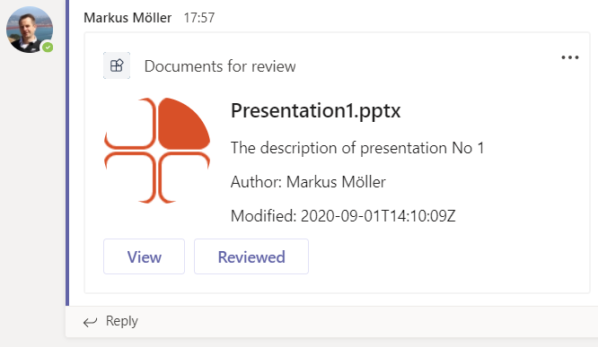
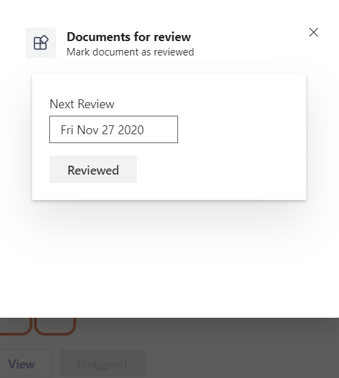

# Document Review SPFx Messaging Extension

## Summary

This sample is a **action** based messaging extension created mainly using SPFx Yeoman Generator and partially using the Teams Yeoman Generator.
It uses the new SPFx capability to be [exposed as a Messaging extension](https://docs.microsoft.com/en-us/sharepoint/dev/spfx/build-for-teams-expose-webparts-teams#expose-web-part-as-microsoft-teams-messaging-extension)


... and an AdaptiveCard with document details is inserted into the conversation...



...finally another task module to mark the document as "Reviewed"



This example is fully documented in the author's [blog post](https://mmsharepoint.wordpress.com/2020/09/03/use-spfx-for-task-modules-in-teams-messaging-extensions-and-access-microsoft-graph/)

## Used SharePoint Framework Version


## Applies to

- [SharePoint Framework](https://aka.ms/spfx)
- [Microsoft 365 tenant](https://docs.microsoft.com/en-us/sharepoint/dev/spfx/set-up-your-developer-tenant)

## Version history

Version|Date|Author|Comments
-------|----|----|--------
1.0|September 02, 2020|[Markus Moeller](https://twitter.com/moeller2_0)|Initial release

## Disclaimer

**THIS CODE IS PROVIDED *AS IS* WITHOUT WARRANTY OF ANY KIND, EITHER EXPRESS OR IMPLIED, INCLUDING ANY IMPLIED WARRANTIES OF FITNESS FOR A PARTICULAR PURPOSE, MERCHANTABILITY, OR NON-INFRINGEMENT.**

---

## Minimal Path to Awesome

- Clone this repository
- Ensure that you are at the solution folder
- in the command-line run at two windows:
  - inside webpart folder **and** inside bot folder
  - **npm install** 

- Since messaging extensions utilize the Azure Bot Framework, you will need to register a new bot. 
[These instructions](https://docs.microsoft.com/en-us/microsoftteams/platform/bots/how-to/create-a-bot-for-teams#register-your-web-service-with-the-bot-framework) provide options for registering with or without an Azure subscription. 
  - Be sure to enable the Microsoft Teams bot channel so your solution can communicate with Microsoft Teams
  - For local testing, set the messaging endpoint to the https URL returned by ngrok plus "/api/messages"
  - Note the bot's Application ID and password (also called the Client Secret) assigned to your bot during the registration process. In the Azure portal this is under the Bot Registration settings; in the legacy portal it's in the Settings tab. Click Manage to go to Azure AD to obtain the Client Secret. You may need to create a new Application Secret in order to have an opportunity to copy it out of the Azure portal. 
- Update the `.env` configuration for the bot to use the Microsoft App Id and App Password (aka Client Secret) from the previous step.
- Update the **webpart**\teams\manifest.json with your botID twice
- Deploy columns and content type to a SharePoint site of your choice. Use [PnP Provisioning Template](https://github.com/mmsharepoint/teams-docreview/blob/master/templates/DocReview.xml) and Apply-PnPProvisioningTemplate for this.
- Via Graph Explorer retrieve and not down the ID of the chosen site and corresponding documents library. Ref [here](https://mmsharepoint.wordpress.com/2020/07/03/a-microsoft-teams-messaging-extension-with-authentication-and-access-to-microsoft-graph-i-i/) for instructions.
  - Insert those IDs into the small [PnP PowerShell script](../scripts/TenantConfig.ps1) to set a tenant property and execute this.
- Install:
    - Run gulp bundle and gulp package-solution and installe your created .sppkg file to your tenant app catalog
    - Zip the webpart\teams\manifest together with at least two of the icons (5ca...) and upload them to your teams app catalog manually
    - Install the app to one team of your choice (hover the team's logo and choose the "Apps logo")

## Debug and test locally

To debug and test the solution locally you use the `serve` Gulp task. This will first build the app and then start a local web server on port 3007, where you can test your Tabs, Bots or other extensions. Also this command will rebuild the App if you change any file in the `/src` directory.

``` bash
gulp serve
```

To debug the code you can append the argument `debug` to the `serve` command as follows. This allows you to step through your code using your preferred code editor.

``` bash
gulp serve --debug
```
To step through code of the **bot** in Visual Studio Code you need to add the following snippet in the `./.vscode/launch.json` file. Once done, you can easily attach to the node process after running the `gulp server --debug` command.

``` json
{
    "type": "node",
      "request": "attach",
      "name": "Attach Node",
      "port": 9229,
      "sourceMaps": true,
      "outFiles": [
          "${workspaceRoot}/dist/**/*.js"
      ]
},
```
To step through the code of the **webpart** it is best to open the task module (Select or Reviewed) while having gulp serve running and installed a .sppkg file created without --ship and locate the files via browser's developer tools. [See here for instance](https://www.eliostruyf.com/how-to-debug-your-sharepoint-framework-web-part/)

## Features

This extension illustrates the following concepts:

- [Expose an SPFx webpart as Teams Messaging extension]()
- [Add and respond to card actions](https://docs.microsoft.com/en-us/microsoftteams/platform/task-modules-and-cards/cards/cards-actions)
- Hand over parameters to task modules

## References

- [Getting started with SharePoint Framework](https://docs.microsoft.com/en-us/sharepoint/dev/spfx/set-up-your-developer-tenant)
- [Building for Microsoft teams](https://docs.microsoft.com/en-us/sharepoint/dev/spfx/build-for-teams-overview)
- [Use Microsoft Graph in your solution](https://docs.microsoft.com/en-us/sharepoint/dev/spfx/web-parts/get-started/using-microsoft-graph-apis)
- [Publish SharePoint Framework applications to the Marketplace](https://docs.microsoft.com/en-us/sharepoint/dev/spfx/publish-to-marketplace-overview)
- [Microsoft 365 Patterns and Practices](https://aka.ms/m365pnp) - Guidance, tooling, samples and open-source controls for your Microsoft 365 development
<<<<<<< HEAD
<<<<<<< HEAD


=======
>>>>>>> be254ab... Initial commit
=======


>>>>>>> fc2b5645b4e763f29c39873e35f90072ef8d5877
