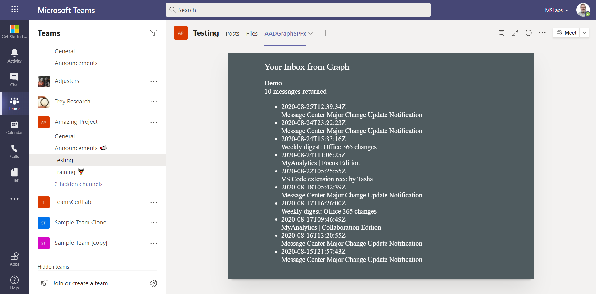
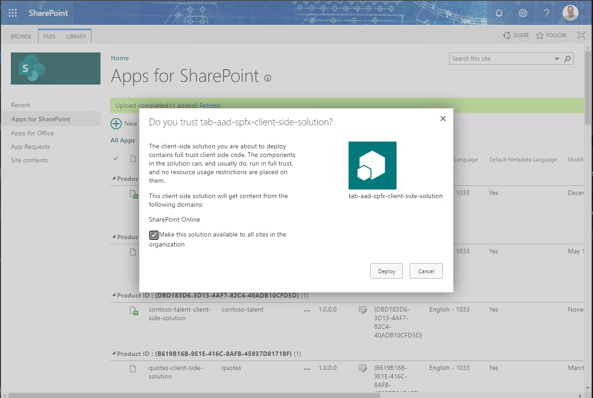
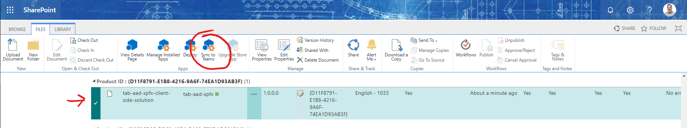
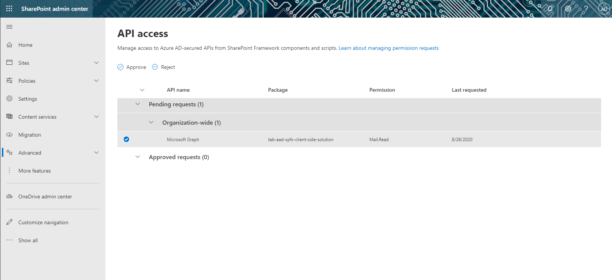
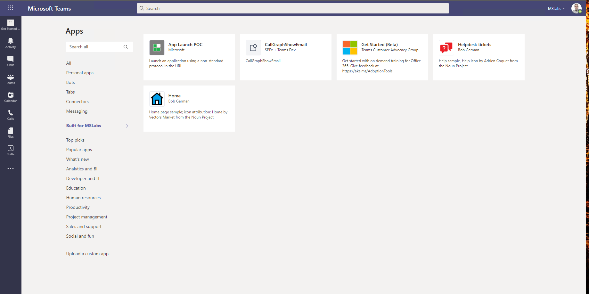

# Teams tab using SharePoint Framework and Microsoft Graph

## Summary

This sample shows how to write a Teams tab using SharePoint Framework, and to call the Graph API from that tab. The web part is bare bones; all it does is display recent emails in the logged-in user's inbox.

## Frameworks

_Please indicate the SPFx version required_

## Prerequisites

* [Office 365 tenant](https://dev.office.com/sharepoint/docs/spfx/set-up-your-development-environment)
* [SPFx Development environment](https://docs.microsoft.com/en-us/sharepoint/dev/spfx/set-up-your-development-environment)

## Version history

Version|Date|Author|Comments
-------|----|----|--------
1.0|August 25, 2020|Bob German|Initial release

## Disclaimer

**THIS CODE IS PROVIDED *AS IS* WITHOUT WARRANTY OF ANY KIND, EITHER EXPRESS OR IMPLIED, INCLUDING ANY IMPLIED WARRANTIES OF FITNESS FOR A PARTICULAR PURPOSE, MERCHANTABILITY, OR NON-INFRINGEMENT.**

---

## Minimal Path to Awesome

#### 1. Clone this repository to your local filesystem

#### 2. Install npm packages and build the project

~~~shell
npm install

gulp bundle --ship
gulp package-solution --ship
~~~

#### 3. Upload the package in the sharepoint/solution folder into the SharePoint app catalog

If you aren't familar with the SharePoint App Catalog, or haven't created one in your tenant, [instructions are here](https://docs.microsoft.com/en-us/sharepoint/use-app-catalog).

You should be prompted to make the solution available to all sites; check "yes" for a Teams solution.

#### 4. Make the solution available in Teams

When the solution has been installed ("no errors" in the last column), select the app and under the Files tab in the ribbon, click "Sync to Teams" to publish a Teams app manifest to the Teams app catalog.

#### 5. Grant permission

Still in the SharePoint admin center, under Advanced/API Access, you should see a permission request for Mail.Read permissions on the Microsoft Graph. They need to be approved for the solution to work.

#### 6. Install the Teams app for yourself or a Team

In Microsoft Teams, click the Apps icon in the lower left corner, then click the link to &lt;tenant name&gt; Apps. You should see this application, CallGraphShowEmail, on the list. Click the application and install it for yourself or a Team.

## Features

Bare bones sample showing how to call the Microsoft Graph from a Teams tab implemented using SharePoint Framework.

* Display recent emails for the logged-in user

