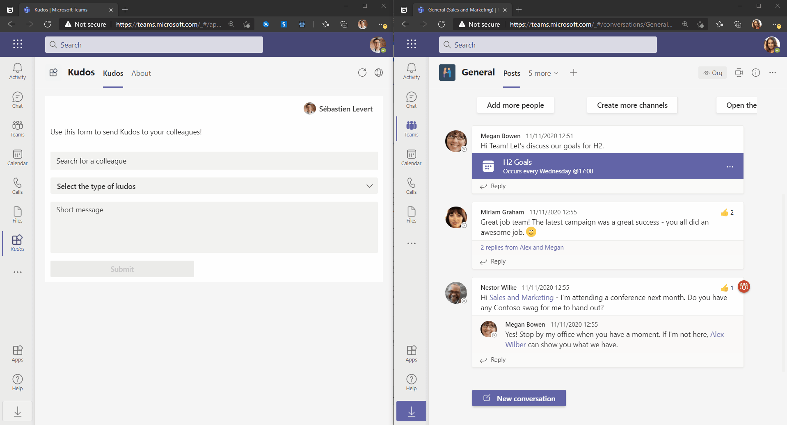

# Kudos App (Teams Activity Feed API)

## Summary

Sample showcasing how to build a solution leveraging the Teams Activity Feed API to send notifications to other users.



## Prerequisites

* [Office 365 tenant](https://dev.office.com/sharepoint/docs/spfx/set-up-your-development-environment)
* [Node.js](https://nodejs.org) version 10.14.1 or higher


    ```bash
    # determine node version
    node --version
    ```

* [Azure CLI](https://docs.microsoft.com/en-us/cli/azure/install-azure-cli) version 2.16.0 or higher (_Optional_)


## Version history

Version|Date|Author|Comments
-------|----|----|--------
1.0|April 26, 2021| [Sébastien Levert](https://www.linkedin.com/in/sebastienlevert) ([@sebastienlevert](https://twitter.com/sebastienlevert)) |Initial release

## Disclaimer

**THIS CODE IS PROVIDED *AS IS* WITHOUT WARRANTY OF ANY KIND, EITHER EXPRESS OR IMPLIED, INCLUDING ANY IMPLIED WARRANTIES OF FITNESS FOR A PARTICULAR PURPOSE, MERCHANTABILITY, OR NON-INFRINGEMENT.**

---

## Minimal Path to Awesome

* Clone this repository
* Create you Azure AD Application using the [manual approach](#create-a-new-azure-ad-application) or execute the following script :
  * `.\scripts\New-AADApp.ps1 -ApplicationName "Kudos App" -RedirectUrl "https://localhost:3000"`
* Copy the `.env.sample` to a new `.env` file
* Add the your generated Azure AD Application id of the `REACT_APP_CLIENT_ID` in the `.env` file
* In the `.publish/manifest.json` file, update the value of `webApplicationInfo > id` with the value of your Azure AD Application
* From the `.publish/manifest.json` file, extract the if and update the `REACT_APP_TEAMS_APP_ID` in the `.env` file
* In the command line run:
  * `npm install`
  * `npm run package`
  * [Upload and install the app to Microsoft Teams](https://docs.microsoft.com/en-us/microsoftteams/platform/concepts/deploy-and-publish/apps-upload#upload-your-package-into-a-team-or-conversation-using-the-store)
  * Install the app for every user involved in your scenario (Every user involved needs to have the app installed)
  * `npm start`

### First time debug step
On the first time running and debugging your app you need allow the localhost certificate.  After starting debugging when your browser is launched and you have installed your app it will fail to load.

- Open a new tab `in the same browser window that was opened`
- Navigate to `https://localhost:3000`
- Click the `Advanced` button
- Select the `Continue to localhost`

### Create a new Azure AD Application

1. Go to the [AAD Azure Portal](https://aad.portal.azure.com), then select **Azure Active Directory** from the left-hand side menu.
  
2. Select **App Registration** and click on **New Registration** button.

3. Fill the details to register an app:
   * Give a name to your application (OneProductivityHub)
   * Select **Accounts in any organizational directory (Any Azure AD directory - Multitenant)** as an access level
   * Use the following Redirect URLs `https://localhost:3000/auth.html`
   * Select **Register**

4. Go to **Authentication** tab and enable **Implicit grant** by selecting `Access tokens` and `ID tokens`, then click `Save` button on the top of the page.

## Features

This solution illustrates the following concepts on top of the a Teams Tab :

* Utilizing the Microsoft Graph Toolkit
* Customizing the Microsoft Graph Toolkit Components
* Utilizing the Activity Feed API provided by Microsoft Graph


