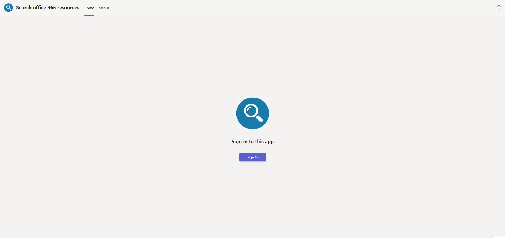
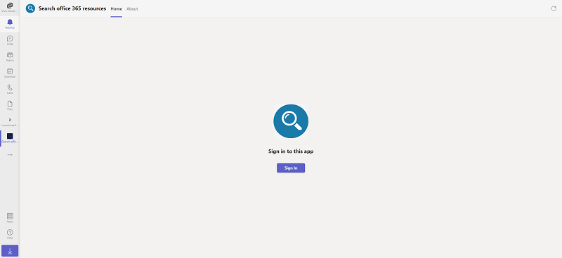
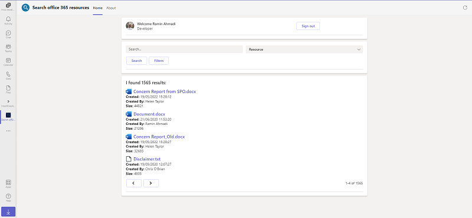
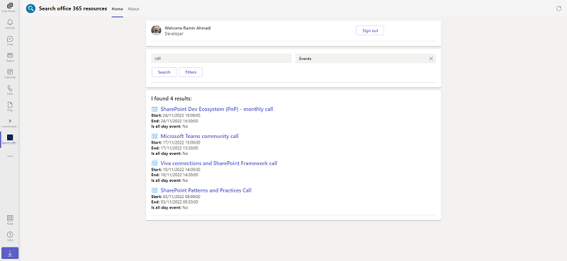
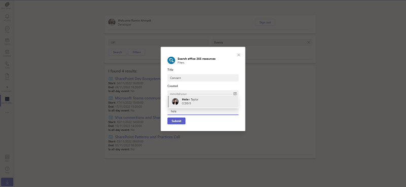
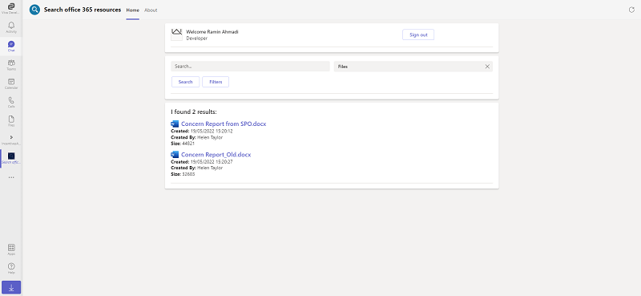
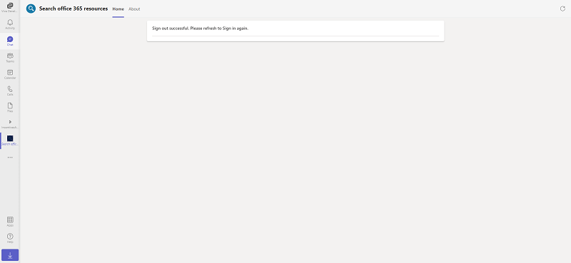

# Tabs with Adaptive Cards

This App talks about the Teams tab which displays Adaptive card with CSharp helping users to search resources such as Events, Messages, Files and list items across Office 365 using Microsoft Graph Search API.

For reference please check [Build tabs with Adaptive Cards](https://docs.microsoft.com/en-us/microsoftteams/platform/tabs/how-to/build-adaptive-card-tabs)



## Frameworks


## Solution

Solution|Author(s)
--------|---------
tab-adaptive-cards-graph-search | [Ramin Ahmadi](https://ramin.expert)

## Version history

Version|Date|Comments
-------|----|--------
1.0|November 2, 2022|Initial release

## Disclaimer

**THIS CODE IS PROVIDED *AS IS* WITHOUT WARRANTY OF ANY KIND, EITHER EXPRESS OR IMPLIED, INCLUDING ANY IMPLIED WARRANTIES OF FITNESS FOR A PARTICULAR PURPOSE, MERCHANTABILITY, OR NON-INFRINGEMENT.**


## Prerequisites

* [Office 365 tenant](https://developer.microsoft.com/en-us/microsoft-365/dev-program)
* Microsoft Teams is installed and you have an account.
* [.NET Core SDK](https://dotnet.microsoft.com/download) version 3.1

  ```bash
  # determine dotnet version
  dotnet --version
  ```
  
* To test locally, you'll need [Ngrok](https://ngrok.com/download) or equivalent tunnelling solution.
Make sure you've downloaded and installed the ngrok on your local machine. ngrok will tunnel requests from the Internet to your local computer and terminate the SSL connection from Teams.

    * ex: `https://subdomain.ngrok.io`.
    
	 NOTE: A free Ngrok plan will generate a new URL every time you run it, which requires you to update your Azure AD registration, the Teams app manifest, and the project configuration. A paid account with a permanent Ngrok URL is recommended.

## Minimal Path to Awesome

1. Run ngrok - point to port 3978

```bash
# ngrok http -host-header=rewrite 3978
```

2. Create a Bot Registration
   In Azure portal, create a [Bot Framework registration resource](https://docs.microsoft.com/en-us/azure/bot-service/bot-builder-authentication?view=azure-bot-service-4.0&tabs=csharp%2Caadv2).

3. Modify the `manifest.json` in the `/AppPackage` folder and replace the `{{BOT-ID}}` with the id from step 2.

4. Zip the contents of `AppPackage` folder into a `manifest.zip`, and use the `manifest.zip` to deploy in app store or add to Teams as in step 7.

5. Modify the `/appsettings.json` and fill in the `{{ Bot Id }}`,`{{ Bot Password }}` and `{{ Connection Name }}` with the id from step 2.

6. Add `{{ Application Base Url }}`in appsetting.json with ngrok tunnel url or deployed application base url. 

7. Upload the manifest.zip to Teams (in the Apps view click "Upload a custom app")
   - Go to Microsoft Teams. From the lower left corner, select Apps
   - From the lower left corner, choose Upload a custom App
   - Go to your project directory, the ./appPackage folder, select the zip folder, and choose Open.
   - Select Add in the pop-up dialog box. Your tab is uploaded to Teams.
    
## To try this sample

- In a terminal, navigate to `TabWithAdpativeCardFlow`

    ```bash
    # change into project folder
    cd # TabWithAdpativeCardFlow
    ```

- Run the bot from a terminal or from Visual Studio, choose option A or B.

  A) From a terminal

  ```bash
  # run the bot
  dotnet run
  ```

  B) Or from Visual Studio

  - Launch Visual Studio
  - File -> Open -> Project/Solution
  - Navigate to `TabWithAdpativeCardFlow` folder
  - Select `TabWithAdpativeCardFlow.csproj` file
  - Press `F5` to run the project

## Interacting with the tab in Teams
    You can use this tab by following the below steps:
    - In the navigation bar located at the far left in Teams, select the ellipses ●●● and choose your app from the list.

## Features of this sample

- Single-sign on



- Tab showing Adaptive cards



- Search different resources across office 365



- Fetch a task module to filter the results



- Task module submit results



- Sign out message



## Deploy the bot to Azure

To learn more about deploying a bot to Azure, see [Deploy your bot to Azure](https://aka.ms/azuredeployment) for a complete list of deployment instructions.

## Further reading

- [Bot Framework Documentation](https://docs.botframework.com)
- [Bot Basics](https://docs.microsoft.com/azure/bot-service/bot-builder-basics?view=azure-bot-service-4.0)
- [Activity processing](https://docs.microsoft.com/en-us/azure/bot-service/bot-builder-concept-activity-processing?view=azure-bot-service-4.0)
- [Azure Bot Service Introduction](https://docs.microsoft.com/azure/bot-service/bot-service-overview-introduction?view=azure-bot-service-4.0)
- [Azure Bot Service Documentation](https://docs.microsoft.com/azure/bot-service/?view=azure-bot-service-4.0)
- [.NET Core CLI tools](https://docs.microsoft.com/en-us/dotnet/core/tools/?tabs=netcore2x)
- [Azure CLI](https://docs.microsoft.com/cli/azure/?view=azure-cli-latest)
- [Azure Portal](https://portal.azure.com)
- [Language Understanding using LUIS](https://docs.microsoft.com/en-us/azure/cognitive-services/luis/)
- [Channels and Bot Connector Service](https://docs.microsoft.com/en-us/azure/bot-service/bot-concepts?view=azure-bot-service-4.0)
- [Overview of the Microsoft Search API](https://learn.microsoft.com/en-us/graph/search-concept-overview)
