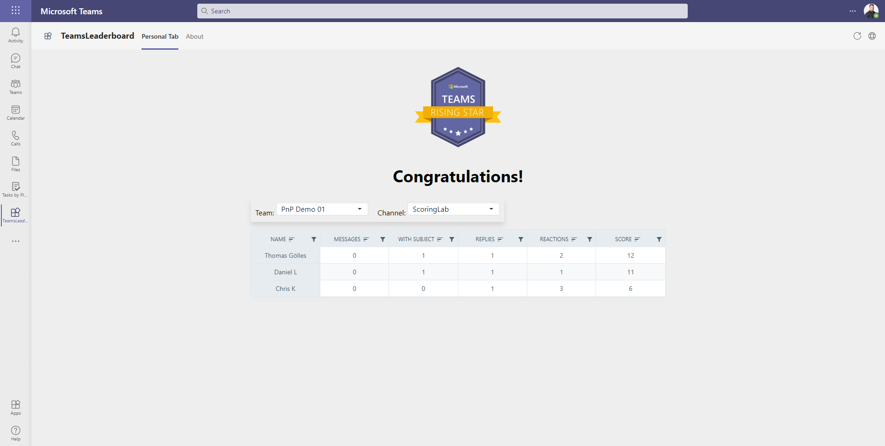

# TeamsLeaderboard

Sample [Microsoft Teams Toolkit V2](https://github.com/OfficeDev/TeamsFx) Blazor project to create a simple leaderboard for a Teams Channel.

Based on the awesome work of [Albert-Jan Schot](https://twitter.com/appieschot) and his blog post [Recognize active team members with the CLI for Microsoft 365](https://www.cloudappie.nl/recognize-active-team-members-cli-microsoft-365/)

Like Appie we are using a simple model to score different points depending on users starting a conversation, giving a reaction or replying to others. As always, messages with a subject line get extra points!

## Summary

Using the Teams Toolkit V2 or TeamsFx for Visual Studio this sample shows how
to create a simple leaderboard for Teams Channels. The sample is based on the TeamsFx
build-in SSO configuration and the code extensions TeamsFx provides.

> **WARNING!**
> 
> **This solution uses Teams Toolkit preview version 0.1.50.37522 from August 19th 2021. 
> Things will change in the future. Do not install TeamsFx or this sample in a production environment!**

If you have no experience with [TeamsFx](https://github.com/OfficeDev/TeamsFx) yet, please take 15 minutes and watch the recording of 
this [Microsoft 365 Community Call ](https://www.youtube.com/watch?v=WPnZgcjr6PI).

The sample is based on a static tab that is defined in Tab.razor. The tab initialises TeamsFx with 
your SSO config and the calls the graph to get all the teams of the current user.

If you select a team and channel from the dropdown the tab querys all the messages, reactions and responses in that channel form the graph.
Using a model defined in HelperClasses.cs a different amount of points is awarded based on the type of interaction.   

A [Radzen](https://www.radzen.com/) data grid component visualizes the final leaderboard.

## Frameworks

## Prerequisites

* [Office 365 tenant](https://dev.office.com/sharepoint/docs/spfx/set-up-your-development-environment)
* .NET5
* Visual Studio 2019
* TeamsFx 0.1.50.37522

_At the time of the writing we already know that there will be a new
version of TeamsFx available somewhere in the "near" future. At that point the code in this sample
isn't valid anymore. The future version will also be compatible with Visual Studio 2022._

## Version history

Version|Date|Author|Comments
-------|----|----|--------
1.0|October 10, 2021|[Thomy Goelles](https://twitter.com/thomyg)|Initial release

## Disclaimer

**THIS CODE IS PROVIDED *AS IS* WITHOUT WARRANTY OF ANY KIND, EITHER EXPRESS OR IMPLIED, INCLUDING ANY IMPLIED WARRANTIES OF FITNESS FOR A PARTICULAR PURPOSE, MERCHANTABILITY, OR NON-INFRINGEMENT.**

---

## Minimal Path to Awesome

_Include consise instructions to set up and run the sample. These are just an example!_

* Clone this repository
* Check the manifest.json and change name and developer info at your will
* Click on Project -> TeamsFx -> Configure SSO and check the output window for details
* Go to the azure portal and add ChannelMessage.Read.All to the created app 
* Consent the required permissions
* Go back to Visual Studio 2019 and press F5

If you want to change the Teams manifest later, just make changes to the file in the solution but 
make sure to click on Project -> TeamsFx -> Update Teams Manifest to sync your changes to the teams developer portal.

You can export your app from developer portal in the latest version or submit it to your local app store if your development enviorment 
is locked down to only a selection of Teams apps. 

## Features

* SSO based on TeamsFx
* Usage of Graphclient
* Adding an additional permission to the created Azure AD application

