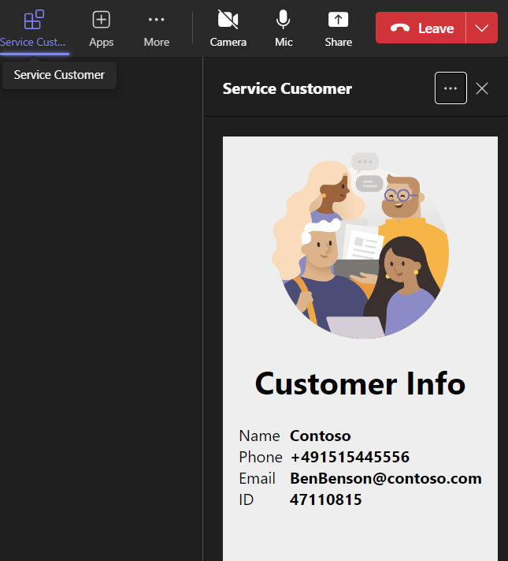

# tab-meeting-create-data-csharp
A Microsoft Teams Tab displaying simple custom data in a meeting which can be installed by the parallel console application.

## Summmary

This sample is a Microsoft Teams Tab displaying simple custom data in a meeting which can be installed by the parallel console application. Additionally at first the console application creates a meeting and also writes the custom data to a custom storage where it's later retrieved from the meeting app. 

High-level process


In meeting side-panel display



For further details see the author's [blog post](https://mmsharepoint.wordpress.com/2023/10/06/creating-teams-meetings-and-install-teams-meeting-app-with-microsoft-graph/)

## Tools and Frameworks


## Prerequisites

* [Office 365 tenant](https://dev.office.com/sharepoint/docs/spfx/set-up-your-development-environment)
* [Visual Studio 2022](https://visualstudio.microsoft.com/vs/community/)
* [Teams Toolkit for Visual Studio](https://learn.microsoft.com/en-us/microsoftteams/platform/toolkit/toolkit-v4/teams-toolkit-fundamentals-vs?pivots=visual-studio-v17-7&WT.mc_id=M365-MVP-5004617)

## Applies to

This sample was created [using the Teams Toolkit with Visual Studio 2022](https://learn.microsoft.com/en-us/microsoftteams/platform/toolkit/toolkit-v4/teams-toolkit-fundamentals-vs?pivots=visual-studio-v17-7&WT.mc_id=M365-MVP-5004617). 

## Version history

Version|Date|Author|Comments
-------|----|--------|--------
1.0|Oct 16, 2023|[Markus Moeller](http://www.twitter.com/moeller2_0)|Initial release

## Disclaimer

**THIS CODE IS PROVIDED *AS IS* WITHOUT WARRANTY OF ANY KIND, EITHER EXPRESS OR IMPLIED, INCLUDING ANY IMPLIED WARRANTIES OF FITNESS FOR A PARTICULAR PURPOSE, MERCHANTABILITY, OR NON-INFRINGEMENT.**

---
## Minimal Path to Awesome
- Clone the repository
    ```bash
    git clone https://github.com/pnp/teams-dev-samples.git
- Open samples\tab-meeting-create-data-csharp\TeamsMeetingCreationPoC.sln in Visual Studio
- Perform first actions in TeamsMeetingServiceCall\GettingStarted.txt (before hitting F5)
- This should [register an app in Azure AD](https://learn.microsoft.com/en-us/microsoftteams/platform/toolkit/add-single-sign-on?pivots=visual-studio&WT.mc_id=M365-MVP-5004617#add-sso-to-teams-app-for-visual-studio)
- Ensure there is an app 
  - with redirect uri https://localhost/blank-auth-end.html
  - SignInAudience multi-tenant
  - with client secret
  - with **delegated** Graph permissions AppCatalog.Read.All, Calendars.ReadWrite, TeamsAppInstallation.ReadWrite, Chat.ReadBasic OnlineMeetings.ReadW, TeamsTab.ReadWriteForChat
    - if you prefer app context created with **application** Graph permissions AppCatalog.Read.All, Calendars.ReadWrite, TeamsAppInstallation.ReadWrite, OnlineMeetings.Read.All, TeamsTab.ReadWriteForChat.All
  - With exposed Api "access_as_user" and App ID Uri api://localhost/<App ID>
  - With the client IDs for Teams App and Teams Web App 1fec8e78-bce4-4aaf-ab1b-5451cc387264 and 5e3ce6c0-2b1f-4285-8d4b-75ee78787346
- Check for a Debug Environment Variable "DOTNET_ENVIRONMENT" (="Development"?) and either use appsettings.json or appsettings.Development.json in TeamsMeetingCreationPoC
- Create an Azure App Configuration and put configuration string ....-. and/or
- Create an Azure Data Table named "Customer" and put account name and AccountStorageKey to appsettings.json of TeamsMeetingCreationPoC and TeamsMeetingServiceCall
- Add 2 Emails/UPNs from your tenant to your appsettings.json (or a appsettings.Development.json) of TeamsMeetingCreationPoC
- Run Debug in TeamsMeetingCreationPoC to create a Teams meeting with app installed and custom data written
- Run Debug in TeamsMeetingServiceCall to show app and custom data inside Teams meeting 


## Features
This is a Microsoft Teams Tab displaying simple custom data in a meeting which can be installed by the parallel console application.
* Use Microsoft Graph to create [Events](https://learn.microsoft.com/en-us/graph/api/user-post-events?view=graph-rest-1.0&tabs=http&WT.mc_id=M365-MVP-5004617) and install [Apps](https://learn.microsoft.com/en-us/graph/api/chat-post-installedapps?view=graph-rest-1.0&tabs=http&WT.mc_id=M365-MVP-5004617) in it
* Build a [Teams Tab Meeting app](https://learn.microsoft.com/en-us/microsoftteams/platform/apps-in-teams-meetings/build-tabs-for-meeting?tabs=desktop%2Cmeeting-chat-view-desktop%2Cmeeting-side-panel%2Cmeeting-stage-view-desktop%2Cchannel-meeting-desktop&WT.mc_id=M365-MVP-5004617)
* Configuraton storage and retrieval in [Azure App Configuration](https://learn.microsoft.com/en-us/azure/azure-app-configuration/overview?WT.mc_id=M365-MVP-5004617)
* Data Storage and retrieval in [Azure Tables](https://learn.microsoft.com/en-us/dotnet/api/overview/azure/data.tables-readme?view=azure-dotnet&WT.mc_id=M365-MVP-5004617)

