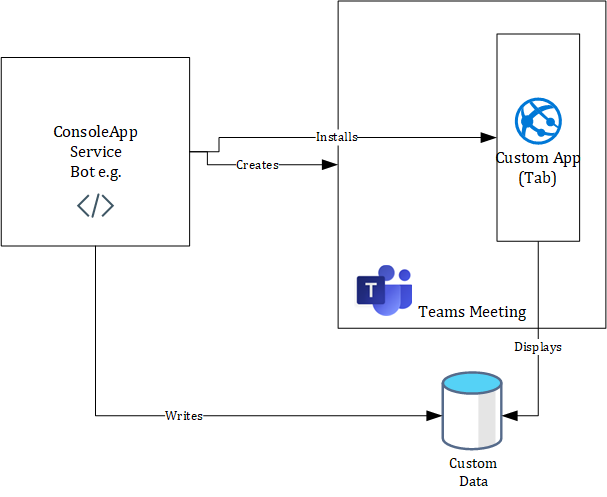
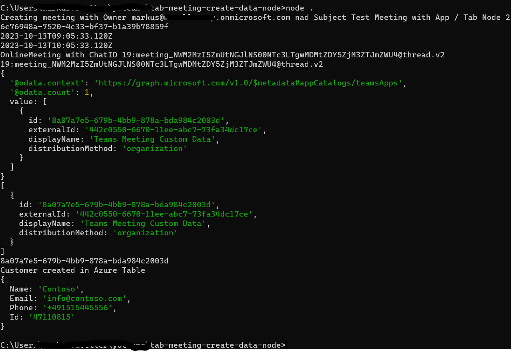

# tab-meeting-create-data-node
A Microsoft Teams Tab displaying simple custom data in a meeting which can be installed by the parallel NodeJS console application.

## Summmary

This sample is a Microsoft Teams Tab displaying simple custom data in a meeting which can be installed by the parallel console application. Additionally at first the console application creates a meeting and also writes the custom data to a custom storage where it's later retrieved from the meeting app. 

High-level process



Run the console app (to create meeting, install app and write custom data)



In meeting side-panel display


For further details see the author's [blog post](https://mmsharepoint.wordpress.com/2023/10/16/creating-teams-meetings-install-teams-meeting-app-and-use-custom-data-nodejs/)

## Tools and Frameworks


For further details see the [Yo Teams documentation](https://github.com/PnP/generator-teams/docs)

## Prerequisites

* [Office 365 tenant](https://dev.office.com/sharepoint/docs/spfx/set-up-your-development-environment)
* [Node.js](https://nodejs.org) version 14.17.5 or higher
* [Gulp CLI](https://github.com/gulpjs/gulp-cli) `npm install gulp-cli --global`
* [ngrok](https://ngrok.com) or similar tunneling application is required for local testing

## Applies to

This sample was created [using the Yeoman Generator for Teams with Visual Studio Code](https://pnp.github.io/generator-teams/). 

## Version history

Version|Date|Author|Comments
-------|----|--------|--------
1.0|Oct 27, 2023|[Markus Moeller](http://www.twitter.com/moeller2_0)|Initial release

## Disclaimer

**THIS CODE IS PROVIDED *AS IS* WITHOUT WARRANTY OF ANY KIND, EITHER EXPRESS OR IMPLIED, INCLUDING ANY IMPLIED WARRANTIES OF FITNESS FOR A PARTICULAR PURPOSE, MERCHANTABILITY, OR NON-INFRINGEMENT.**

---

## Minimal Path to Awesome
- Clone the repository
    ```bash
    git clone https://github.com/pnp/teams-dev-samples.git
    ```

- In a console, navigate to `samples\tab-meeting-create-data-node`

    ```bash
    cd samples\tab-meeting-create-data-node
    ```

- Install modules

    ```bash
    npm install
    ```
- Run ngrok in separate bash and note down the given url to .env (PUBLIC_HOSTNAME)
    ```bash
    gulp start-ngrok
    ```

- You will need to register an app in Azure AD [also described here](https://mmsharepoint.wordpress.com/2021/09/07/meeting-apps-in-microsoft-teams-1-pre-meeting/#appreg)
  - with client secret
  - with **application** Graph permissions AppCatalog.Read.All, Calendars.ReadWrite, TeamsAppInstallation.ReadWrite, OnlineMeetings.Read.All, TeamsTab.ReadWriteForChat.All
  - With exposed Api "access_as_user" and App ID Uri api://{NGrok-Url}/{App ID}
  - With the client IDs for Teams App and Teams Web App 1fec8e78-bce4-4aaf-ab1b-5451cc387264 and 5e3ce6c0-2b1f-4285-8d4b-75ee78787346
- Also add the app ID and its secret to .env (taken from .env-sample) as TAB_APP_ID= and 
    - add the secret to TAB_APP_SECRET=
- Package the app
    ```bash
    gulp manifest
    ```
- Start the app
    ```bash
    gulp serve --debug
    ```
- Create a meeting in Teams via the console app
    ```bash
    node .
    ```


## Features
This is a Microsoft Teams Tab displaying simple custom data in a meeting which can be installed by the parallel console application.
* Use Microsoft Graph to create [Events](https://learn.microsoft.com/en-us/graph/api/user-post-events?view=graph-rest-1.0&tabs=http&WT.mc_id=M365-MVP-5004617) and install [Apps](https://learn.microsoft.com/en-us/graph/api/chat-post-installedapps?view=graph-rest-1.0&tabs=http&WT.mc_id=M365-MVP-5004617) in it
* Build a [Teams Tab Meeting app](https://learn.microsoft.com/en-us/microsoftteams/platform/apps-in-teams-meetings/build-tabs-for-meeting?tabs=desktop%2Cmeeting-chat-view-desktop%2Cmeeting-side-panel%2Cmeeting-stage-view-desktop%2Cchannel-meeting-desktop&WT.mc_id=M365-MVP-5004617)
* Using and authenticating with [Microsoft Graph JavaScript SDK](https://learn.microsoft.com/en-us/graph/sdks/sdks-overview?WT.mc_id=M365-MVP-5004617)
* Configuraton storage and retrieval in [Azure App Configuration](https://learn.microsoft.com/en-us/azure/azure-app-configuration/overview?WT.mc_id=M365-MVP-5004617)
* Data Storage and retrieval in [Azure Tables](https://learn.microsoft.com/en-us/javascript/api/overview/azure/data-tables-readme?view=azure-node-latest&WT.mc_id=M365-MVP-5004617)

