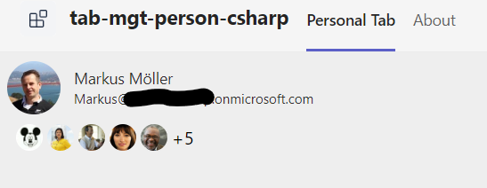

# tab-mgt-person-csharp

# Summary

This sample is a Teams Tab created using the Teams Toolkit with Visual Studio 2022. It uses the Microsoft Graph Toolkit (MGT) to access Microsoft Graph in the back.
It uses Teams SSO with the on-behalf flow and MGT TeamsMSAL2Provider.

Teams Tab with MGT components



For further details see the author's [blog post](https://mmsharepoint.wordpress.com/2023/02/16/use-teams-toolkit-and-visual-studio-c-to-create-a-teams-tab-using-microsoft-graph-toolkit/)

## Applies to

This sample was created [using the Teams Toolkit with Visual Studio 2022](https://learn.microsoft.com/en-us/microsoftteams/platform/toolkit/teams-toolkit-fundamentals?pivots=visual-studio&WT.mc_id=M365-MVP-5004617). The same sample was also realized with the [Yeoman Generator for Teams](https://github.com/pnp/generator-teams) and can be found [here](https://github.com/pnp/teams-dev-samples/tree/main/samples/tab-mgt-person).

## Version history

Version|Date|Author|Comments
-------|----|----|--------
1.0|Mar 08, 2023|[Markus Moeller](https://twitter.com/moeller2_0)|Initial release

## Disclaimer

**THIS CODE IS PROVIDED *AS IS* WITHOUT WARRANTY OF ANY KIND, EITHER EXPRESS OR IMPLIED, INCLUDING ANY IMPLIED WARRANTIES OF FITNESS FOR A PARTICULAR PURPOSE, MERCHANTABILITY, OR NON-INFRINGEMENT.**

## Minimal Path to Awesome
- Clone the repository
    ```bash
    git clone https://github.com/pnp/teams-dev-samples.git
- Open samples\tab-mgt-person-csharp\tab-mgt-person-csharp.sln in Visual Studio
- Perform first actions in [GettingStarted.txt](./TabMGTPerson/GettingStarted.txt) (before hitting F5)
- This should [register an app in Azure AD](https://learn.microsoft.com/en-us/microsoftteams/platform/toolkit/add-single-sign-on?pivots=visual-studio&WT.mc_id=M365-MVP-5004617#add-sso-to-teams-app-for-visual-studio)
- Ensure there is an app
  - with redirect uri https://localhost/auth-teams-sso.html in SPA
  - SignInAudience multi-tenant
  - with client secret
  - with **delegated** permissions profile, offline_access, openid, User.Read, People.Read and User.ReadBasic.All
  - With exposed Api "access_as_user" and App ID Uri api://localhost/<App ID>
  - With the client IDs for Teams App and Teams Web App 1fec8e78-bce4-4aaf-ab1b-5451cc387264 and 5e3ce6c0-2b1f-4285-8d4b-75ee78787346
- Find/Add the app registration ClientId, ClientSecret to your appsettings.json (or a appsettings.Development.json)
- Find/Fill OAuthAuthority with https://login.microsoftonline.com/_YOUR_TENANTID_
- Now you are good to go to continue in GettingStarted.txt with hitting F5 (You can also select an installed browser in the VS menu)
- In case you did not give admin consent to the permissions, ensure to allow pop-ups in the browser
  
## Features
This is a simple Teams Tab. It uses the Microsoft Graph Toolkit (MGT) for simplifying access to Microsoft 365 resources.
* SSO access token generation to access Microsoft Graph
* [Use Microsoft Teams MSAL2 provider](https://learn.microsoft.com/en-us/graph/toolkit/providers/teams-msal2?tabs=html&WT.mc_id=M365-MVP-5004617)
* [Use Person component to render info about current user](https://learn.microsoft.com/en-us/graph/toolkit/components/person?WT.mc_id=M365-MVP-5004617)
* [Use People component to retrieve and render recent contacts](https://learn.microsoft.com/en-us/graph/toolkit/components/people?WT.mc_id=M365-MVP-5004617)


