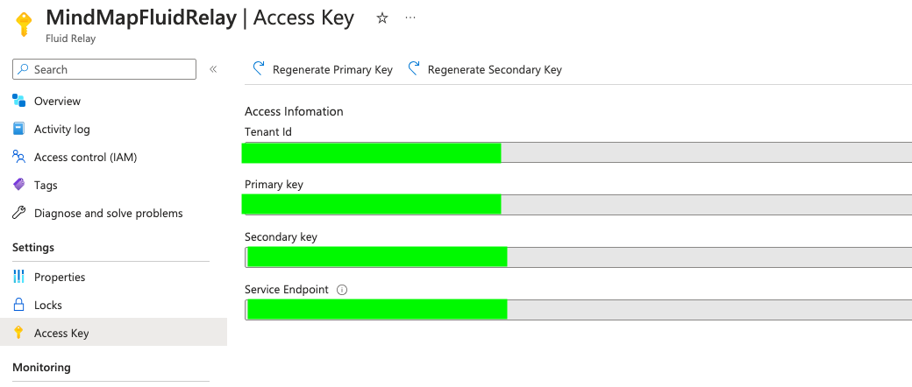
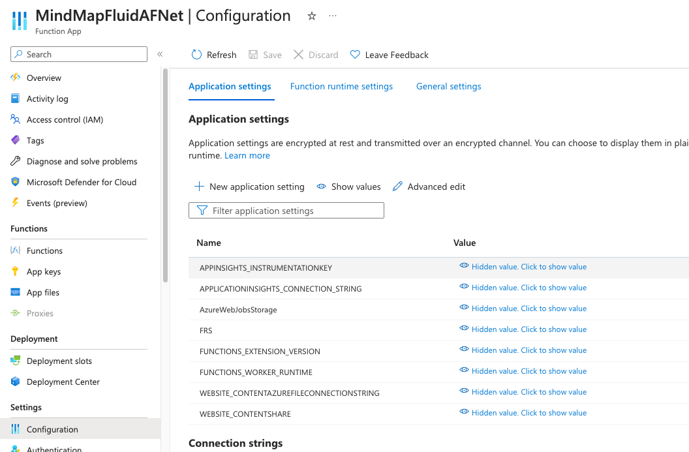

# Test it with Azure Fluid Relay Service

## Prerequisites

- [Azure Subscription](https://portal.azure.com/)
- [Visual Studio 2022](https://visualstudio.microsoft.com) or VSCode (additonal tooling is required!)

## Create Azure Fluid Relay

[How to: Provision an Azure Fluid Relay service](https://learn.microsoft.com/en-us/azure/azure-fluid-relay/how-tos/provision-fluid-azure-portal)

## Visual Studio Deployment of Azure Function

- Open the Visual Studio Solution `FunctionApp1.sln` this file is Located unter the folder `APIC/FunctionApp1`
- Please follow the Deployment and Azure Function Steps from the MS-Lean Quickstart Guide starting at (Publish the project to Azure)
[https://learn.microsoft.com/en-us/azure/azure-functions/functions-create-your-first-function-visual-studio#publish-the-project-to-azure]

if you have already created the Azure function you can also import the Publishing Profile

## VsCode Deployment of Azure Function

### Prerequisites

- [.NET 6.0 SDK](https://dotnet.microsoft.com/download/dotnet/6.0)
- [Azure Functions Core Tools](../articles/azure-functions/functions-run-local.md#install-the-azure-functions-core-tools) version 4.x.
- [Visual Studio Code](https://code.visualstudio.com/) on one of the [supported platforms](https://code.visualstudio.com/docs/supporting/requirements#_platforms).
- [C# extension](https://marketplace.visualstudio.com/items?itemName=ms-dotnettools.csharp) for Visual Studio Code.  
- [Azure Functions extension](https://marketplace.visualstudio.com/items?itemName=ms-azuretools.vscode-azurefunctions) for Visual Studio Code.

### Deployment it

- Open the Folder `APIC/FunctionApp1`
- Please follow this Sections `Sign in to Azure,Create the function app in Azure,Deploy the project to Azure` in the MS-Learn Quickstart Guide start at [Sign in to Azure](https://learn.microsoft.com/en-us/azure/azure-functions/create-first-function-vs-code-csharp#sign-in-to-azure)

## Configure your Azure Function

- first go to your Fluid Relay Service and go to Access Key
  
  this information we need in the next steps
- Go to your Azure Function select `Configuration`
  - in the tab `Application settings` add a `New applicaition settings`
    Set as Name `FRS` and the value is the `Primary key` of your Fluid Relay Service of step 1
    Please hit the buttun save!!! (my typical mistake)
    
- Go to your Azure Function select `CORS`
  - You have to enable CORS for some domains and localhost

    ```text
    https://portal.azure.com
    https://teams.micosoft.com
    https://localhost:53000
    ```

   

### Side notes

Please Store the key in a Azure KeyVault, with manages Identity it is mutch more secure than in the AppSetting

## Use the Azure Fluid Relay Service and the Azure Function

Please open the File `src/config.ts`
FRS stands for Fluid Relay Service and only this parameters are interestig in this step

- change `FRS_local` from `true` to `false`
- `FRS_TokenProviderURL` you find your URL in the Azure Function `Overview`, please add `/api/GetToken`as Endpoint
- `FRS_TenantId` you find in your `Fluid Relay Service` in the section `Access Key`
- `FRS_Endpoint`you find in your `Fluid Relay Service` in  the section `Access Key`

The Config should look like this

```ts
const config = {
  FRS_local:false,
  FRS_TokenProviderURL:"https://yourAZFunction.azurewebsites.net/api/GetToken",
  FRS_TenantId: "your valid Guid",
  FRS_Endpoint:"https://eu.fluidrelay.azure.com"
};
```

## Run you App in VSCode

Hit `F5`
