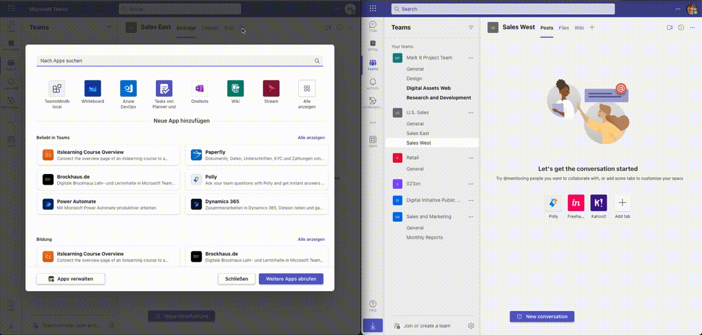
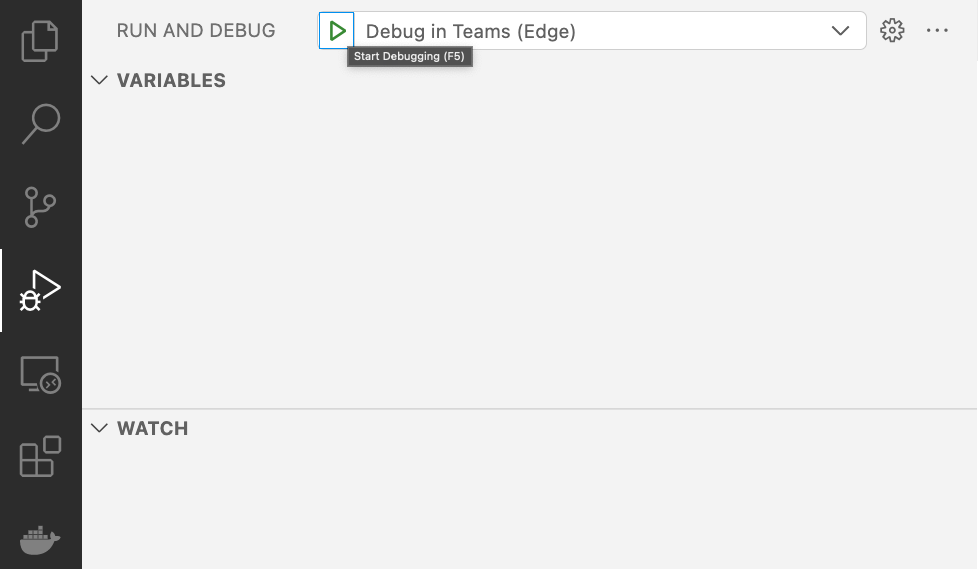
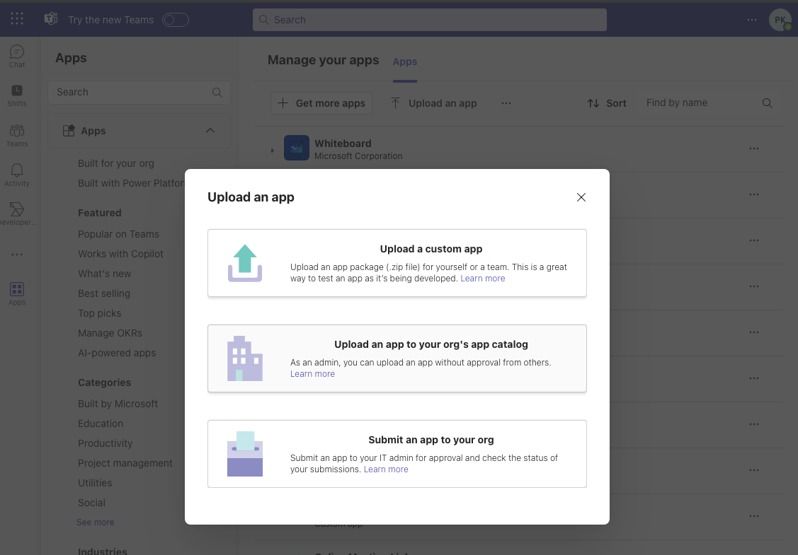
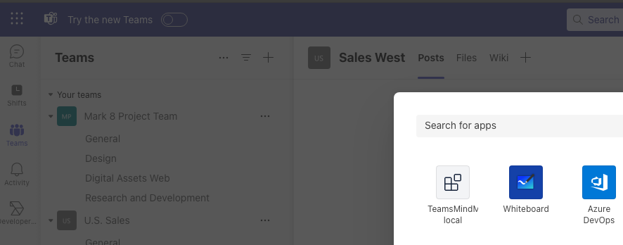

# MindMap based on Fluid

## Summary

Group Chat

Channel Tab

Meeting Tab (GO on Stage)

## Prerequisites

- [Node.js](https://nodejs.org/), supported versions: 18
- An M365 account. If you do not have M365 account, apply one from [M365 developer program](https://developer.microsoft.com/microsoft-365/dev-program)
- [Set up your dev environment for extending Teams apps across Microsoft 365](https://aka.ms/teamsfx-m365-apps-prerequisites)

> Please note that after you enrolled your developer tenant in Office 365 Target Release, it may take couple days for the enrollment to take effect.

- [Teams Toolkit Visual Studio Code Extension](https://aka.ms/teams-toolkit) version 5.0.0 and higher or [TeamsFx CLI](https://aka.ms/teamsfx-cli)

## Minimal Path to Awesome

- Clone this repository (or [download this solution as a .ZIP file](https://pnp.github.io/download-partial/?url=https://github.com/pnp/teams-dev-samples/tree/main/samples/tab-mindmap-fluid) then unzip it)
- From your command line, change your current directory to the directory containing this sample (`tab-mindmap-fluid`, located under `samples`)
- in the command line run:
  - `code .`
  - Visual Studio Code Extention: Start debugger
  
  - First use of Teams Toolkit a Certificate will be installed, please allow it
  - As Sone the Application is stated, you see  2 running Tasks
  
  - Add the apppackage to orgs's app catalog of your [M365 Developer Tenant](https://developer.microsoft.com/en-us/microsoft-365/dev-program)
  
  - Go to your Channel / Chat / Meeting and add the TeamsMindMap-local
  
  - Test it with multiple users in different browser profiles on your Maschine
  
## Test it with Azure Fluid Relay Service

Please Follow this [link](AZ-FluidRelay.md)

## Version history

Version|Date|Author|Comments
-------|----|----|--------
1.0|July 3, 2023| [Peter Paul Kirschner](https://github.com/petkir) |Initial release

## Disclaimer

**THIS CODE IS PROVIDED *AS IS* WITHOUT WARRANTY OF ANY KIND, EITHER EXPRESS OR IMPLIED, INCLUDING ANY IMPLIED WARRANTIES OF FITNESS FOR A PARTICULAR PURPOSE, MERCHANTABILITY, OR NON-INFRINGEMENT.**

---

## References

- [Teams Toolkit Documentations](https://docs.microsoft.com/microsoftteams/platform/toolkit/teams-toolkit-fundamentals)
- [Teams Toolkit CLI](https://docs.microsoft.com/microsoftteams/platform/toolkit/teamsfx-cli)
- [TeamsFx SDK](https://docs.microsoft.com/microsoftteams/platform/toolkit/teamsfx-sdk)
- [Teams Toolkit Samples](https://github.com/OfficeDev/TeamsFx-Samples)

