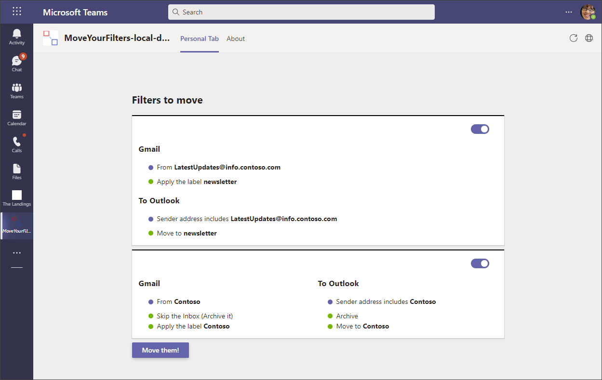

# Move your filters

Sample Microsoft Teams Toolkit React project to read filters and labels from Gmail and create matching rules and folders in Outlook.

## Summary
Two options for reading rules and labels from Gmail.

- Connect to Gmail through Oauth
- Import filters file exported from Gmail

The rules are displayed on the screen and selected rules may be created in Outlook through single sign on through TeamsFX.
This solution uses Teams Toolkit (Preview) v3.2.0 from January 12, 2022. 

## Frameworks

## Prerequisites

- [NodeJS](https://nodejs.org/en/)
- An M365 account. If you do not have M365 account, apply one from [M365 developer program](https://developer.microsoft.com/en-us/microsoft-365/dev-program)
- [Teams Toolkit Visual Studio Code Extension](https://aka.ms/teams-toolkit) or [TeamsFx CLI](https://aka.ms/teamsfx-cli)
- A GMail account (or use the [sample file to import](./assets/) )
- A Google app ID

## Version history

Version|Date|Author|Comments
-------|----|----|--------
1.0|January 18, 2022|[Mark Allan](https://twitter.com/MarkXA) and [Tom Resing](https://twitter.com/resing)|Initial release

## Disclaimer

**THIS CODE IS PROVIDED *AS IS* WITHOUT WARRANTY OF ANY KIND, EITHER EXPRESS OR IMPLIED, INCLUDING ANY IMPLIED WARRANTIES OF FITNESS FOR A PARTICULAR PURPOSE, MERCHANTABILITY, OR NON-INFRINGEMENT.**

---

## Minimal Path to Awesome

* Clone this repository
* Add your Google API app id to the config file
* From Visual Studio Code: Start debugging the project by hitting the `F5` key in Visual Studio Code. 
* Alternatively use the `Run and Debug Activity Panel` in Visual Studio Code and click the `Run and Debug` green arrow button.
* From TeamsFx CLI: Start debugging the project by executing the command `teamsfx preview --local` in your project directory.

## Features

* SSO from Teams Toolkit
* Authenticates to Google Workspace
* Reads from GMail
* Writes to Outlook

