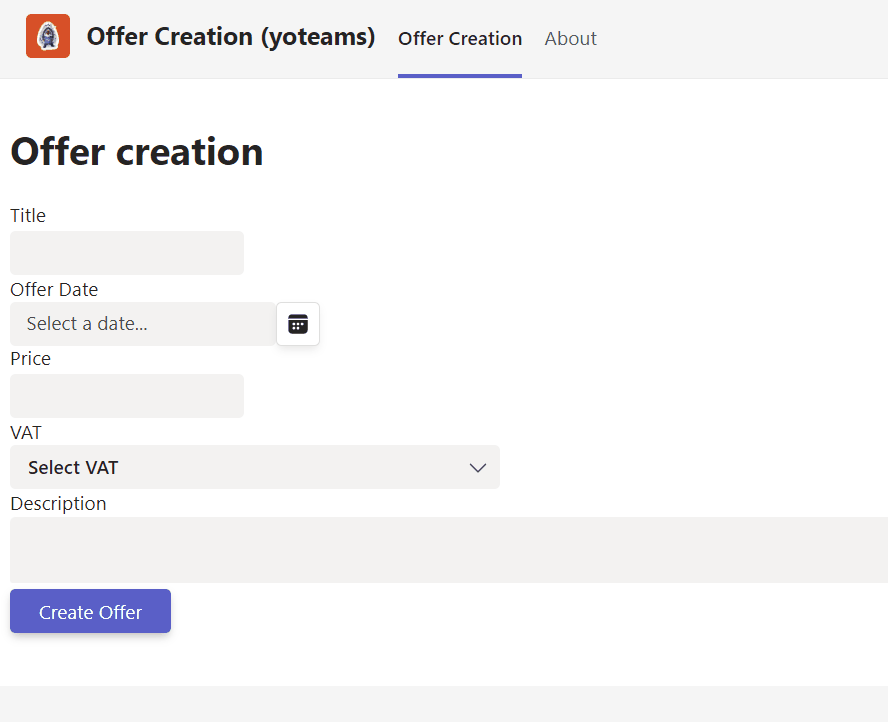
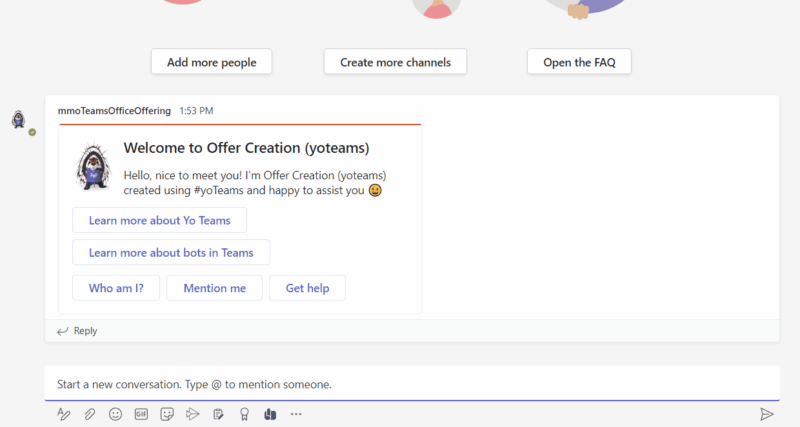
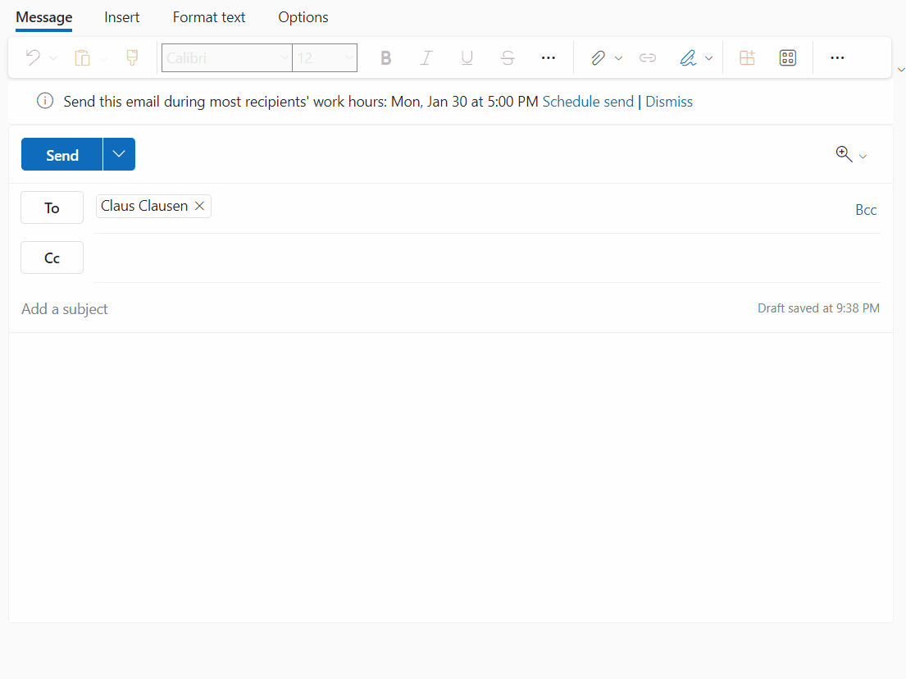

# Offer Creation (yoteams) - Microsoft Teams App

Teams and Office App to create custom offer documents for further processing.

## Summary

This sample is a Teams personal Tab to act as a Microsoft 365 across application (Teams, Outlook, Office) including a search-based messaging extension to act in Teams and Outlook. The App will create custom offer documents based on a custom SharePoint content type with custom document template for further processing such as review and finalization (PDF archive).

App live in action inside Teams



App live in action inside Teams using messaging extension



App live in action inside **Outlook** using messaging extension



For further details see the author's [blog series](https://mmsharepoint.wordpress.com/2022/12/28/a-sharepoint-document-generator-as-microsoft-365-app-i-yoteams/)

This sample is realized with yeoman generator for Teams. A similar sample realizing the Document Generator in a personal tab as well is available as SPFx solution in the [PnP DEV FX Webparts sample gallery](https://github.com/pnp/sp-dev-fx-webparts/tree/main/samples/react-office-offer-creation).


## Prerequisites

* [Office 365 tenant](https://dev.office.com/sharepoint/docs/spfx/set-up-your-development-environment)
* [Node.js](https://nodejs.org) version 14.17.5 or higher
* [Gulp CLI](https://github.com/gulpjs/gulp-cli) `npm install gulp-cli --global`
* [ngrok](https://ngrok.com) or similar tunneling application is required for local testing

    ```bash
    # determine node version
    node --version
    ```

## Version history

Version|Date|Author|Comments
-------|----|----|--------
1.0|Feb 07, 2023|[Markus Moeller](https://twitter.com/moeller2_0)|Initial release

## Disclaimer

**THIS CODE IS PROVIDED *AS IS* WITHOUT WARRANTY OF ANY KIND, EITHER EXPRESS OR IMPLIED, INCLUDING ANY IMPLIED WARRANTIES OF FITNESS FOR A PARTICULAR PURPOSE, MERCHANTABILITY, OR NON-INFRINGEMENT.**

## Minimal Path to Awesome
- Clone the repository
    ```bash
    git clone https://github.com/pnp/teams-dev-samples.git
    ```

- In a console, navigate to `/samples/tab-office-offer-creation`

    ```bash
    cd /samples/tab-office-offer-creation
    ```

- Install modules

    ```bash
    npm install
    ```
- Create the content-type for your offers in a site / default document library of your choice
    - With PnP-PowerShell for instance call the deploy script with your site url as parameter
        ```bash
        .\templates\deploy.ps1 -siteUrl <YourFullSiteUrl>
    
    - Put the same site url to your .env as SiteUrl=
- You will need to register an app in Azure AD [also described here](https://mmsharepoint.wordpress.com/2021/09/07/meeting-apps-in-microsoft-teams-1-pre-meeting/#appreg)
  - with client secret
  - with **delegated** SharePoint permissions AllSites.Write 
  - With exposed Api "access_as_user" and App ID Uri api://{NGrok-Url}/{App ID}
  - With the client IDs for Teams App and Teams Web App 1fec8e78-bce4-4aaf-ab1b-5451cc387264 and 5e3ce6c0-2b1f-4285-8d4b-75ee78787346
  - Also With the client IDs for Office Apps Office web	4765445b-32c6-49b0-83e6-1d93765276ca, Office desktop 0ec893e0-5785-4de6-99da-4ed124e5296c,
Outlook desktop, mobile	d3590ed6-52b3-4102-aeff-aad2292ab01c, Outlook web bc59ab01-8403-45c6-8796-ac3ef710b3e3
- Also add the app ID and its secret to .env (taken from .env-sample) as TAB_APP_ID= and 
    - add the secret to TAB_APP_SECRET=
- Since messaging extensions utilize the Azure Bot Framework, you will need to register a new bot. 
[These instructions](https://learn.microsoft.com/en-us/microsoftteams/platform/sbs-messagingextension-searchcommand?tabs=latestversionofvisualstudio&tutorial-step=3&WT.mc_id=M365-MVP-5004617) provide options for registering with or without an Azure subscription. 
  - Be sure to enable the Microsoft Teams, Outlook AND Microsoft 365 Extensions bot channel so your solution can communicate with Microsoft Teams AND Outlook
  - For local testing, set the messaging endpoint to the https URL returned by ngrok plus "/api/messages" otherwise to your Azure App host url
- Also add the bot's app ID and its secret to .env (taken from .env-sample) as MICROSOFT_APP_ID= and 
    - add the secret to MICROSOFT_APP_PASSWORD= 
- In the Bot itself add the app id and secret as "GraphConnection" with app id, tenant id, secret and scope=https://graph.microsoft.com/.default
    - Use Azure Active Directory V2 as service provider
    - Use the configured App URI configured also to your **bot's app registration** in the format api://{NGrok-Url}/{App ID} as Token Exchange URL
    - Add the client IDs for Teams App and Teams Web App 1fec8e78-bce4-4aaf-ab1b-5451cc387264 and 5e3ce6c0-2b1f-4285-8d4b-75ee78787346
    - Also add the client IDs for Outlook desktop, mobile d3590ed6-52b3-4102-aeff-aad2292ab01c, Outlook web bc59ab01-8403-45c6-8796-ac3ef710b3e3, 00000002-0000-0ff1-ce00-000000000000


## Features

This is a Teams personal Tab app to act as a Microsoft 365 across application (Teams, Outlook, Office)
* Using SSO with Teams JS SDK 2.0
* [Use SSO in a search-based messaging extension and extend to Outlook](https://learn.microsoft.com/en-us/microsoftteams/platform/m365-apps/extend-m365-teams-message-extension?tabs=manifest-teams-toolkit&WT.mc_id=M365-MVP-5004617)
* Using O-B-O flow secure and totally in backend to retrieve and store data via Microsoft SharePoint
* Using SharePoint Rest API inside NodeJS application
* [Extend Teams apps across Microsoft 365](https://docs.microsoft.com/en-us/microsoftteams/platform/m365-apps/overview?WT.mc_id=M365-MVP-5004617)
* [Use Universal Actions (UAM) in search based message extensions](https://learn.microsoft.com/en-us/microsoftteams/platform/messaging-extensions/how-to/search-commands/universal-actions-for-search-based-message-extensions?WT.mc_id=M365-MVP-5004617)
* [Use FluentUI React Northstar Input, Datepicker, Dropdown, DropdownItem, DropdownItemProps, DropdownProps, Loader, TextArea](https://fluentsite.z22.web.core.windows.net/)


## Useful links

* [Debugging with Visual Studio Code](https://github.com/pnp/generator-teams/blob/master/docs/docs/user-guide/vscode.md)
* [Developing with ngrok](https://github.com/pnp/generator-teams/blob/master/docs/docs/concepts/ngrok.md)
* [Developing with Github Codespaces](https://github.com/pnp/generator-teams/blob/master/docs/docs/user-guide/codespaces.md)

## Additional build options

You can use the following flags for the `serve`, `ngrok-serve` and build commands:

* `--no-linting` or `-l` - skips the linting of Typescript during build to improve build times
* `--debug` - builds in debug mode and significantly improves build time with support for hot reloading of client side components
* `--env <filename>.env` - use an alternate set of environment files
* `--publish` - automatically publish the application to the Teams App store

## Deployment

The solution can be deployed to Azure using any deployment method.

* For Azure Devops see [How to deploy a Yo Teams generated project to Azure through Azure DevOps](https://www.wictorwilen.se/blog/deploying-yo-teams-and-node-apps/)
* For Docker containers, see the included `Dockerfile`

## Logging

To enable logging for the solution you need to add `msteams` to the `DEBUG` environment variable. See the [debug package](https://www.npmjs.com/package/debug) for more information. By default this setting is turned on in the `.env` file.

Example for Windows command line:

``` bash
SET DEBUG=msteams
```

If you are using Microsoft Azure to host your Microsoft Teams app, then you can add `DEBUG` as an Application Setting with the value of `msteams`.


