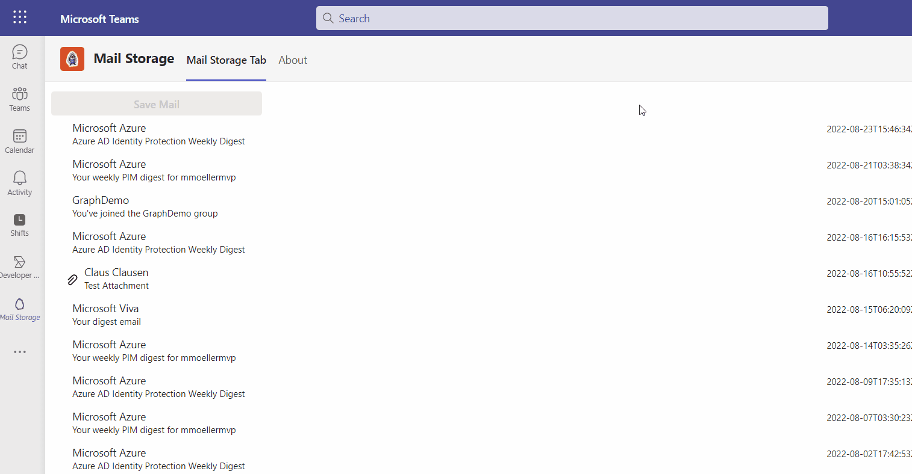
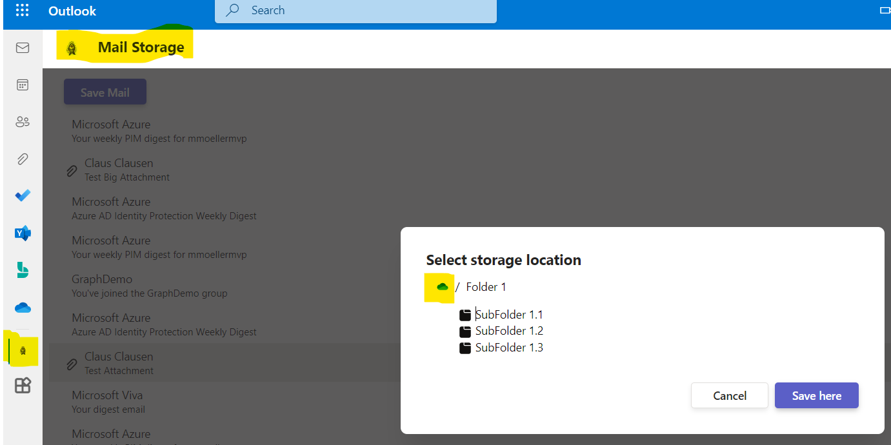
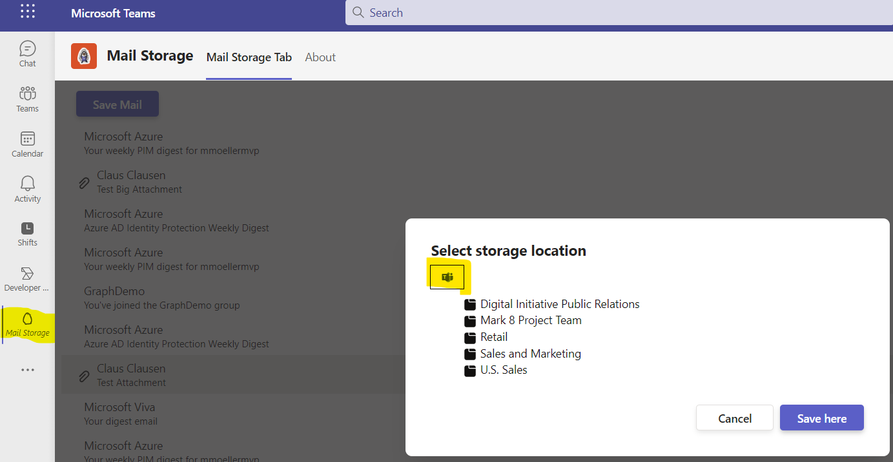
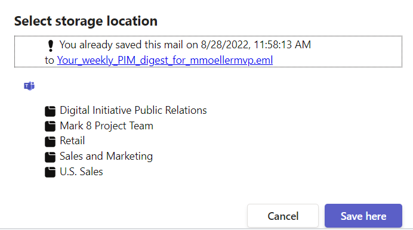

# Tab Office Mail Storage - Microsoft Teams App

Teams and Office App to store selected mail in OneDrive

## Summary

This Microsoft Teams and Office personal tab lists recent mails of signed in user and lets her/him store the whole mail as .eml in a dialog selected personal OneDrive folder.

App live in action inside Teams



App in action inside Outlook



App in action inside Teams



App warning if mail was already stored (powered by Microsoft Graph openExtensions)



For further details see the author's [blog post](https://mmsharepoint.wordpress.com/2022/08/31/extend-teams-apps-to-m365-with-sso-the-right-way/)

## Prerequisites

* [Office 365 tenant](https://dev.office.com/sharepoint/docs/spfx/set-up-your-development-environment)
* [Node.js](https://nodejs.org) version 10.14.1 or higher
* [Gulp CLI](https://github.com/gulpjs/gulp-cli) `npm install gulp-cli --global`
* [ngrok](https://ngrok.com) or similar tunneling application is required for local testing

## Version history

Version|Date|Author|Comments
-------|----|----|--------
1.0|Aug 31, 2022|[Markus Moeller](https://twitter.com/moeller2_0)|Initial release

## Disclaimer

**THIS CODE IS PROVIDED *AS IS* WITHOUT WARRANTY OF ANY KIND, EITHER EXPRESS OR IMPLIED, INCLUDING ANY IMPLIED WARRANTIES OF FITNESS FOR A PARTICULAR PURPOSE, MERCHANTABILITY, OR NON-INFRINGEMENT.**

## Minimal Path to Awesome
- Clone the repository
    ```bash
    git clone https://github.com/pnp/teams-dev-samples.git
    ```

- In a console, navigate to `/samples/tab-office-sso-mail-save`

    ```bash
    cd /samples/tab-office-sso-mail-save
    ```

- Install modules

    ```bash
    npm install

- Run ngrok in separate bash and note down the given url to .env

    ```bash
    gulp start-ngrok
    ```

- You will need to register an app in Azure AD [also described here](https://mmsharepoint.wordpress.com/2021/09/07/meeting-apps-in-microsoft-teams-1-pre-meeting/#appreg)
  - with client secret
  - with **delegated** permissions Mail.Read, Mail.ReadWrite, Team.ReadBasic.All, Files.ReadWrite, Sites.ReadWrite.All, offline_access, openid, profile
  - With exposed Api "access_as_user" and App ID Uri api://<NGrok-Url>/<App ID>
  - With the client IDs for Teams App and Teams Web App 1fec8e78-bce4-4aaf-ab1b-5451cc387264 and 5e3ce6c0-2b1f-4285-8d4b-75ee78787346
  - Also With the client IDs for Office Apps Office web	4765445b-32c6-49b0-83e6-1d93765276ca, Office desktop 0ec893e0-5785-4de6-99da-4ed124e5296c,
Outlook desktop, mobile	d3590ed6-52b3-4102-aeff-aad2292ab01c, Outlook web bc59ab01-8403-45c6-8796-ac3ef710b3e3
- Also add the app ID and its secret to .env (taken from .env-sample) as TAB_APP_ID= and 
    - add the secret to TAB_APP_SECRET"    ```

- Enable Teams Developer Preview in your client via <Your Account> | About | Developer Preview

- Package the app
    ```bash
    gulp manifest
    ```
- Start the app
    ```bash
    gulp serve --debug
    ```    
- Sideload the app in Teams

## Features

This is a Teams and Office personal Tab app using SSO and Microsoft Graph
* Using SSO with Teams JS SDK 2.0
* Using O-B-O flow secure and totally in backend to retrieve and store data via Microsoft Graph
* [Extend Teams apps across Microsoft 365](https://docs.microsoft.com/en-us/microsoftteams/platform/m365-apps/overview?WT.mc_id=M365-MVP-5004617)
* [Use FluentUI React Northstar List and Dialog](https://fluentsite.z22.web.core.windows.net/)
* [Upload small (<4MB) DriveItem with Microsoft Graph](https://docs.microsoft.com/en-us/graph/api/driveitem-put-content?view=graph-rest-1.0&tabs=http&WT.mc_id=M365-MVP-5004617)
* [Upload large (>4MB) DriveItem with Microsoft Graph in resumable upload](https://docs.microsoft.com/en-us/graph/api/driveitem-createuploadsession?view=graph-rest-1.0&WT.mc_id=M365-MVP-5004617) 
* [Read and store custom data with message object featuring Microsoft Graph openExtensions](https://docs.microsoft.com/en-us/graph/api/resources/opentypeextension?view=graph-rest-1.0&WT.mc_id=M365-MVP-5004617)

## Configuration

Configuration is stored in the `.env` file.

## Debug and test locally

To debug and test the solution locally you use the `serve` Gulp task. This will first build the app and then start a local web server on port 3007, where you can test your Tabs, Bots or other extensions. Also this command will rebuild the App if you change any file in the `/src` directory.

``` bash
gulp serve
```

To debug the code you can append the argument `debug` to the `serve` command as follows. This allows you to step through your code using your preferred code editor.

``` bash
gulp serve --debug
```

## Useful links

* [Debugging with Visual Studio Code](https://github.com/pnp/generator-teams/blob/master/docs/docs/user-guide/vscode.md)
* [Developing with ngrok](https://github.com/pnp/generator-teams/blob/master/docs/docs/concepts/ngrok.md)
* [Developing with Github Codespaces](https://github.com/pnp/generator-teams/blob/master/docs/docs/user-guide/codespaces.md)

## Additional build options

You can use the following flags for the `serve`, `ngrok-serve` and build commands:

* `--no-linting` or `-l` - skips the linting of Typescript during build to improve build times
* `--debug` - builds in debug mode and significantly improves build time with support for hot reloading of client side components
* `--env <filename>.env` - use an alternate set of environment files
* `--publish` - automatically publish the application to the Teams App store

## Deployment

The solution can be deployed to Azure using any deployment method.

* For Azure Devops see [How to deploy a Yo Teams generated project to Azure through Azure DevOps](https://www.wictorwilen.se/blog/deploying-yo-teams-and-node-apps/)
* For Docker containers, see the included `Dockerfile`

## Logging

To enable logging for the solution you need to add `msteams` to the `DEBUG` environment variable. See the [debug package](https://www.npmjs.com/package/debug) for more information. By default this setting is turned on in the `.env` file.

Example for Windows command line:

``` bash
SET DEBUG=msteams
```

If you are using Microsoft Azure to host your Microsoft Teams app, then you can add `DEBUG` as an Application Setting with the value of `msteams`.

