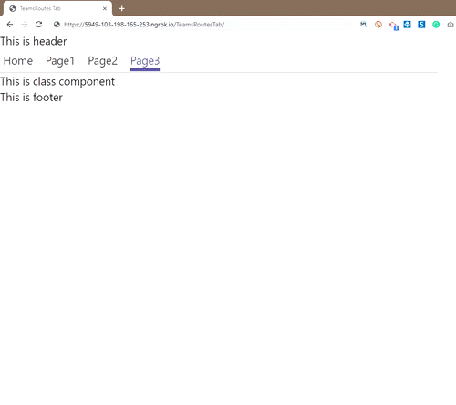

# tab-react-router - Microsoft Teams App

This is a starter solution  sample app to show the demostrations of how to use React Router with Teams App project generated using Yo teams. It particularlly uses Hash Router when we need to have mutiple pages like a stand alone react application and applying the navigation using router. Hoping that this sample would be useful for/as reference to create a React Router based Teams App Tab with mutiple pages and support for deeplinking and using the concepts of router for nagivation.

## Idea behind this Sample
 Once we create a Teams App Tab using Yeoman Generator it creates a project structure as Single page application.
We had requirement where we wanted to create full stand alone application with mutiple pages. With yo teams generated based project, when we want to add new page we would need to add new Tab by running new command again but that would be setup new Tab which would point to particular html page which renders a single React component but this tab would work like stand alone full fledged react application. Ideally we should have a single entry point to our Teams Tab appliation and then all other pages can be navigated using React Router concept. You can find the history behind this sample at below url

https://github.com/pnp/generator-teams/issues/284


## Features/Concepts explored

* Seperate components for Header and Footer to reuse across applciation
* Defining Routes in Default TeamsRoutesTab compopnent generated from yo teams
* Default route to redirect to Home Page loading a default Component(landing page of application)
* Menu in header which load targeted component defined based on Routes
* Concept to pass parameter to new route/page using URL Path parameter and read url path parameter in targeted page (e.g we need detail page and pass the values from previous screen to load targeted data in detail page)
* Using hooks to manage the current active page/route and highlight the menu item
* Loading Page Not found component when the user tries to browser any route not defined in Hash Router.
* Page 3 shows demostration on how to load Class Component (if not using functional components)

## Sample in Action



## Version history

Version|Date|Author|Comments
-------|----|----|--------
1.0|Feb 22, 2022|[Siddharth Vaghasia](https://twitter.com/siddh_me), [Kunj Sangani](https://twitter.com/sanganikunj)|Initial release

## Prerequisites

* [Office 365 tenant](https://dev.office.com/sharepoint/docs/spfx/set-up-your-development-environment)
* [Node.js](https://nodejs.org) version 14.7.0 or higher

## Disclaimer

**THIS CODE IS PROVIDED *AS IS* WITHOUT WARRANTY OF ANY KIND, EITHER EXPRESS OR IMPLIED, INCLUDING ANY IMPLIED WARRANTIES OF FITNESS FOR A PARTICULAR PURPOSE, MERCHANTABILITY, OR NON-INFRINGEMENT.**


## Getting started with Microsoft Teams Apps development

Head on over to [Microsoft Teams official documentation](https://developer.microsoft.com/en-us/microsoft-teams) to learn how to build Microsoft Teams Tabs or the [Microsoft Teams Yeoman generator docs](https://github.com/PnP/generator-teams/docs) for details on how this solution is set up.

## Project setup

All required source code are located in the `./src` folder:

* `client` client side code
* `server` server side code
* `public` static files for the web site
* `manifest` for the Microsoft Teams app manifest

For further details see the [Yo Teams documentation](https://github.com/PnP/generator-teams/docs)

## Building the app

Before building for the first time, install the npm dependencies.

``` bash
npm install
npm i -g gulp-cli
```

The application is built using the `build` Gulp task.

``` bash
gulp build
```

## Building the manifest

To create the Microsoft Teams Apps manifest, run the `manifest` Gulp task. This will generate and validate the package and finally create the package (a zip file) in the `package` folder. The manifest will be validated against the schema and dynamically populated with values from the `.env` file.

``` bash
gulp manifest
```

## Deploying the manifest

Using the `yoteams-deploy` plugin, automatically added to the project, deployment of the manifest to the Teams App store can be done manually using `gulp tenant:deploy` or by passing the `--publish` flag to any of the `serve` tasks.

## Configuration

Configuration is stored in the `.env` file.

## Debug and test locally

To debug and test the solution locally you use the `serve` Gulp task. This will first build the app and then start a local web server on port 3007, where you can test your Tabs, Bots or other extensions. Also this command will rebuild the App if you change any file in the `/src` directory.

``` bash
gulp serve
```

To debug the code you can append the argument `debug` to the `serve` command as follows. This allows you to step through your code using your preferred code editor.

``` bash
gulp serve --debug
```

## Useful links

* [Debugging with Visual Studio Code](https://github.com/pnp/generator-teams/blob/master/docs/docs/vscode.md)
* [Developing with ngrok](https://github.com/pnp/generator-teams/blob/master/docs/docs/ngrok.md)
* [Developing with Github Codespaces](https://github.com/pnp/generator-teams/blob/master/docs/docs/codespaces.md)

## Additional build options

You can use the following flags for the `serve`, `ngrok-serve` and build commands:

* `--no-linting` or `-l` - skips the linting of Typescript during build to improve build times
* `--debug` - builds in debug mode and significantly improves build time with support for hot reloading of client side components
* `--env <filename>.env` - use an alternate set of environment files
* `--publish` - automatically publish the application to the Teams App store

## Deployment

The solution can be deployed to Azure using any deployment method.

* For Azure Devops see [How to deploy a Yo Teams generated project to Azure through Azure DevOps](https://www.wictorwilen.se/blog/deploying-yo-teams-and-node-apps/)
* For Docker containers, see the included `Dockerfile`

## Logging

To enable logging for the solution you need to add `msteams` to the `DEBUG` environment variable. See the [debug package](https://www.npmjs.com/package/debug) for more information. By default this setting is turned on in the `.env` file.

Example for Windows command line:

``` bash
SET DEBUG=msteams
```

If you are using Microsoft Azure to host your Microsoft Teams app, then you can add `DEBUG` as an Application Setting with the value of `msteams`.

