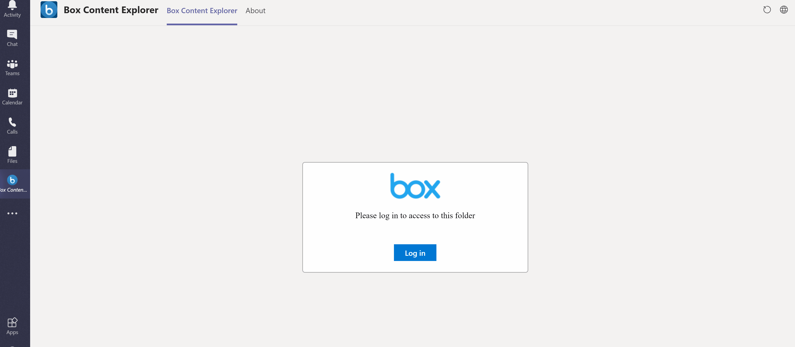

# Microsoft Teams App - OAuth 2.0 Authorization code flow

## Summary

This sample shows how you can implement OAuth 2.0 authorization code flow using SPFx and Microsoft Teams SDK. Also it shows the integration with Box.com but can be used as a general case for other OAuth based services.

## Frameworks

## Prerequisites

* [Office 365 tenant](https://dev.office.com/sharepoint/docs/spfx/set-up-your-development-environment)
* [SPFx Development environment](https://docs.microsoft.com/en-us/sharepoint/dev/spfx/set-up-your-development-environment)

## Version history

Version|Date|Author|Comments
-------|----|----|--------
1.0|July 22, 2020|Ramin ahmadi|Initial release

## Disclaimer

**THIS CODE IS PROVIDED *AS IS* WITHOUT WARRANTY OF ANY KIND, EITHER EXPRESS OR IMPLIED, INCLUDING ANY IMPLIED WARRANTIES OF FITNESS FOR A PARTICULAR PURPOSE, MERCHANTABILITY, OR NON-INFRINGEMENT.**

---

## Minimal Path to Awesome

### REGISTER YOUR APP
 use Box.com as an example because it has pre-build user interface components such as UI Elements which helps us to focus on the code rather than the UI, but you can use any other providers. The first step is to register your app, each provider has different way of registering the app or even different name, for example Application Registration in Azure or Connected App in salesforce, for Box.com you can navigate to the developer console and select the Create a new app button. You have different options for creating your app such as Enterprise integration or Partner Integration, but let’s select Custom App and then select Standard OAuth 2.0 (User Authentication).
 Give it a name and create the custom app. Navigate to the configuration page and here you can find the Client ID and the Client secret, copy the values as we need them later (you may see different names for some providers, for example when you create a connected app in Salesforce, instead of Client ID and Client Secret you will see Consumer Key and Consumer Secret but they do the same thing).

If you scroll down you will find the Application scopes, based on your application you can select or deselect the scopes, for this sample, let’s stick with the default scope which is Read and write files and folders stored in Box.

Update the CORS with your root SharePoint URL. e.x. https://contoso.sharepoint.com

After uploading the pages into SharePoint (next step), update the Redirect URI with the loginComplete.aspx page. e.x. https://contoso.sharepoint.com/sitepages/logincomplete.aspx

### UPLOAD THE START PAGE AND THE COMPLETE PAGE
We need two pages, one for redirecting the user to the authorization page of the identity provider to sign in and get consent for the scopes required for our apps, and one for check the returned state and return the code to the success callback function (commonly known as Redirect page and must be an absolute URI).

You can host those pages anywhere like Azure, AWS or your private host, but for this sample I’m going to host them in SharePoint, also bear in mind that both pages must be on the same domain otherwise you will get an error.

Also make sure everyone has access to those pages.

### UPDATE CONFIGURATION

Open configuration.ts file and update the boxClientId and boxClientSecret.

## Features

This sample illustrates tthe following concepts on top of SharePoint Framework.

* React Hooks
* [box-ui-elements](https://github.com/box/box-ui-elements)
* Office UI fabric components

