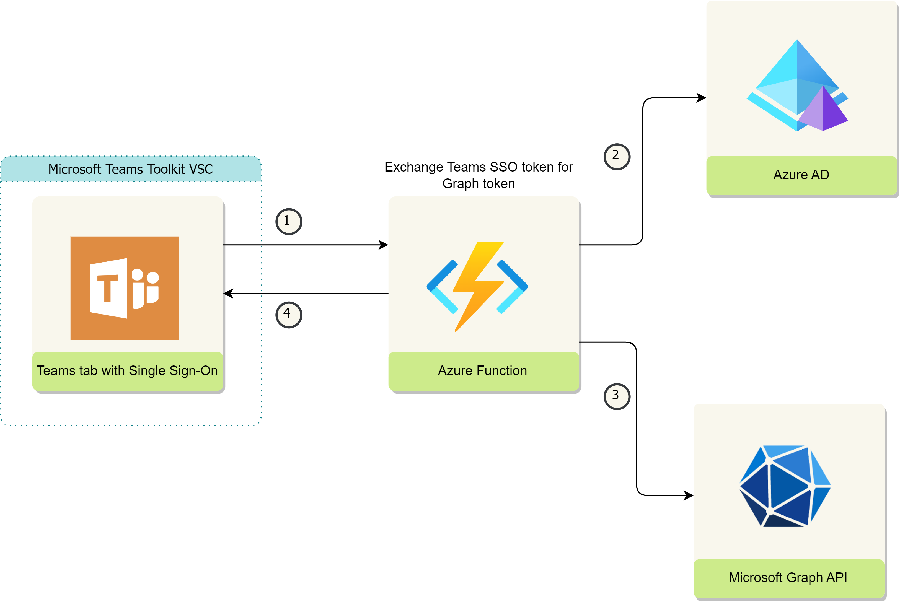

## Summary

The purpose of this sample app is to convert different types of documents into PDF via the Microsoft Graph API, and then merge them together in order to form one document pack. It utilizes a Microsoft Teams tab with single sign-on enabled and uses an Azure function as its backend to interact with the Graph API.

_See below an app architecture_

## App architecture

## Demo

## Prerequisites

1. Set up and install Teams Toolkit for Visual Studio Code v5.0 [How to install Teams Toolkit v5.0](https://learn.microsoft.com/en-us/microsoftteams/platform/toolkit/install-teams-toolkit?tabs=vscode).

2. [Node.js](https://nodejs.org/), supported versions: 14, 16, 18

3. An [Microsoft 365 account for development](https://docs.microsoft.com/microsoftteams/platform/toolkit/accounts)

4. Download and install visual studio 2022 from this link (https://visualstudio.microsoft.com/vs/)
   1. We need this to debug the Azure function

## Version history

| Version | Date          | Author       | Comments        |
| ------- | ------------- | ------------ | --------------- |
| 1.0     | June 25, 2023 | Ejaz Hussain | Initial release |

## Disclaimer

**THIS CODE IS PROVIDED _AS IS_ WITHOUT WARRANTY OF ANY KIND, EITHER EXPRESS OR IMPLIED, INCLUDING ANY IMPLIED WARRANTIES OF FITNESS FOR A PARTICULAR PURPOSE, MERCHANTABILITY, OR NON-INFRINGEMENT.**

---

## Minimal Path to Awesome

> **Azure function project location**: <mark>\api\PDFConverstion</mark>

### Debug the Teams tab (front-end) locally

1. First, select the Teams Toolkit icon on the left in the VS Code toolbar.
2. In the Account section, sign in with your [Microsoft 365 account](https://docs.microsoft.com/microsoftteams/platform/toolkit/accounts) if you haven't already.
3. Press F5 to start debugging which launches your app in Teams using a web browser. Select `Debug (Edge)` or `Debug (Chrome)`.
4. When Teams launches in the browser, select the Add button in the dialog to install your app to Teams.
5. On initial app run, Allow the following Graph API permissions via the consent prompt. <mark>Make sure popups are allowed in the browser to see the consent prompot</mark>.

   | Graph API Permissions |
   | --------------------- |
   | User.Read             |
   | Files.ReadWrite.All   |
   | offline_access        |
   | openid                |
   | profile               |

6. Once the Teams tab is up and running, follow the below steps to run the Azure function app

### Debug the Azure function app (backend) locally

1. Navigate to **api** folder and open the Azure function project in the <mark>Visual Studio 2022</mark>
2. Copy the following parameters from the .localconfig file under the **api** folder and paste them into **local.settings.json**.

   | Variables           | Description                                                                           |
   | ------------------- | ------------------------------------------------------------------------------------- |
   | M365_CLIENT_ID      | Your AAD App client id.                                                               |
   | M365_CLIENT_SECRET  | Your AAD App client secret.                                                           |
   | M365_AUTHORITY_HOST | Authority host for your AAD tenant.                                                   |
   | M365_TENANT_ID      | Tenant id for your AAD tenant.                                                        |
   | ALLOWED_APP_IDS     | List of client ids which are allowed to call the function app. Split by semicolon ';' |

3. Run the function project in debug mode parallelly.

### Use the Document pack app

1. Once the both front-end and back-end apps running, you can now use the document pack app in the Microsoft Teams client.
2. Upload some documents and click on Create PDF document pack button to create document pack
