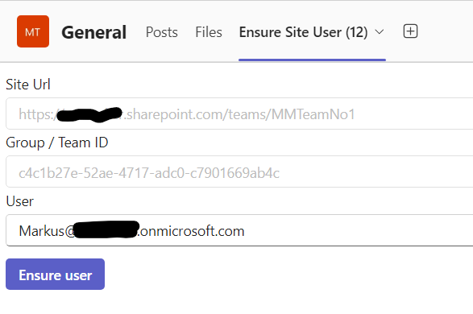

# Tab SSO Graph SPO Refresh

## Summary

This app describes how to establish a Teams Tab as SSO solution including the generation of a second SharePoint access token.
Although Microsoft Graph is the way to go there are still gaps to the original SharePoint rest API. One example is shown in this sample as it is the /_api/web/ensureuser endpoint

Teams Tab to ensure a SharePoint user in current's Team site



For further details see the author's [blog post](https://mmsharepoint.wordpress.com/2021/06/22/use-sharepoint-rest-api-in-microsoft-teams-with-sso-and-on-behalf-flow/) on a previous version.

## Applies to

This sample was created [using the Teams Toolkit with Visual Studio Code](https://learn.microsoft.com/en-us/microsoftteams/platform/toolkit/teams-toolkit-fundamentals?pivots=visual-studio&WT.mc_id=M365-MVP-5004617). The same sample was also realized with the [Teams Toolkit for Visual Studio 2022](https://learn.microsoft.com/en-us/microsoftteams/platform/toolkit/toolkit-v4/teams-toolkit-fundamentals-vs?WT.mc_id=M365-MVP-5004617) and can be found [here](https://github.com/pnp/teams-dev-samples/samples/tab-sso-graph-spo-refresh-csharp)

## Version history

Version|Date|Author|Comments
-------|----|----|--------
1.0|Aug 09, 2024|[Markus Moeller](https://twitter.com/moeller2_0)|Initial release

## Disclaimer

**THIS CODE IS PROVIDED *AS IS* WITHOUT WARRANTY OF ANY KIND, EITHER EXPRESS OR IMPLIED, INCLUDING ANY IMPLIED WARRANTIES OF FITNESS FOR A PARTICULAR PURPOSE, MERCHANTABILITY, OR NON-INFRINGEMENT.**

## Minimal Path to Awesome
- Clone the repository
    ```bash
    git clone https://github.com/pnp/teams-dev-samples.git
    ```
- Create .env.local from .env.dev
    ```bash
    copy .\env\.env.dev .\env\.env.local
    ```
- Fill in your SharePoint tenant into AAD_APP_SPO_SCOPE
- In Teams Toolkit:
1. First, select the Teams Toolkit icon on the left in the VS Code toolbar.
2. In the Account section, sign in with your [Microsoft 365 account](https://docs.microsoft.com/microsoftteams/platform/toolkit/accounts) if you haven't already.
3. Press F5 to start debugging which launches your app in Teams using a web browser. Select `Debug in Teams (Edge)` or `Debug in Teams (Chrome)`.
4. When Teams launches in the browser, select the Add button in the dialog to install your app to a Team of your choice
5. Confirm the Configuration screen with 
6. Ensure the permissions of your Entra ID app are consented tenant-wide
  
## Features
- Using FluentUI 9 compontents
- Generating Entra ID access tokens for Microsoft Graph but also SharePoint Rest Api access

