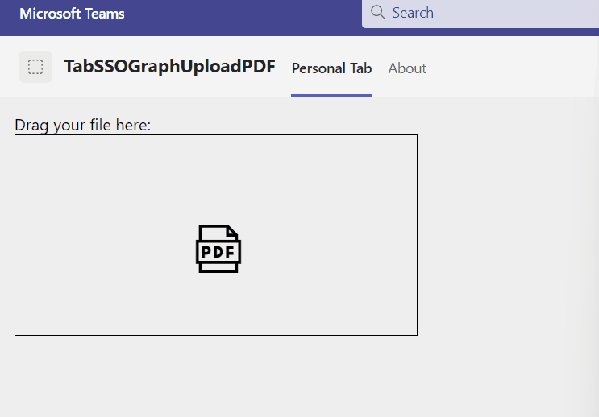

# tab-sso-graph-upload-pdf-csharp

## Summary
This Teams Tab enables a user to upload a supported ("csv", "doc", "docx", "odp", "ods", "odt", "pot", "potm", "potx", "pps", "ppsx", "ppsxm", "ppt", "pptm", "pptx", "rtf", "xls", "xlsx") file type via drag and drop while the uploaded file will be converted as PDF.
In Teams context it uses the current channel as a Folder name in the default drive of current team.
It uses the following capabilities (mostly) on behalf of Microsoft Graph:
* Use HTML5 drag and drop event handling
* Writing normal files smaller 4MB
* Retrieving files with format=pdf conversion



For further details see the author's [blog post](https://mmsharepoint.wordpress.com/2023/02/26/pdf-document-conversion-in-a-teams-tab-with-microsoft-graph-and-teams-toolkit-for-visual-studio-c/)

## Applies to

This sample was created [using the Teams Toolkit with Visual Studio 2022](https://learn.microsoft.com/en-us/microsoftteams/platform/toolkit/teams-toolkit-fundamentals?pivots=visual-studio&WT.mc_id=M365-MVP-5004617). The same sample was also realized with the [Yeoman Generator for Teams](https://github.com/pnp/generator-teams) and can be found [here](https://github.com/pnp/teams-dev-samples/samoles/tab-sso-graph-upload-as-pdf).

## Version history

Version|Date|Author|Comments
-------|----|--------|--------
1.0|April 01, 2023|[Markus Moeller](http://www.twitter.com/moeller2_0)|Initial release

## Disclaimer

**THIS CODE IS PROVIDED *AS IS* WITHOUT WARRANTY OF ANY KIND, EITHER EXPRESS OR IMPLIED, INCLUDING ANY IMPLIED WARRANTIES OF FITNESS FOR A PARTICULAR PURPOSE, MERCHANTABILITY, OR NON-INFRINGEMENT.**

---
## Minimal Path to Awesome
- Clone the repository
    ```bash
    git clone https://github.com/pnp/teams-dev-samples.git
- Open samples\tab-sso-graph-upload-as-pdf-csharp\tab-sso-graph-upload-pdf.sln in Visual Studio
- Perform actions in GettingStarted.txt
- This should [register an app in Azure AD](https://learn.microsoft.com/en-us/microsoftteams/platform/toolkit/add-single-sign-on?pivots=visual-studio&WT.mc_id=M365-MVP-5004617#add-sso-to-teams-app-for-visual-studio)
- Ensure there is an app 
  - with redirect uri https://localhost/blank-auth-end.html
  - SignInAudience multi-tenant
  - with client secret
  - with **delegated** permissions Files.ReadWrite and Sites.ReadWrite.All
  - With exposed Api "access_as_user" and App ID Uri api://localhost/<App ID>
  - With the client IDs for Teams App and Teams Web App 1fec8e78-bce4-4aaf-ab1b-5451cc387264 and 5e3ce6c0-2b1f-4285-8d4b-75ee78787346
- Find/Add the app registration ClientId, ClientSecret to your appsettings.json (or a appsettings.Development.json)
- Find/Fill OAuthAuthority with https://login.microsoftonline.com/_YOUR_TENANTID_
- Grant admin consent to the given permissions in the app registration
- Now you are good to go to continue in GettingStarted.txt with hitting F5 (You can also select an installed browser in the VS menu)

## Features
This is a simple Teams Tab. It uses the Microsoft Graph Toolkit (MGT) for simplifying access to Microsoft 365 resources.
* SSO access token generation to access Microsoft Graph
* Call backend controller to execute O-B-O flow and Microsoft Graph requests
* [Convert supported files to PDF with Microsoft Graph](https://learn.microsoft.com/en-us/graph/api/driveitem-get-content-format?view=graph-rest-1.0&tabs=http&WT.mc_id=M365-MVP-5004617)
* [Use Fluent UI Web Components with Blazor](https://learn.microsoft.com/en-us/fluent-ui/web-components/integrations/blazor?WT.mc_id=M365-MVP-5004617)


