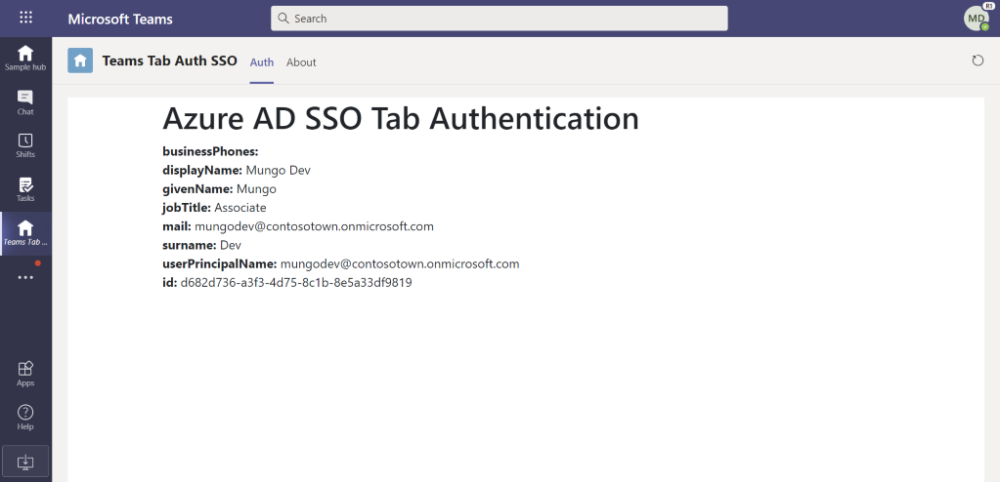
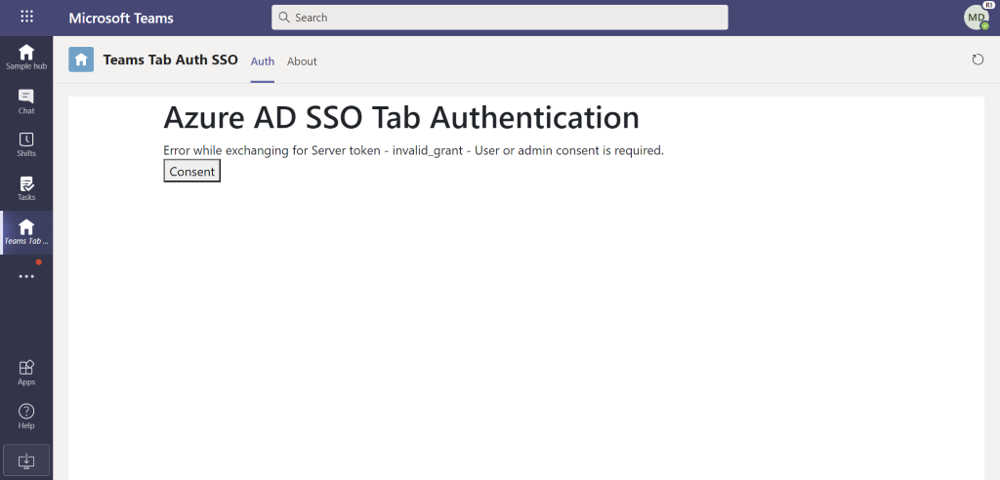
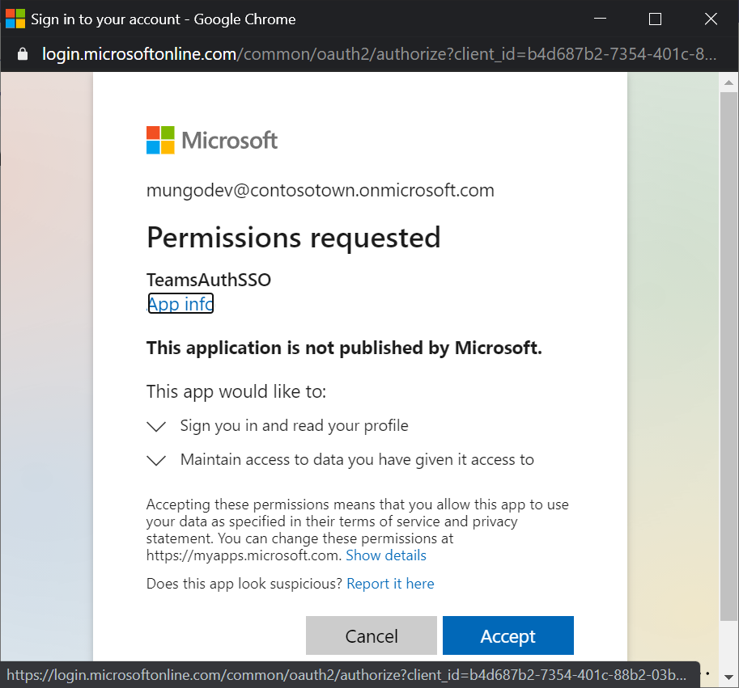
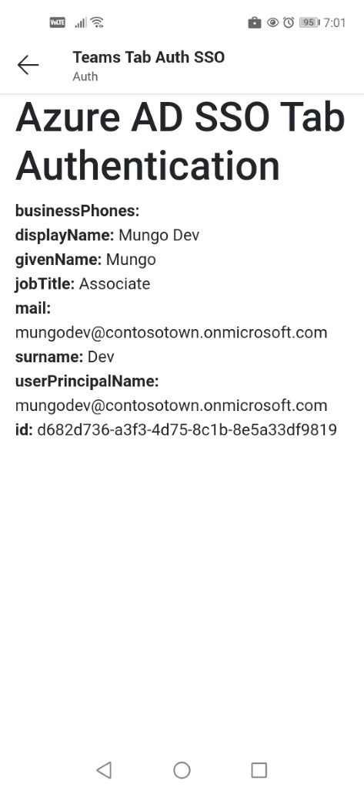
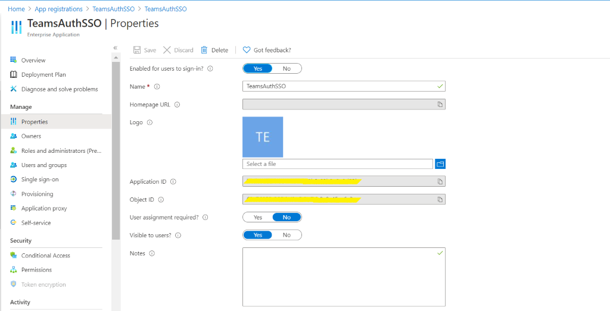

# Microsoft Teams Tabs Single Sign-On Sample code 

## Summary

This sample shows you how to implement AZURE AD single-sign-on support for Teams tabs. Samples are generally not production-ready or an out-of-the-box solution but are intended to show developers specific patterns for use in their applications. The functionality is bare bone, all it does is to call a web service, get the right access token then retrieves a user’s profile.

## Frameworks

## Prerequisites

* [Office 365 tenant](https://developer.microsoft.com/en-us/microsoft-365/dev-program)

* To test locally, you'll need Ngrok installed on your development machine. Make sure you've downloaded and installed Ngrok on your local machine. ngrok will tunnel requests from the Internet to your local computer and terminate the SSL connection from Teams.

    * ex: `https://subdomain.ngrok.io`.

	 NOTE: A free Ngrok plan will generate a new URL every time you run it, which requires you to update your Azure AD registration, the Teams app manifest, and the project configuration. A paid account with a permanent Ngrok URL is recommended.

## Version history

Version|Date|Author|Comments
-------|----|----|--------
1.0|December 03, 2020|Abtin Amini  Arun Kumar Anaparthi|Initial release

## Disclaimer

**THIS CODE IS PROVIDED *AS IS* WITHOUT WARRANTY OF ANY KIND, EITHER EXPRESS OR IMPLIED, INCLUDING ANY IMPLIED WARRANTIES OF FITNESS FOR A PARTICULAR PURPOSE, MERCHANTABILITY, OR NON-INFRINGEMENT.**

---

## Minimal Path to Awesome

Step 1: Register an Azure AD Application 
====================================

Your tab needs to run as a registered Azure AD application to obtain an access token from Azure AD. In this step you'll register the app in your tenant and give Teams permission to obtain access tokens on its behalf.

1. Register a new application in the [Azure Active Directory – App Registrations](https://go.microsoft.com/fwlink/?linkid=2083908) portal.
2. Select **New Registration** and on the *register an application page*, set following values:
    * Set **name** to your app name.
    * Choose the **supported account types** (any account type will work)
    * Leave **Redirect URI** empty.
    * Choose **Register**.
3. On the overview page, copy and save the **Application (client) ID, Directory (tenant) ID**. You’ll need it later when updating your Teams application manifest.
4. Under **Manage**, select **Expose an API**. 
5. Select the **Set** link to generate the Application ID URI in the form of `api://{AppID}`. Insert your fully qualified domain name (with a forward slash "/" appended to the end) between the double forward slashes and the GUID. The entire ID should have the form of: `api://fully-qualified-domain-name/{AppID}`
    * ex: `api://subdomain.ngrok.io/00000000-0000-0000-0000-000000000000`.
    
   The fully qualified domain name is the human readable domain name from which your app is served. If you are using a tunneling service such as Ngrok, you will need to update this value whenever your Ngrok subdomain changes. 
6. Select the **Add a scope** button. In the panel that opens, enter `access_as_user` as the **Scope name**.
7. Set **Who can consent?** to `Admins and users`
8. Fill in the fields for configuring the admin and user consent prompts with values that are appropriate for the `access_as_user` scope:
    * **Admin consent title:** Teams can access the user’s profile.
    * **Admin consent description**: Allows Teams to call the app’s web APIs as the current user.
    * **User consent title**: Teams can access the user profile and make requests on the user's behalf.
    * **User consent description:** Enable Teams to call this app’s APIs with the same rights as the user.
9. Ensure that **State** is set to **Enabled**
10. Select **Add scope** button to save
    * The domain part of the **Scope name** displayed just below the text field should automatically match the **Application ID** URI set in the previous step, with `/access_as_user` appended to the end:
        * `api://subdomain.ngrok.io/00000000-0000-0000-0000-000000000000/access_as_user`
11. In the **Authorized client applications** section, identify the applications that you want to authorize for your app’s web application. Select Add a client application. Enter each of the following client IDs and select the authorized scope you created in the previous step:
    * `1fec8e78-bce4-4aaf-ab1b-5451cc387264` (Teams mobile/desktop application)
    * `5e3ce6c0-2b1f-4285-8d4b-75ee78787346` (Teams web application)
12. Navigate to **API Permissions**, and make sure to add the follow permissions:
-   Select Add a permission
-   Select Microsoft Graph -\> Delegated permissions.
    * User.Read (enabled by default)
    * email
    * offline_access
    * OpenId
    * profile
13. Navigate to **Authentication**
    If an app hasn't been granted IT admin consent, users will have to provide consent the first time they use an app.
    Set a redirect URI:
    * Select **Add a platform**.
    * Select **web**.
    * Enter the **redirect URI** for your app. This will be the page where a successful implicit grant flow will redirect the user. This will be same fully qualified domain name that you entered in step 5 followed by the API route where a authentication response should be sent. If you are following any of the Teams samples, this will be: `https://subdomain.ngrok.io/End`
         
    Next, Enable implicit grant by checking the following boxes:  
    ✔ ID Token  
    ✔ Access Token
    
Congratulations! You have completed the app registration prerequisites to proceed with your tab SSO app. 

Step 2: Update the app manifest file 
====================================

Add new properties to your Microsoft Teams manifest:
* **WebApplicationInfo** - The parent of the following elements:
* **id** - The client ID of the application. This is the application ID that you obtained as part of registering the application with Azure AD.
* **resource** - The domain and subdomain of your application. This is the same URI (including the api:// protocol) that you registered when creating your scope in step 6 above. You shouldn't include the access_as_user path in your resource. The domain part of this URI should match the domain, including any subdomains, used in the URLs of your Teams application manifest.

		"webApplicationInfo": {
			"id": "00000000-0000-0000-0000-000000000000",
			"resource": "api://subdomain.ngrok.io/00000000-0000-0000-0000-000000000000"
			}

Step 3: Run the app locally 
====================================

1. Clone the repository.

  		git clone “https://github.com/pnp/teams-dev-samples.git”
  
2. If you are using Visual Studio
 	- Launch Visual Studio
 	- File -> Open -> Project/Solution
 	- Navigate to samples/tab-sso-teamsclientsdk/Source folder.
 	- Select TeamsAuthSSO.csproj file
 
3. Run Ngrok to expose your local web server via a public URL. Make sure to point it to your Ngrok URI. For example, if you're using port 3333 locally, run:

		Win: ./ngrok http 3333 -host-header=localhost:3333 -subdomain="contoso"
		Mac: /ngrok http 3333 -host-header=localhost:3333 -subdomain="contoso"

Step 4: Packaging and installing your app to Teams 
====================================
Zip the manifest with the profile images and install it in Teams. 

Step 5: Trying out the app 
====================================
1. Once you have installed the app, it should automatically open for you. Visit the Auth Tab to begin testing out the authentication flow.
2. Follow the onscreen prompts. The authentication flow will print the output to your screen.
   - The first time you run the app it should get an access token from Microsoft Teams, but it will not be able to get one from the server unless the user or an administrator consent. If this is necessary, you will see a consent button.

   - Click the consent button and a pop-up window will display the consent dialog from Azure AD.

   - Once you've granted all the permissions, the page will use the access token it received to make a Graph API call.

   - Once you've granted all the permissions, you can revisit this tab and you will notice that you will automatically be logged in.

   - The SSO even works on mobile devices.

Step 6: Testing the consent process
====================================

If you need to remove all consents for the application for test purposes, simply delete its service principal in the Azure AD portal. It may take a few minutes for cached values to time out. The service principal is created automatically the first time someone consents. 

App structure
=============

### Routes
1. /Index renders the tab UI.
   - This is the tab called Auth Tab in personal app inside Teams. The purpose of this view is primarily to execute the auth.js file that handles initiates the authentication flow.
   - This tab can also be added to Teams channels.
2. /GetUserAccessToken does not render anything but instead is the server-side route for initiating the [on-behalf-of flow](https://docs.microsoft.com/en-us/azure/active-directory/develop/v1-oauth2-on-behalf-of-flow).
   - It takes the token it receives from the auth.js file and attempts to exchange it for a new token that has elevated permissions to access the profile Graph API (which is usually used to retrieve the users profile photo).
   - If it fails (because the user hasn't granted permission to access the profile API), it returns an error to the /Index view. This error is used to display the "Consent" button which uses the Teams SDK to open the /Start view in a pop-up window.
3. /Start and /End routes are used if the user needs to grant further permissions. This experience happens in a separate window.
    - The /Start view merely creates a valid AAD authorization endpoint and redirects to that AAD consent page.
    - Once the user has consented to the permissions, AAD redirects the user back to /End. This view is responsible for returning the results back to the /Start view by calling the notifySuccess API.
    - This workflow is only necessary if you want authorization to use additional Graph APIs. Most apps will find this flow unnecessary if all they want to do is authenticate the user.
    - This workflow is the same as our standard [web-based authentication flow](https://docs.microsoft.com/en-us/microsoftteams/platform/tabs/how-to/authentication/auth-tab-aad#navigate-to-the-authorization-page-from-your-popup-page) that we've always had in Teams before we had single sign-on support. It just so happens that it's a great way to request additional permissions from the user, so it's left in this sample as an illustration of what that flow looks like.

