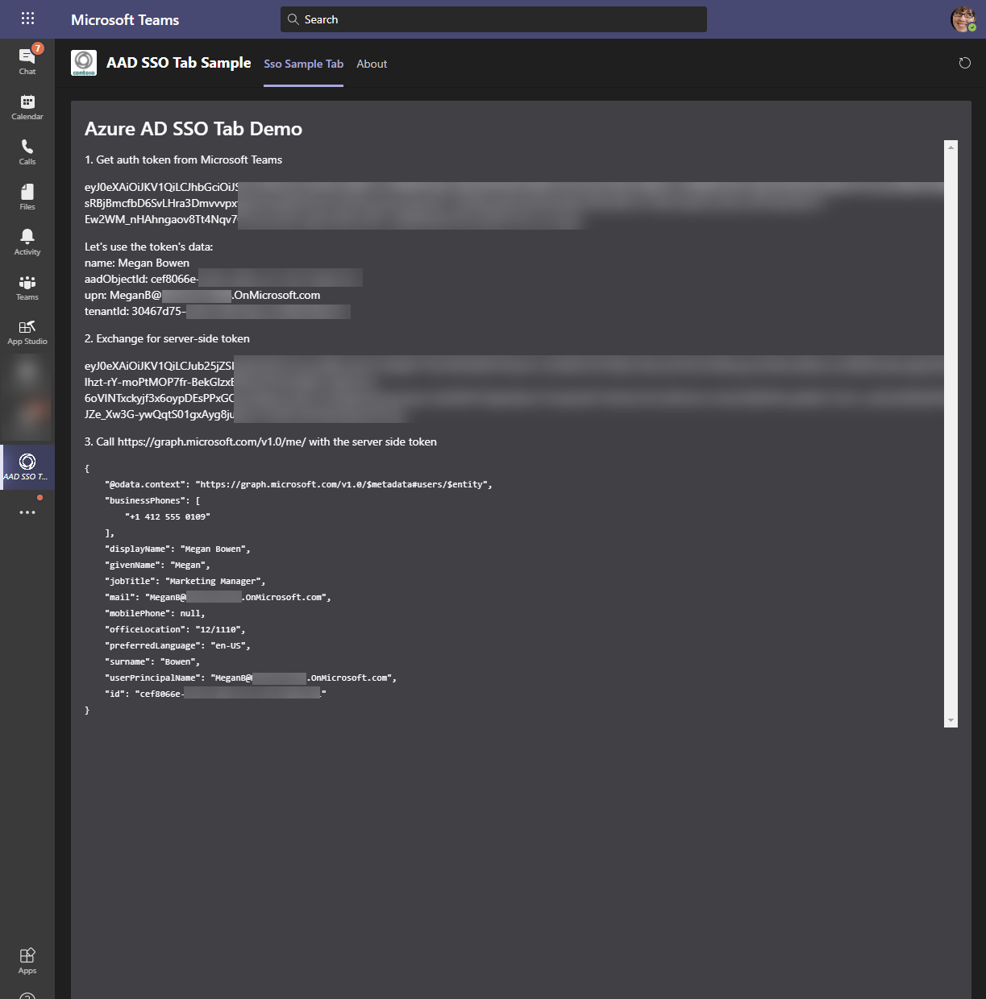

# Teams Tab Single Sign-on (SSO) Sample

## Summary

This sample shows how to create a tab for Teams that uses the built-in [Single Sign-On (SSO)](https://docs.microsoft.com/microsoftteams/platform/tabs/how-to/authentication/auth-aad-sso) capabilities to get a secure token containing important user information like user display name, Azure AD Object Id, UPN and Tenant ID. The sample also shows how to create a web service to enable exchange for an [On-Behalf-Of](https://docs.microsoft.com/en-us/azure/active-directory/develop/v2-oauth2-on-behalf-of-flow) token that can be used to call another service, such as the Microsoft Graph, to access additional capabilities.

Please note that using SSO does *not* eliminate the user seeing consent popups - these are still required in order to ensure the application has approval to access the user's information. To assist in this, read [here](https://docs.microsoft.com/en-gb/microsoftteams/platform/tabs/how-to/authentication/auth-aad-sso#tenant-admin-consent) on how to have an administrator pre-consent on behalf of all the users in the organisation.

Below is a screenshot of the SSO tab in action:



**Please note** that this sample actually contains two separate, alternate projects: a .NET version and a Node.js version. In addition, the .NET version uses a more 'vanilla JS' approach, in order to show how SSO can be implemented in such a scenario, and the Node.js version uses a React front end, in order to demonstrate SSO using a front end framework.

## Frameworks

**Dotnet Version**


**Node.js Version**


## Prerequisites

**Node.js Version**
* [Node.js](https://nodejs.org) version 12.6.1 or higher

    ```bash
    # determine node version
    node --version
    ```

**Dotnet Version**
* [Dotnet Core](https://dotnet.microsoft.com/) version 3.1 or higher

**Both Versions**
* [Office 365 tenant](https://dev.office.com/sharepoint/docs/spfx/set-up-your-development-environment)
* Optional: Static hosting such as [github pages](https://pages.github.com/)

## Version history

Version|Date|Author|Comments
-------|----|----|--------
1.0|December 05, 2020|Hilton Giesenow|Initial release

## Disclaimer

**THIS CODE IS PROVIDED *AS IS* WITHOUT WARRANTY OF ANY KIND, EITHER EXPRESS OR IMPLIED, INCLUDING ANY IMPLIED WARRANTIES OF FITNESS FOR A PARTICULAR PURPOSE, MERCHANTABILITY, OR NON-INFRINGEMENT.**

---

## Minimal Path to Awesome

#### 1. Clone this repository

    ```bash
    git clone https://github.com/pnp/teams-dev-samples.git
    ```

#### 2. Register Azure AD application

tbd...

#### 3. Update app configuration & run the web application

**Dotnet Version**

* See [`dotnet`](src/dotnet) folder

**Node.js Version**

* See [`node`](src/node) folder

#### 4. Update & package the Teams app manifest

tbd...

#### 5. Upload the manifest to Teams

tbd...

## Features

This sample demonstrates how to create a tab for Teams that uses Single-Sign-On (SSO) as well as how to exchange the SSO token for an On-Behalf-Of (OBO) token.

## Further Reading

* [What Are Tabs (Overview of Tabs in Teams)](https://docs.microsoft.com/en-us/microsoftteams/platform/tabs/what-are-tabs)
* [Tab Authentication](https://docs.microsoft.com/en-us/microsoftteams/platform/tabs/how-to/authentication/auth-flow-tab)
* [Single Sign-On (SSO) For Tabs](https://docs.microsoft.com/en-us/microsoftteams/platform/tabs/how-to/authentication/auth-aad-sso)
* [Microsoft Authentication Library (MSAL) 2.0](https://github.com/AzureAD/microsoft-authentication-library-for-js/tree/dev/lib/msal-browser)
