# Create a Microsoft Teams Meeting with Calling & Meeting Bot, and add a custom app to the meeting programmatically- Sample code.  

## Summary

This sample code shows you how to create virtual event app with Teams platform online meeting graph API and new meeting extensibility features. Samples are generally not production-ready or an out-of-the-box solution but are intended to show developers specific patterns for use in their applications. The functionality is bare bone, all it does is to initiate a Calling & Meeting bot on behalf of users and enables the meeting organizers to programmatically add a custom app, in this example “Share Notes”, to the meeting.

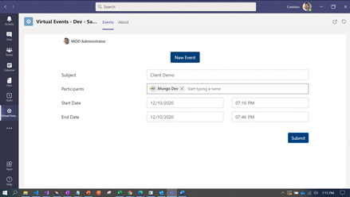

## Frameworks

## Prerequisites

* [Office 365 tenant](https://developer.microsoft.com/en-us/microsoft-365/dev-program)

* To test locally, you'll need Ngrok installed on your development machine. Make sure you've downloaded and installed Ngrok on your local machine. ngrok will tunnel requests from the Internet to your local computer and terminate the SSL connection from Teams.

    * ex: `https://subdomain.ngrok.io`.

	 NOTE: A free Ngrok plan will generate a new URL every time you run it, which requires you to update your Azure AD registration, the Teams app manifest, and the project configuration. A paid account with a permanent Ngrok URL is recommended.

## Version history

Version|Date|Author|Comments
-------|----|----|--------
1.0|December 18, 2020|Abtin Amini  Arun Kumar Anaparthi|Initial release

## Disclaimer

**THIS CODE IS PROVIDED *AS IS* WITHOUT WARRANTY OF ANY KIND, EITHER EXPRESS OR IMPLIED, INCLUDING ANY IMPLIED WARRANTIES OF FITNESS FOR A PARTICULAR PURPOSE, MERCHANTABILITY, OR NON-INFRINGEMENT.**

---

## Minimal Path to Awesome

Step 1: Setup bot in Service
====================================
1. Create new bot channel registration resource in Azure.

2. Create New Microsoft App ID and Password.

3. Go to App registrations and create a new app registration in a different tab.
4. Register an application.
	* Fill out name and select third option for supported account type and click "Register".

5. Create Client Secret.
	* Navigate to the "Certificates & secrets" blade and add a client secret by clicking "New Client Secret"

	* Copy and paste the secret somewhere safe. You will need it in a future step. Paste the App Id and password in the respective blocks and click on OK.

	* Click on Create on the Bot Channel registration

Step 2: Configure AAD app
====================================
1. Expose API endpoint.
	* Click "Expose an API" in the left rail
		 Update your application ID URL to include your bot id - api://botid-<your_bot_id>, where <your_bot_id> is the id of the bot that will be making the SSO request and found in your Teams Application Manifest.
2. Click "Add a scope"
	* access_as_user as the Scope name.
	* Set Who can consent? to Admins and users.
	* Fill in the fields for configuring the admin and user consent prompts with values that are appropriate for the access_as_user scope. 
		* Suggestions:
			* Admin consent title: Teams can access the user’s profile.
			* Admin consent description: Allows Teams to call the app’s web APIs as the current user.
			* User consent title: Teams can access your user profile and make requests on your behalf.
			* User consent description: Enable Teams to call this app’s APIs with the same rights that you have 
	* Ensure that State is set to Enabled.
	* Select Add scope (Note: The domain part of the Scope name displayed just below the text field should automatically match the Application ID URI set in the previous step, with /access_as_user appended to the end).
3. Authorize client applications.
      Add the following Ids as authorized clients for your application.
	* 1fec8e78-bce4-4aaf-ab1b-5451cc387264 (Teams mobile/desktop application).
	* 5e3ce6c0-2b1f-4285-8d4b-75ee78787346 (Teams web application).
4. Add any necessary API permissions 
	* Select Microsoft Graph -> Delegated permissions
 		- User.Read (enabled by default)
 		- email
 		- offline_access
 		- OpenId
 		- Profile
 		- User.Read.All
 		- User.Invite.All
 		- Calendars.ReadWrite
 		- TeamsAppInstallation.ReadWriteForChat
 		- TeamsTab.Create
 		- Notes.ReadWrite.All
		- People.Read
		
	* Select Microsoft Graph -> Application permissions
 		- Notes.ReadWrite.All
 		- Calls.AccessMedia.All
 		- Calls.Initiate.All
 		- Calls.InitiateGroupCall.All
 		- Calls.JoinGroupCall.All
 		- Calls.JoinGroupCallAsGuest.All                 

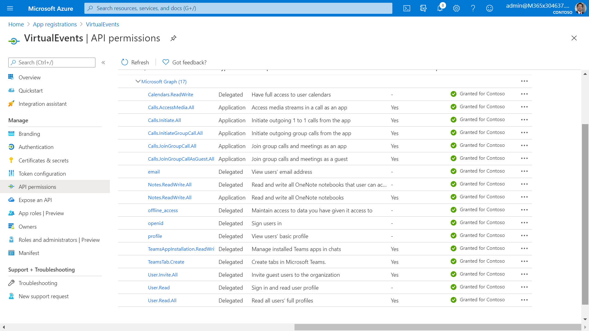

5. Redirect URI
 	- Select Add a platform.
 	- Select web.
 	- Enter the redirect URI for your app:	https://subdomain.ngrok.io/End, https://subdomain.ngrok.io/auth

    Next, Enable implicit grant by checking the following boxes:  
    ✔ ID Token  
    ✔ Access Token
    
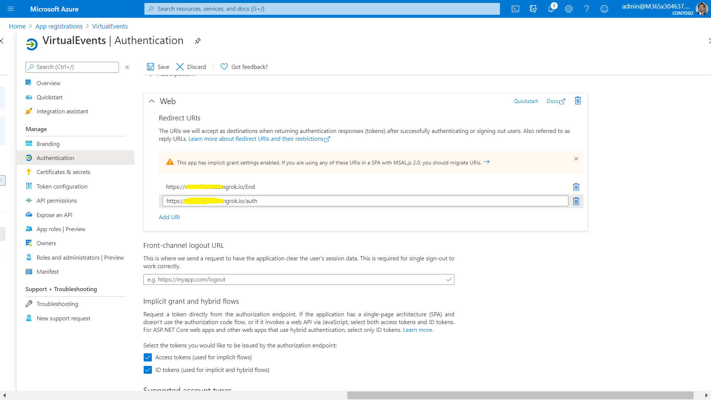

Step 3: Run the app locally 
====================================

1. Clone the repository.

  		git clone “https://github.com/pnp/teams-dev-samples.git”
  
2. If you are using Visual Studio
 	- Launch Visual Studio
 	- File -> Open -> Project/Solution
 	- Navigate to samples/virtual-events-meeting-extensibility/Source/VirtualMeetingExtensibility folder.
 	- Select VirtualMeetingExtensibility.csproj file.

3. Run Ngrok to expose your local web server via a public URL. Make sure to point it to your Ngrok URI. For example, if you're using port 3333 locally, run:

		Win: ./ngrok http 3333 -host-header=localhost:3333 -subdomain="contoso"
		Mac: /ngrok http 3333 -host-header=localhost:3333 -subdomain="contoso".

4. Update the index.cshtml and appsettings.json files

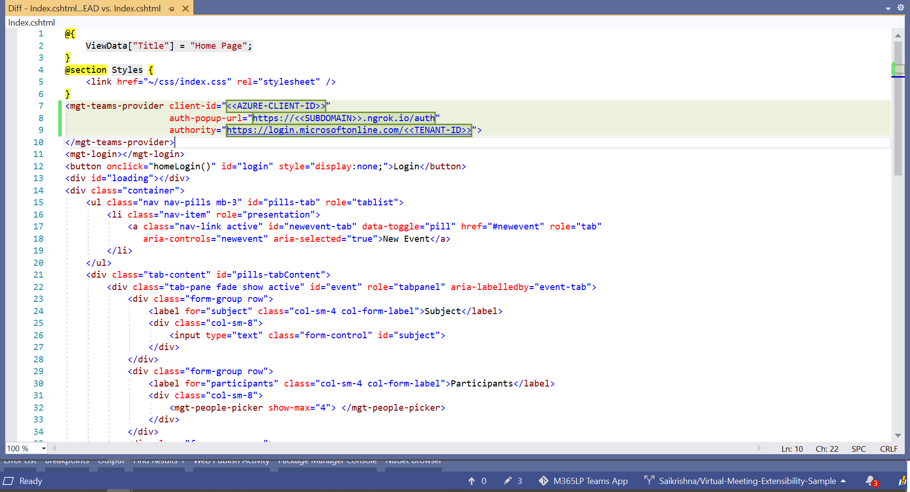

5. Enable the Microsoft Teams channel and enable calling on the Calling tab in the Azure Bots Channel Registration. Fill in the Webhook (for calling) where you will receive incoming notifications. E.g. https://{your domain}/callback/calling.

Step 4: Packaging and installing your app to Teams 
==================================================

Make sure the required values such ap App id, content URL of Static tab, configuration url of configurable tab and web application info sections are populated in the manifest, Zip the manifest with the profile images and install it in Teams.

Step 5: Try out the app
==================================================

Open the virtual event app and follow the scenarios.

1: Create calendar event : App allows creation of Teams meeting based on meeting parameters provided in the Tab. It allows users to choose meeting participants and date/time. 

Make sure to sign in, in order to get the people picker working.
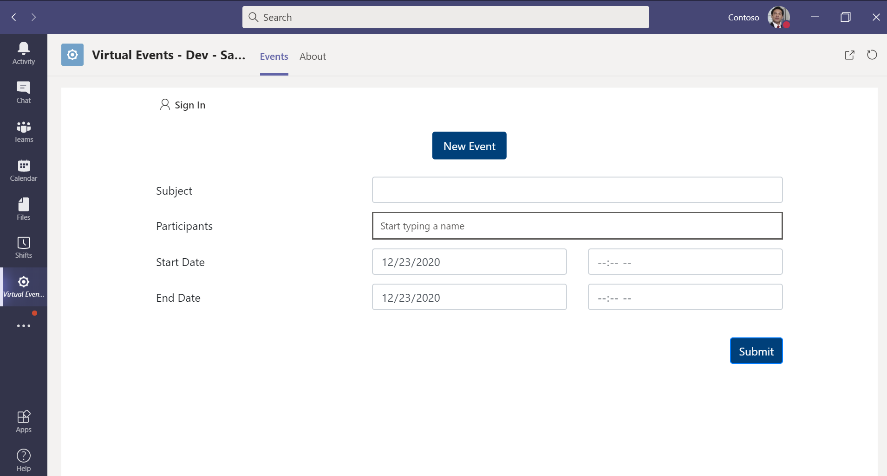

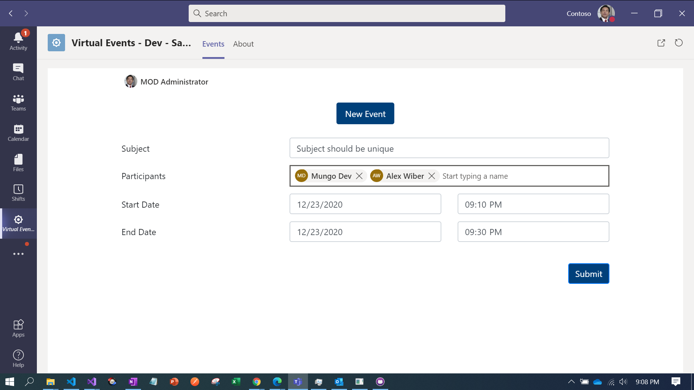

2: Bot initiating call to the participants: At the scheduled time, the Calling & Meeting bot initiates a call to all the attendees of the event. The attendees may choose to accept / reject the call. 

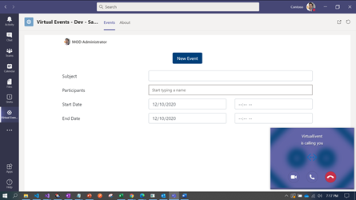

3 : Meeting stage view: The bot is also present as a participant in the meeting. The bot has access to participants information, video and audio stream. 

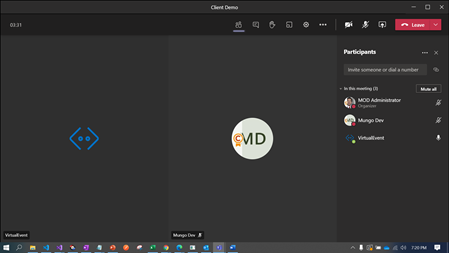

4: Existing app has been installed programmatically: As meeting event gets created, the app also gets added to the meeting automatically using Graph API.

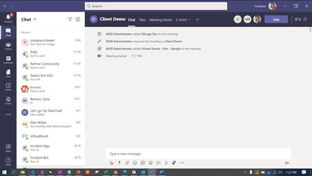

5: Tab got added to the meeting programmatically: Programmatically  adding an app to meeting based on a custom logic allows flexibility and control over determining meeting experience based on business requirements

6: Meeting side panel: As an in-meeting experience, the app allows users to take notes during the call in the meeting’s side panel. 

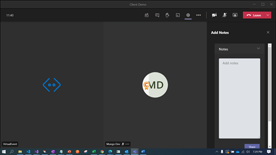

7: Posting the meeting notes from the meeting side panel: Each attendee may take their own notes during the meeting. At the end of the meeting, the attendees can share the notes they have taken to collate.

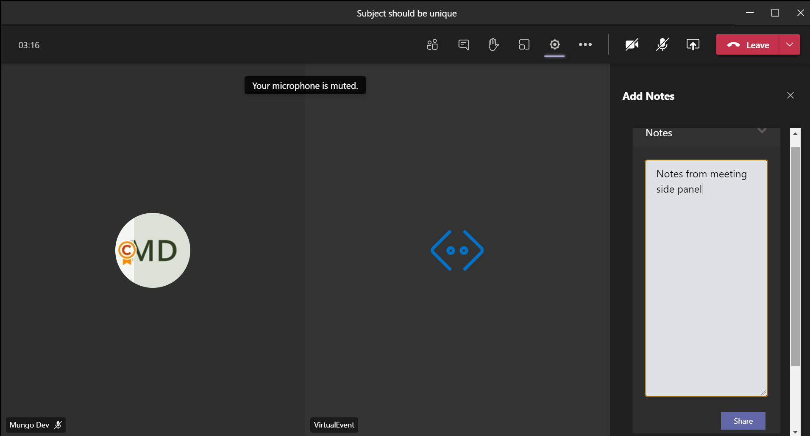

8: Notes in the Notebook page with the username who has shared the notes: Collated meeting notes across team is consolidated into one single page and section automatically created for the specific meeting.

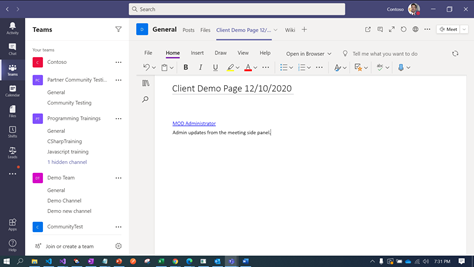

9: Participants /Attendees information: List of attendees who participated in the meeting are collected at regular intervals (every 3 seconds) and stored in Cosmos DB. This can be used for further analysis and reporting at various levels of aggregation. 

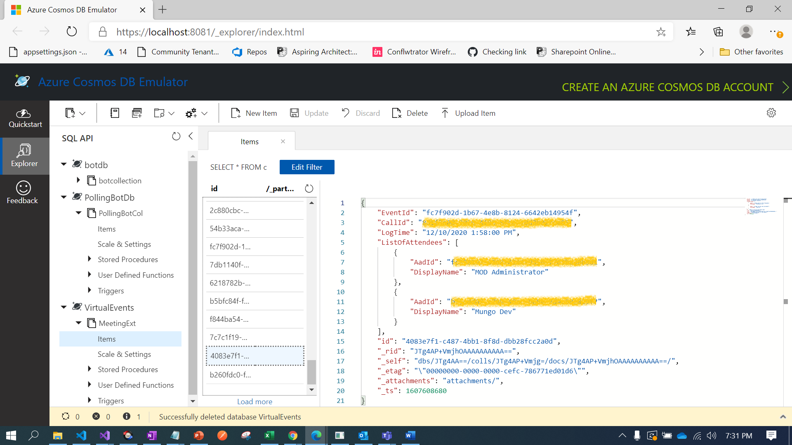

## Important features in the sample code:

Virtual Event and online meeting:

1. [Creating Online event](https://docs.microsoft.com/en-us/graph/api/user-post-events?view=graph-rest-1.0&tabs=http): A calendar event will be created for the given schedule and participants.
2. Virtual Event Bot: Bot will initiate the call at the scheduled time to the mentioned participants.
3. [List of Participants](https://docs.microsoft.com/en-us/graph/api/call-list-participants?view=graph-rest-1.0&tabs=http): Actual attendees’ information would be retrieved periodically and gets stored into cosmos DB, using which the list of participants can be known.

[Meeting Extensibility App](https://docs.microsoft.com/en-us/microsoftteams/platform/apps-in-teams-meetings/teams-apps-in-meetings):

1. [Programmatically adding app in Teams meetings](https://docs.microsoft.com/en-us/graph/api/chat-post-installedapps?view=graph-rest-beta&tabs=http): Extending the Virtual Event app to allow installing the existing applications into the meeting as part of the event creation and allowing to include the app as part of the meeting.
2. [Creating OneNote notebook](https://docs.microsoft.com/en-us/graph/api/onenote-post-notebooks?view=graph-rest-1.0&tabs=http): OneNote notebook, section and page will be created for the event. Meeting notes from different user would get stored into the notebook page.
3. [Updating OneNote notebook from the meeting](https://docs.microsoft.com/en-us/graph/api/page-update?view=graph-rest-1.0&tabs=http): Attendees can make use of meeting side panel to take notes during the meeting and share their notes. The notes taken during the meeting will be consolidated in one single page in the OneNote per meeting. 

## Take it Further

* Following are a few industry solutions, IPs that can potentially be built using the sample app
	- Education: Solution that allows professors / teachers to create Teams meetings for classes, invite the bot to listen in and transcribe the meeting into a language of choice for students. Students part of the same class could also take notes together and share it for everyone in the class to learn from each other.
 	- Enterprise / Professional Services: Managers could create team meetings / 1:1 meetings with their team mates using the solution. The Calling & Meeting bot can track action items from the meeting and create tasks for each participating member
 	- Cross-Industry: The solution can be extended to any helpdesk scenario. When a user requesting support schedules a meeting, the bot finds an available agent based on their presence, calendar availability, shift timings and calls an available agent directly to support the user.  The agent can in turn take follow up notes on the support tickets to be documented / archived. 

